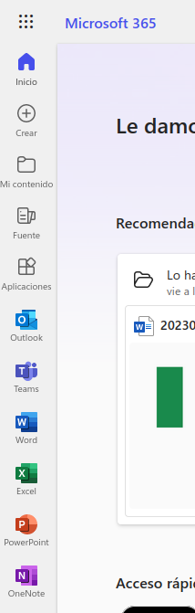

---
# Front matter
# Metainformació del document
title: Estratègies per a l'ús del full de càlcul
titlepage: true
subtitle: Instal·lació i introducció al full de càlcul
author: 
- Alfredo Rafael Vicente Boix
lang: ca
page-background: img/bg.png

# portada
titlepage-rule-height: 2
titlepage-rule-color: AA0000
titlepage-text-color: AA0000
titlepage-background: ../portades/portadaU1.png

# configuració de l'índex
toc-own-page: true
toc-title: Continguts
toc-depth: 2

# capçalera i peu
header-left: \thetitle
header-right: Curs 2023-2024
footer-left: CEFIRE València
footer-right: \thepage/\pageref{LastPage}

# Les figures que apareguen on les definim i centrades
float-placement-figure: H
caption-justification: centering 

# No volem numerar les linies de codi
listings-disable-line-numbers: true

# Configuracions dels paquets de latex
header-includes:

  #  imatges i subfigures
  - \usepackage{graphicx}
  - \usepackage{subfigure}
  - \usepackage{lastpage}

  #  - \usepackage{adjustbox}
  # marca d'aigua
  #- \usepackage{draftwatermark}
 # - \SetWatermarkText{\includegraphics{./img/Markdown.png}}
  #- \SetWatermarkText{Per revisar}
  #- \SetWatermarkScale{.5}
  #- \SetWatermarkAngle{20}
   
  # caixes d'avisos 
  - \usepackage{awesomebox}

  # text en columnes
  - \usepackage{multicol}
  - \setlength{\columnseprule}{1pt}
  - \setlength{\columnsep}{1em}

  # pàgines apaïsades
  - \usepackage{pdflscape}
  
  # per a permetre pandoc dins de blocs Latex
  - \newcommand{\hideFromPandoc}[1]{#1}
  - \hideFromPandoc {
      \let\Begin\begin
      \let\End\end
    }
 
# definició de les caixes d'avis
pandoc-latex-environment:
  noteblock: [note]
  tipblock: [tip]
  warningblock: [warning]
  cautionblock: [caution]
  importantblock: [important]
...

\vspace*{\fill}

{ height=50px }

Aquest document està subjecte a una llicència creative commons que permet la seua difusió i ús comercial reconeixent sempre l'autoria del seu creador. Aquest document es troba per a ser modificat al següent repositori de github:
<!-- CANVIAR L'ENLLAÇ -->
[https://github.com/arvicenteboix/fulldecalcul](https://github.com/arvicenteboix/fulldecalcul)
\newpage

# Què és un Full de Càlcul?

Un full de càlcul és una aplicació que permet manipular dades numèriques i alfanumèriques disposades en forma de taules compostes per cel·les. Amb aquesta premissa poden fer ús del full de càlcul per a realitzar nombroses tasques. En aquest cas en centrarem en l'ús del càlcul per a la tasca docent. El primer pas com a docents de la Comunitat Valenciana és la instal·lació del full de càlcul.

# Instal·lació

Coma  docents de la Comunitat tenim diferent opcions i totes elles són vàlides.

* LibreOffice: es tracta d'una versió de codi obert i està disponible per a pràcticament totes les plataformes més comuns: Windows, Linux i Mac. En aquesta versió ens centrarem en el curs.
* MS Office: es tracta d'una versió de pagament que tots els docents de la Comunitat tenim disponible per a instal·la en un ordinador.
* Office 365: Es tracta d'una versió al núvol per a poder utilitzar les ferramentes Office a través del navegador. Aquesta versió no té tantes característiques com la versió d'escriptori.

## LibreOffice

El programa de full de càlcul de Libreoffice s'anomena Calc. Este està disponible per a pràcticament totes les distribucions GNU/Linux que existeixen sense necessitat d'instal·lar res. Directament anant al menú Inici>Oficina el tronarem:

{ width=60% }

En Windows pots descarregar l'última versió de Libreoffice des [d'ací](https://es.libreoffice.org/descarga/libreoffice/?version=7.6.6&lang=es). Et recomanem que utilitzes la versió 7.6.6, uan vegada descarregat només has de fer doble clic al programa per a instal·lar-lo:

{ width=60% }

## Office 365

Per a fer ús del full de càlcul d'Office 365 (anomenant Excel). Cal anar a la [pàgina web d'Office 365](https://www.office.com/?auth=2). Veurem que al menú de l'esquerre tenim una icona que posa Excel:

{ width=30% }

En aquest cas podem utilitzar Excel a qualsevol plataforma,només ens cal el navegador. 

:::warning
A estes altures tots els docents deurien de tindre activades ja les opcions per a utilitzat Office 365. Si algú no veu la icona d'Excel, que no es preocupe, a final del curs 23-24 ja deurien d'estar acivades.
:::

## MS Office

Microsoft Office també està disponible per a tots els docents de la Comunitat però en aquest cas només es pot fer funcionar amb Windows, per a descarregar MS Office cal anar a *Ver cuenta* al vostre perfil de la pàgina d'Office (teniu una inicial o la vostra foto per a marcar-ho):

{ width=60% }

Una vegada dins a l'esquerra verurem que tenim una opció que posa *Aplicacions Office*:

{ width=60% }

Ahí vos apareixerà una opció per a instal·lar Office, si feu clic vos baixarà la Suite i caldrà que feu clic per a que l'instal·le:

{ width=60% }

Una vegada instal·lat si busque excel a la barra de busca de Windows vos apareixerà que ja està instal·lat:

{ width=60% }

Això sí, és important que una vegada instal·lat registreu l'Office amb el vostre compte corporatiu:

{ width=60% }

:::caution
Recorde que nosaltres anem a fer ús de Libreoffice, moltes vegades farem referència a les altres suites per a explicar algunes diferències.
:::

# Treballant amb el full de càlcul

Hi ha una sèries de conceptes que cal tenir clars abans de començar a treballar. És imprescindible que aquesta terminologia la tingueu clara ja que anem a estar referint-nos a ella en tot moment. La base del full de càlcul és la Cel·la.

## Cel·les, Files i Columnes

- **Cel·la**: És la intersecció d'una fila i una columna. Cada cel·la té una adreça única que es determina a partir de la seva posició en la columna i la fila. Per exemple, la cel·la "B2" es troba a la columna B i la fila 2.

- **Fila**: És un conjunt de Cel·les en una línia horitzontal. Les files es numeren seqüencialment (1, 2, 3, etc.).

- **Columna**: És un conjunt de Cel·les en una línia vertical. Les columnes es designen amb lletres (A, B, C, etc.).

- Un **full** és un conjunt de Cel·les organitzades en files i columnes. Cada full de càlcul pot contenir múltiples fulls.

- Les **fórmules** són expressions que realitzen càlculs sobre les dades de les Cel·les. Una fórmula comença sempre amb un signe igual (=). Per exemple, la fórmula `=SUM(A1:A3)` sumarà els valors de les Cel·les A1 a A3.

{ width=60% }

- **Rang**, és un número de cel·les que vindran determinades per la primera cel·la del rang i l'última, per exemple el rang A3:C5 serà:

{ width=60% }

:::caution
Una de les característiques de les fórmules és que són diferents en castellà, en valencià i en anglès. En el nostre cas utilitzarem les fórmules en castellà, per tant la suite l'heu de tenir configurada en castellà. De tota manera podeu fer ús de la llengua que vullgueu, si teniu configurat el full de càlcul en anglès i heu fet el full en un programa configurat en valencià, automàticament vos apareixeran traduïdes pel que no hi haurà problemes d'incompatibilitat.
:::

# Formats

## Formats de cel·la

En un full de càlcul, una cel·la pot tenir diversos formats. Aquí tens una descripció breu de alguns d'ells:

- **Text**: El text apareix per defecte alineat a l'esquerra de la cel·la.
- **Números**: Els números apareixen per defecte alineats a la dreta. Podem especificar que el que hem escrit és un número (Categoria Número) i especificar paràmetres com quants decimals volem visualitzar o si volem separadors de milers.
- **Dates**: També podem introduir dates. Les dates queden alineades a la dreta, com els números.
- **Percentatge**: Podem especificar que hem escrit és un percentatge (Categoria percentatge) i especificar paràmetres com quants decimals volem visualitzar. El número escrit es multiplica per 100 i apareix el símbol %.
- **Moneda**: Podem especificar que hem escrit un número referit a una quantitat de diners (Categoria Moneda). Escollim la moneda internacional (euros, dolars, rubles....) i especificar paràmetres com quants decimals volem. Apareix el símbol de la moneda a la dreta del número.
- **Científic**: Podem utilitzar la Categoria Científic per a visualitzar números llargs en notació científica de forma molt compacte, igual que fan les calculadores.
- **Fracció**: El full de càlcul pot treballar i fer càlculs amb fraccions, però si escrivim 1/2 en una cel·la hem de dir al programa que això és una fracció amb la categoria fracció.

Pots accedir per a veure tots els tipus de format que pot contenir una cel·la de la següents manera, fent clic amb el botó dret del ratolí:

{ width=60% }

:::tip
Tenim el cas del **Format condicional** que permet que el format d’una cel·la canviï si es produeixen determinades condicions. Per exemple, podem fer que una cel·la amb un nombre aparega de color roig si és negatiu o negre si és positiu.
:::

{ width=60% }

## Formats del full

Al igual que el processador de text, existeix la possibilitat de donar un format determinat al nostre full de càlcul. Per defecte ja ens apareix una barra a Libreoffice com aquesta:

{ width=60% }

En aquesta barra tenim diferents opcions, totes les opcions de la barra són importants i són molt utilitzades:

{ width=90% }

### Format de la pestanya

Una tinguem tots els nostre full configurats tenim l'opció de poder canviar el color de la pestanya del full per a que ens siga més fàcil d'organitzar-nos. A més si ja hem dibuixat totes les quadricules i donat un format amb un color de fons de les cel·les etc... podrem llevar les línies de quadrícula fent clic en *Ver líneas de cuadrícula*

{ width=60% }

:::tip
Recorda que si fas clic sobre el + podràs anar afegint més fulls. Les full es poden relacionar entre ells. Agafar intervals d'altre full per a utilitzar-los en el que estàs treballant.
:::

## Validació de dades

Una altra opció molt interessant, tot i que no parlem de format pròpiament dit és l'opció de validació de dades que ens permetrà crear un desplegable de les dades en una cel·la. Per exemple si volguérem que una cel·la només permetra unes dades determinades, podríem anar a *Datos > Validez*:

{ width=50% }

Després seleccionariem *Intervalo de celdas*:

{ width=50% }

I seleccionariem d'on volem agafar les dades, i li donaríem a acceptar:

{ width=50% }

Finalment tindríem en el full de càlcul un desplegable per a poder seleccionar les dades que nosaltres desitjarem:

{ width=40% }

:::tip
En el casos que feu ús d'aquesta opció, és una opció recomanable tindre totes les dades dels desplegables en un full a banda. 
:::

:::note
En Excel l'opció es diu *Validación de datos* i per a seleccionar un interval heu de agafar l'opció *Personalizar* i seleccionar l'interval.
:::

# Fórmules 

Per realitzar fórmules en LibreOffice Calc, primer heu de seleccionar la cel·la on voleu introduir la fórmula. A continuació, podeu començar a introduir la fórmula. Per exemple:

1. **Feu clic a la cel·la** on voleu introduir la fórmula.
2. **Feu clic a l'icona de Funció** a la Barra de Fórmules. Heu de posar un signe d'igual a la línia d'entrada i podeu començar a introduir la fórmula.
3. **Introduïu la fórmula**. Les fórmules poden contenir nombres, text, operadors aritmètics, operadors lògics o funcions. Per exemple, en lloc d'escriure `=SUM(A1:B1)`, podeu escriure `=A1+B1`.
4. **Premeu Enter o feu clic a la icona ok verda** per inserir el resultat a la cel·la activa.

Totes les fórmules comencen amb un signe d'igual. Alguns exemples de fórmules de LibreOffice Calc poden ser:

- `=A1+10` Mostra el contingut de la cel·la A1 més 10.
- `=A1*16%` Mostra el 16% del contingut de A1.
- `=A1 * A2` Mostra el resultat de la multiplicació de A1 i A2.
- `=ROUND(A1;1)` Mostra el contingut de la cel·la A1 arrodonit a un decimal.
- `=B8-SUM(B10:B14)` Calcula B8 menys la suma de les cel·les B10 a B14.
- `=SUM(B8;SUM(B10:B14))` Calcula la suma de les cel·les B10 a B14 i afegeix el valor a B8.

:::tip
A la propera unitat parlarem un poc més de les fórmules i de com utilitzar l'assistent per a fórmules.
:::

# Bibliografia

(@) https://documentation.libreoffice.org/es/documentacion-en-espanol/calc/

