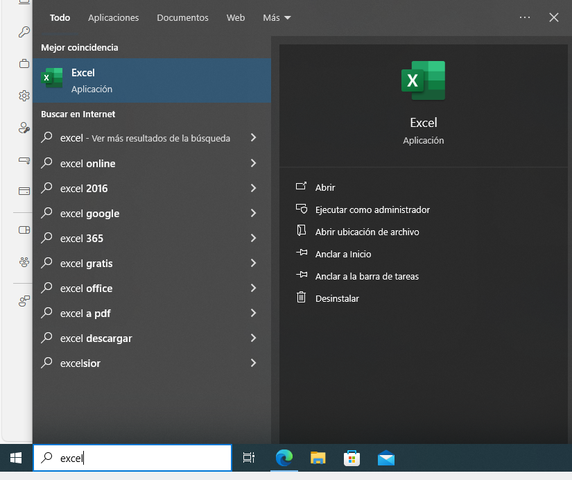

---
# Front matter
# Metainformació del document
title: Estrategias para el uso de la hoja de cálculo
titlepage: true
subtitle: Instalación e introducción a la hoja de cálculo
author: 
- Alfredo Rafael Vicente Boix
lang: ca
page-background: img/bg.png

# portada
titlepage-rule-height: 2
titlepage-rule-color: AA0000
titlepage-text-color: AA0000
titlepage-background: ../portades/portadaU1.png

# configuració de l'índex
toc-own-page: true
toc-title: Continguts
toc-depth: 2

# capçalera i peu
header-left: \thetitle
header-right: Curs 2023-2024
footer-left: CEFIRE València
footer-right: \thepage/\pageref{LastPage}

# Les figures que apareguen on les definim i centrades
float-placement-figure: H
caption-justification: centering 

# No volem numerar les linies de codi
listings-disable-line-numbers: true

# Configuracions dels paquets de latex
header-includes:

  #  imatges i subfigures
  - \usepackage{graphicx}
  - \usepackage{subfigure}
  - \usepackage{lastpage}

  #  - \usepackage{adjustbox}
  # marca d'aigua
  #- \usepackage{draftwatermark}
 # - \SetWatermarkText{\includegraphics{./img/Markdown.png}}
  #- \SetWatermarkText{Per revisar}
  #- \SetWatermarkScale{.5}
  #- \SetWatermarkAngle{20}
   
  # caixes d'avisos 
  - \usepackage{awesomebox}

  # text en columnes
  - \usepackage{multicol}
  - \setlength{\columnseprule}{1pt}
  - \setlength{\columnsep}{1em}

  # pàgines apaïsades
  - \usepackage{pdflscape}
  
  # per a permetre pandoc dins de blocs Latex
  - \newcommand{\hideFromPandoc}[1]{#1}
  - \hideFromPandoc {
      \let\Begin\begin
      \let\End\end
    }
 
# definició de les caixes d'avis
pandoc-latex-environment:
  noteblock: [note]
  tipblock: [tip]
  warningblock: [warning]
  cautionblock: [caution]
  importantblock: [important]
...

\vspace*{\fill}

{ height=50px }

Este documento está sujeto a una licencia creative commons que permite su difusión y uso comercial reconociendo siempre la autoría de su creador. Este documento se encuentra para ser modificado en el siguiente repositorio de github:
<!-- CAMBIAR EL ENLACE -->
[https://github.com/arvicenteboix/fulldecalcul](https://github.com/arvicenteboix/fulldecalcul)
\newpage

# ¿Qué es una Hoja de Cálculo?

Una hoja de cálculo es una aplicación que permite manipular datos numéricos y alfanuméricos dispuestos en forma de tablas compuestas por celdas. Con esta premisa pueden hacer uso de la hoja de cálculo para realizar numerosas tareas. En este caso nos centraremos en el uso del cálculo para la tarea docente. El primer paso como docentes de la Comunidad Valenciana, es la instalación de la hoja de cálculo.

# Instalación

Como docentes de la Comunidad tenemos diferentes opciones y todas ellas son válidas.

* LibreOffice: se trata de una versión de código abierto y está disponible para prácticamente todas las plataformas más comunes: Windows, Linux y Mac. En esta versión nos centraremos en el curso.
* MS Office: se trata de una versión de pago que todos los docentes de la Comunidad tenemos disponible para instalar en un ordenador.
* Office 365: Es una versión en la nube para poder utilizar las herramientas Office a través del navegador. Esta versión no tiene tantas características como la versión de escritorio.

## LibreOffice

El programa de hoja de cálculo de LibreOffice se llama Calc. Este está disponible para prácticamente todas las distribuciones GNU/Linux que existen sin necesidad de instalar nada. Directamente yendo al menú Inicio>Oficina lo encontraremos:

En Windows puedes descargar la última versión de LibreOffice desde [aquí](https://es.libreoffice.org/descarga/libreoffice/?version=7.6.6&lang=es). Te recomendamos que utilices la versión 7.6.6, una vez descargado solo tienes que hacer doble clic en el programa para instalarlo:

## Office 365

Para hacer uso de la hoja de cálculo de Office 365 (llamada Excel). Debes ir a la [página web de Office 365](https://www.office.com/?auth=2). Veremos que en el menú de la izquierda tenemos un icono que dice Excel:

En este caso podemos utilizar Excel en cualquier plataforma, solo necesitamos el navegador. 

:::warning
A estas alturas todos los docentes deberían tener activadas ya las opciones para utilizar Office 365. Si alguien no ve el icono de Excel, que no se preocupe, al final del curso 23-24 ya deberían estar activadas.
:::

## MS Office

Microsoft Office también está disponible para todos los docentes de la Comunidad, pero en este caso solo puede funcionar con Windows. Para descargar MS Office, debes ir a *Ver cuenta* en tu perfil de la página de Office (tienes una inicial o tu foto para marcarlo):

Una vez dentro, a la izquierda verás que tenemos una opción que dice *Aplicaciones Office*:

Ahí te aparecerá una opción para instalar Office, si haces clic te descargará la Suite y tendrás que hacer clic para que se instale:

Una vez instalado, si buscas Excel en la barra de búsqueda de Windows, te aparecerá que ya está instalado:

Eso sí, es importante que una vez instalado registres Office con tu cuenta corporativa:

:::caution
Recuerda que nosotros vamos a hacer uso de LibreOffice, muchas veces haremos referencia a las otras suites para explicar algunas diferencias.
:::

# Trabajando con la hoja de cálculo

Hay una serie de conceptos que debes tener claros antes de empezar a trabajar. Es imprescindible que esta terminología la tengas clara ya que nos vamos a referir a ella en todo momento. La base de la hoja de cálculo es la Celda.

## Celdas, Filas y Columnas

- **Celda**: Es la intersección de una fila y una columna. Cada celda tiene una dirección única que se determina a partir de su posición en la fila y la columna. Por ejemplo, la celda "B2" se encuentra en la columna B y la fila 2.

- **Fila**: Es un conjunto de Celdas en una línea horizontal. Las filas se numeran secuencialmente (1, 2, 3, etc.).

- **Columna**: Es un conjunto de Celdas en una línea vertical. Las columnas se designan con letras (A, B, C, etc.).

- Una **hoja** es un conjunto de Celdas organizadas en filas y columnas. Cada hoja de cálculo puede contener múltiples hojas.

- Las **fórmulas** son expresiones que realizan cálculos sobre los datos de las Celdas. Una fórmula siempre comienza con un signo igual (=). Por ejemplo, la fórmula `=SUM(A1:A3)` sumará los valores de las Celdas A1 a A3.

- **Rango**, es un número de celdas que vendrán determinadas por la primera celda del rango y la última, por ejemplo el rango A3:C5 será:

:::caution
Una de las características de las fórmulas es que son diferentes en castellano, en valenciano y en inglés. En nuestro caso utilizaremos las fórmulas en castellano, por tanto la suite la debéis tener configurada en castellano. De todas formas podéis hacer uso del idioma que queráis, si tenéis configurada la hoja de cálculo en inglés y habéis hecho la hoja en un programa configurado en valenciano, automáticamente os aparecerán traducidas por lo que no habrá problemas de incompatibilidad.
:::

# Formatos

## Formatos de celda

En una hoja de cálculo, una celda puede tener varios formatos. Aquí tienes una descripción breve de algunos de ellos:

- **Texto**: El texto aparece por defecto alineado a la izquierda de la celda.
- **Números**: Los números aparecen por defecto alineados a la derecha. Podemos especificar que lo que hemos escrito es un número (Categoría Número) y especificar parámetros como cuántos decimales queremos visualizar o si queremos separadores de miles.
- **Fechas**: También podemos introducir fechas. Las fechas quedan alineadas a la derecha, como los números.
- **Porcentaje**: Podemos especificar que lo que hemos escrito es un porcentaje (Categoría porcentaje) y especificar parámetros como cuántos decimales queremos visualizar. El número escrito se multiplica por 100 y aparece el símbolo %.
- **Moneda**: Podemos especificar que hemos escrito un número referido a una cantidad de dinero (Categoría Moneda). Elegimos la moneda internacional (euros, dólares, rublos....) y especificar parámetros como cuántos decimales queremos. Aparece el símbolo de la moneda a la derecha del número.
- **Científico**: Podemos utilizar la Categoría Científico para visualizar números largos en notación científica de forma muy compacta, igual que hacen las calculadoras.
- **Fracción**: La hoja de cálculo puede trabajar y hacer cálculos con fracciones, pero si escribimos 1/2 en una celda debemos decir al programa que esto es una fracción con la categoría fracción.
Puedes acceder para ver todos los tipos de formato que puede contener una celda de la siguiente manera, haciendo clic con el botón derecho del ratón:

:::tip
Tenemos el caso del **Formato condicional** que permite que el formato de una celda cambie si se producen determinadas condiciones. Por ejemplo, podemos hacer que una celda con un número aparezca de color rojo si es negativo o negro si es positivo.
:::

## Formatos de la hoja

Al igual que el procesador de texto existe la posibilidad de dar un formato determinado a nuestra hoja de cálculo. Por defecto ya nos aparece una barra en Libreoffice como esta:

En esta barra tenemos diferentes opciones, todas las opciones de la barra son importantes y son muy utilizadas:

### Formato de la pestaña

Una vez tengamos todas nuestras hojas configuradas tenemos la opción de poder cambiar el color de la pestaña de la hoja para que nos sea más fácil organizarnos. Además si ya hemos dibujado todas las cuadrículas y dado un formato con un color de fondo de las celdas etc... podremos quitar las líneas de cuadrícula haciendo clic en *Ver líneas de cuadrícula*

:::tip
Recuerda que si haces clic sobre el + podrás ir añadiendo más hojas. Las hojas se pueden relacionar entre ellas. Coger intervalos de otra hoja para utilizarlos en la que estás trabajando.
:::

## Validación de datos

Otra opción muy interesante, aunque no hablemos de formato propiamente dicho es la opción de validación de datos que nos permitirá crear un desplegable de los datos en una celda. Por ejemplo si quisiéramos que una celda solo permitiera unos datos determinados, podríamos ir a Datos > Validez:

Después seleccionaríamos *Intervalo de celdas*:

Y seleccionaríamos de dónde queremos coger los datos, y le daríamos a aceptar:

Finalmente tendríamos en la hoja de cálculo un desplegable para poder seleccionar los datos que nosotros deseáramos:

:::tip
En los casos que hagáis uso de esta opción, es una opción recomendable tener todos los datos de los desplegables en una hoja aparte.
:::

:::note
En Excel la opción se llama *Validación de datos* y para seleccionar un intervalo tenéis que coger la opción *Personalizar* y seleccionar el intervalo.
:::

# Fórmulas 

Para realizar fórmulas en LibreOffice Calc, primero debéis seleccionar la celda donde queréis introducir la fórmula. A continuación, podéis empezar a introducir la fórmula. Por ejemplo:

1. **Haced clic en la celda** donde queréis introducir la fórmula.
2. **Haced clic en el icono de Función** en la Barra de Fórmulas. Debéis poner un signo de igual en la línea de entrada y podéis empezar a introducir la fórmula.
3. **Introducid la fórmula**. Las fórmulas pueden contener números, texto, operadores aritméticos, operadores lógicos o funciones. Por ejemplo, en lugar de escribir `=SUM(A1:B1)`, podéis escribir `=A1+B1`.
4. **Presionad Enter o haced clic en el icono ok verde** para insertar el resultado en la celda activa.

Todas las fórmulas comienzan con un signo de igual. Algunos ejemplos de fórmulas de LibreOffice Calc pueden ser:

- `=A1+10` Muestra el contenido de la celda A1 más 10.
- `=A1*16%` Muestra el 16% del contenido de A1.
- `=A1 * A2` Muestra el resultado de la multiplicación de A1 y A2.
- `=ROUND(A1;1)` Muestra el contenido de la celda A1 redondeado a un decimal.
- `=B8-SUM(B10:B14)` Calcula B8 menos la suma de las celdas B10 a B14.
- `=SUM(B8;SUM(B10:B14))` Calcula la suma de las celdas B10 a B14 y añade el valor a B8.

:::tip
En la próxima unidad hablaremos un poco más de las fórmulas y de cómo utilizar el asistente para fórmulas.
:::

# Bibliografía

(@) https://documentation.libreoffice.org/es/documentacion-en-espanol/calc/

