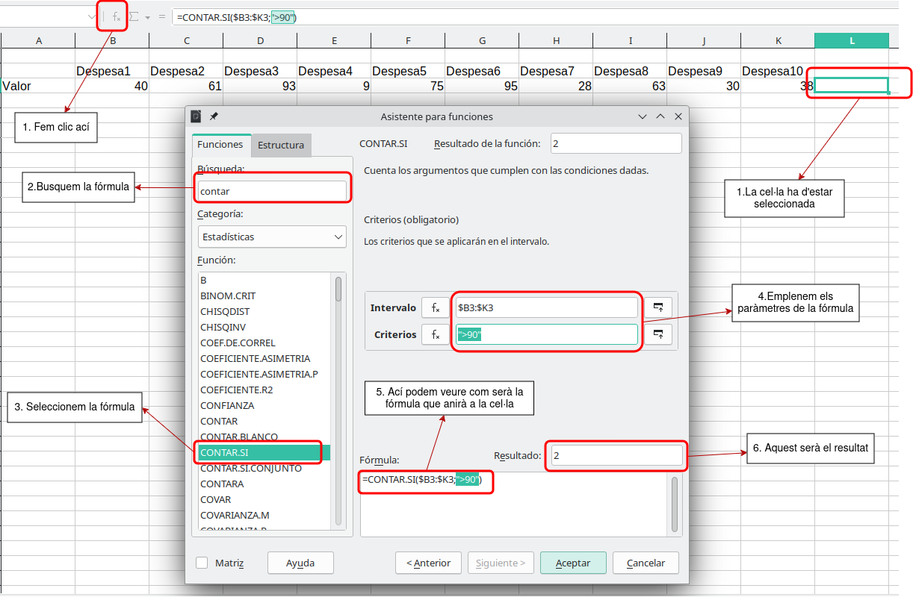
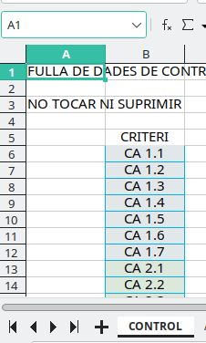
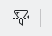
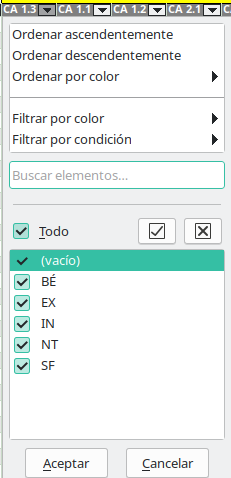
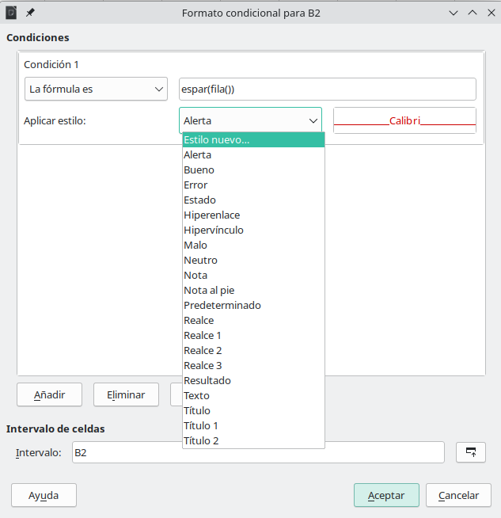
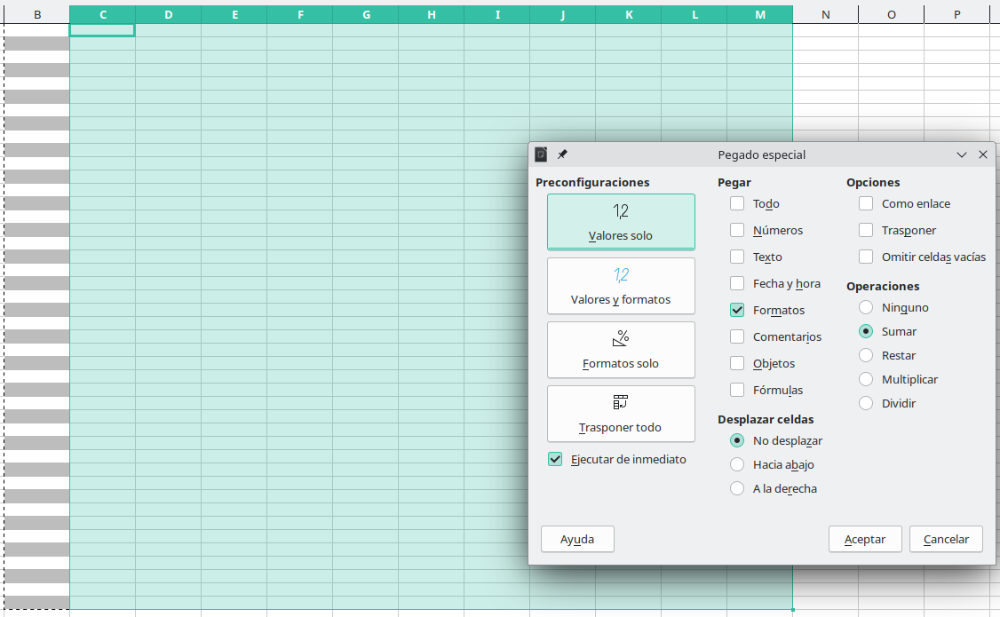
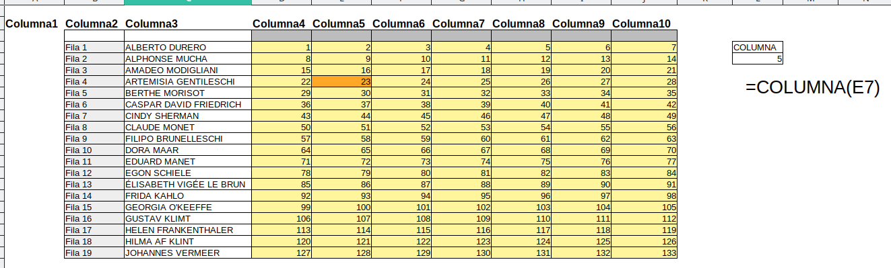

---
# Front matter
# Metainformació del document
title: Estratègies per a l'ús del full de càlcul
titlepage: true
subtitle: Treballant amb el full de càlcul, ús de les fórmules
author: 
- Alfredo Rafael Vicente Boix
lang: ca
page-background: img/bg.png

# portada
titlepage-rule-height: 2
titlepage-rule-color: AA0000
titlepage-text-color: AA0000
titlepage-background: ../portades/U2.png

# configuració de l'índex
toc-own-page: true
toc-title: Continguts
toc-depth: 2

# capçalera i peu
header-left: \thetitle
header-right: Curs 2023-2024
footer-left: CEFIRE València
footer-right: \thepage/\pageref{LastPage}

# Les figures que apareguen on les definim i centrades
float-placement-figure: H
caption-justification: centering 

# No volem numerar les linies de codi
listings-disable-line-numbers: true

# Configuracions dels paquets de latex
header-includes:

  #  imatges i subfigures
  - \usepackage{graphicx}
  - \usepackage{subfigure}
  - \usepackage{lastpage}


  #  - \usepackage{adjustbox}
  # marca d'aigua
  #- \usepackage{draftwatermark}
 # - \SetWatermarkText{\includegraphics{./img/Markdown.png}}
  #- \SetWatermarkText{Per revisar}
  #- \SetWatermarkScale{.5}
  #- \SetWatermarkAngle{20}
   
  # caixes d'avisos 
  - \usepackage{awesomebox}

  # text en columnes
  - \usepackage{multicol}
  - \setlength{\columnseprule}{1pt}
  - \setlength{\columnsep}{1em}

  # pàgines apaïsades
  - \usepackage{pdflscape}
  
  # per a permetre pandoc dins de blocs Latex
  - \newcommand{\hideFromPandoc}[1]{#1}
  - \hideFromPandoc {
      \let\Begin\begin
      \let\End\end
    }
 
# definició de les caixes d'avis
pandoc-latex-environment:
  noteblock: [note]
  tipblock: [tip]
  warningblock: [warning]
  cautionblock: [caution]
  importantblock: [important]
...

<!-- 
FÓRMULAS BÁSICAS + * / %
SUMAR
DIFERENCIES ENTRE TEXT I FORMULA

ÚS DE FÓRMULES 

AUTOEMPLENAR

REFERENCIAS ANSOLUTAS Y RELATIVAS
eL SIGNO $

CONTAR.SI
SI
si.error

OPERACIONS AMB DATES 

=HOY()
=DIA()
=DIASEMANA()


EXEMPLE PRÀCTIC 


Els errors en calc

 -->

\vspace*{\fill}

{ height=50px }

Aquest document està subjecte a una llicència creative commons que permet la seua difusió i ús comercial reconeixent sempre l'autoria del seu creador. Aquest document es troba per a ser modificat al següent repositori de github:
<!-- CANVIAR L'ENLLAÇ -->
[https://github.com/arvicenteboix/fulldecalcul](https://github.com/arvicenteboix/fulldecalcul)
\newpage


# Introducció

En aquesta unitat anem a entrar a utilitzar l'ús de les fórmules, aquestes fórmules les utilitzarem a través de l'assistent de Libreoffice que ens ajudarà a fer les fórmules de manera correcta. Una vegada ja tinguem certa pràctica les fórmules les podrem escriure directament sense fer ús de l'assistent.

# Fórmules

Com hem vist per a poder utilitzar les fórmules als fulls de càlcul hem de posar davant de la celda el signe =, existeixen moltíssimes fórmules als fulls de càlcul i es poden programar

## Operadors fonamentals

Operadors fonamentals en fulls de càlcul:

- **Sumar (+):** Utilitzat per a agregar el valor de dues o més cel·les. Per exemple, `=A1+A2` sumaria els valors de les cel·les A1 i A2.
- **Restar (-):** Emprat per a calcular la diferència entre dues cel·les. `=A1-A2` restaria el valor de la cel·la A2 del valor de la cel·la A1.
- **Multiplicar (\*):** Serveix per a obtenir el producte de dos números. `=A1*A2` multiplicaria els valors de les cel·les A1 i A2.
- **Dividir (/):** Utilitzat per a dividir el valor d'una cel·la entre un altre. `=A1/A2` dividiria el valor de la cel·la A1 entre el valor de la cel·la A2.
- **Percentatge (%):** Permet calcular el percentatge d'un valor. `=A1*10%` calcularia el 10% del valor de la cel·la A1.
- **Exponencial (^):** Aixeca un número a la potència d'un altre. `=A1^2` elevaria el valor de la cel·la A1 al quadrat.
- **Radical ( $\sqrt{}$ ):** S'utilitza per a calcular l'arrel quadrada d'un valor. `=SQRT(A1)` retornaria l'arrel quadrada del valor de la cel·la A1.

Totes aquestes fórmules es poden anar combinant entre elles utilitzant els parèntesi de manera que podríem fer `=(A1+A2)*5` on es faria primer la suma i després es multiplicaria per 5.

## Operadors amb rang

Operar amb els operadors fonamentals ens limita molt la nostra capacitat d'ús, per això és millor utilitzar fórmules. De manera que si volguéssim sumar moltes cel·les d'una fila seria molt llarg fer-ho d'una en una, per això es poden utilitzar fórmules que utilitzen tot un rang. Així per exemple si volem sumar totes les cel·les desde A1 a A10 podem fer ús de la fórmula **SUMA(A1:A10)**:


:::note
Per a seleccionar el rang podem fer ús del ratolí i seleccionar les cel·les que volem, automàticament ens apareixerà el rang que volem.
:::

### Altres operadors esencials

* **PROMEDIO**: Aquesta fórmula retorna el valor mitjà aritmètic de les cel·les que passes com a paràmetre. Exemple: =PROMEDIO(A2:B2).
* **MAX** i **MIN**: Aquestes fórmules retornen el valor màxim i mínim respectivament d’un conjunt de cel·les. Exemple: =MAX(A2:C8) o =MIN(A2,B4,C3,29).

:::tip
Fica't en la fórmula MAX i MIN, normalment quasi totes les fórmules de càlcul permeten bé introduir un rang o diferents cel·les separades per a una coma. El que no pots fer és utilitzar dos rangs separats per una coma.
:::

## Assistent per a fórmules

A l'afegir fórmules és interessant fer ús de l'assistent, ja que sempre ens anirà donant indicacions de si una fórmula és correcta o no. Al següent gràfic tens un esquema ràpid de com seria fer ús de l'assistent de fórmules.



## Operadors condicionals

A l'exemple anterior hem vist un operador condicional. Els més comuns són els següents:

- **CONTAR.SI**: Aquesta funció compta el nombre de cel·les que compleixen un criteri específic. Per exemple, `=CONTAR.SI(A2:A5;\"APTE\")` compta el nombre de cel·les que contenen la paraula "APTE" en el rang A2:A5.  
- **SI**: Aquesta funció realitza una comparació lògica entre un valor i el resultat esperat. Té dos resultats possibles: el primer si la comparació és veritable i el segon si la comparació és falsa. Suposa que vols assignar una qualificació a un estudiant basada en la seva nota. Si la nota (en la cel·la B2) és superior o igual a 5, l’estudiant aprova. Si no, suspèn. La fórmula seria: =SI(B2>=5; "Aprova"; "Suspèn"). La primera opció Normalment sol ser una comparativa lògica que done com a resultat vertader o fals, per això s'utilitzen els operadors:

  * \> Major
  * < Menor
  * = Igual
  * Combinació de dos >= Major o igual

- **SI.ERROR**: Aquesta funció retorna un valor especificat si una fórmula s'avalua com a error; en cas contrari, retorna el resultat de la fórmula. Per exemple =SI.ERROR(A2/B2; "Error en la divisió"), podria donar-se quan B2 per exemple és 0.

# Autoemplenar

L’opció Autoemplenar és una funció que permet estalviar temps en realitzar tasques repetitives. Amb aquesta funció, pots copiar valors, realitzar sèries, copiar fórmules, entre altres, simplement arrossegant el ratolí.


Una vegada arrosseguem el ratolí el resultat serà que la fila s'ompli amb Nom1, Nom2, Nom3, etc... De la mateixa manera passaria si tinguéssim només le número. Així mateix passaria amb les fórmules. Si volem que ens faja els càlculs de semblants als anteriors mantenint les referències podem arrastrar i soltar. Així per exemple en el següent recuadre:


# Referències absolutes i relatives $

En un full de càlcul, les referències a les cel·les poden ser absolutes, relatives o mixtes:

1. **Referències absolutes**: Fan referència a les cel·les ubicades en una posició específica i invariable. S'indiquen amb el signe `$` davant la lletra de la columna i del nombre de fila. Per exemple, `$A$1` és una referència absoluta.

2. **Referències relatives**: Fan referència a cel·les ubicades en una columna o en una fila que s'actualitzaran segons el càlcul que es realitzi. No contenen signes de dòlar. Per exemple, `A1` és una referència relativa.

3. **Referències mixtes**: Combina les dues anteriors. Una part de la referència és absoluta (columna o fila) i l'altra és relativa. Per exemple, `$A1` o `A$1`.

Aquestes referències són útils quan es copien fórmules a altres cel·les, permetent ajustar automàticament les referències a les cel·les.

Fixem-nos en el següent exemple, hem posat les fórmules 

```
=B4*C4	=$B$4*C4
```

Si arrastrem les cel·les per a completar la resta de cel·les, podem veure com les de la primera columna sí que canvien els valors, en canvi les de la segona només canvien els valors de C4, ja que B4 és absoluta perquè li hem posat el símbol $.


:::tip
Per a poder crear la referència absoluta polses F4 quan tens el cursor a la fórmula i es convertix automàticament en absoluta. És fàcil recordar-se-ne'n ja que el botó de 4 és el mateix que el de $.
:::

# Operacions amb dates

En LibreOffice, podeu realitzar diverses operacions amb dates. Per exemple, podeu restar dues dates per obtenir el nombre de dies entre elles. Això es pot fer simplement restant una data d'una altra en una nova cel·la.

```markdown
A1: 01/01/2024
A2: 01/02/2024
A3: =A2-A1
```

En aquest exemple, `A3` mostrarà `31`, que és el nombre de dies entre l'1 de gener de 2024 i l'1 de febrer de 2024. De la mateixa manera podem sumar dies, etc...

## Format de dates

Podeu canviar el format de les dates a LibreOffice Calc anant a `Formato -> Celdas -> Fecha`. Des d'aquí, podeu seleccionar el format de data que preferiu. També podeu crear un format de data personalitzat si cap dels formats predefinits no s'ajusta a les vostres necessitats.


:::tip
Podeu canviar l'idioma de la dates també, per si voleu que vos apareguen amb altra llengua de la que tenim configurat Libreoffice Calc.
:::

## Altres funcionas amb dades

Existeixen altres funcions molt utilitzades per a dates en LibreOffice Calc són:

1. **HOY()**: Aquesta funció retorna la data actual. S'actualitza cada vegada que recalculem el full de càlcul.

2. **AHORA()**: Aquesta funció retorna la data i hora actuals. Com la funció HOY(), també s'actualitza cada vegada que recalculem el full de càlcul.

3. **FECHA(any; mes; dia)**: Aquesta funció es pot utilitzar per crear una data a partir d'un any, mes i dia especificats. Per exemple, `FECHA(1954;7;20)` crea la data 20 de juliol de 1954. Esta funció és interessant quan estàs calculant dates a partir d'altres paràmetres. Si vols escriure una data, escriu directament la data.

4. **SIFECHA(data_inici; data_final; "unitats")**: Aquesta funció retorna el nombre de dies, mesos o anys complets entre dues dates. Per exemple, `SIFECHA("2024-01-01"; "2024-12-31"; "d")` retorna el nombre de dies entre l'1 de gener de 2024 i el 31 de desembre de 2024. Pots canviar, d - dies, m - mesos, y - anys.

5. **DIASEMANA(fecha;tipo)**: retorna el dia de la setmana per a una data donada. El dia es retorna com un enter entre 1 (Diumenge) i 7 (Dissabte) si no s’especifica cap tipus o si el tipus és 1. Per exemple: DIASETMANA("1996-07-24";2) retorna 3 (el paràmetre tipo és 2, per tant, Dilluns és dia número 1. El 24 de juliol de 1996 va ser un Dimecres i, per tant, dia número 3).

# Exemple pràctic

Anem a plantejar-vos un full de càlcul per a que aneu practicant. La proposta és un full de càlcul amb la següent disposició:


En aquest full de càlcul tenim diferents Situacions d'aprenentatge (SA) on anem a posar diferents criteris d'avaluació, els criteris d'avaluació són desplegables. Les notes també són desplegables limitant-se a les notes concretes que podem posar.

Podem ordenar les diferents files o crear un criteri de búsqueda, per nom concret o per orde alfabètic.

Les últimes columnes conten el número de de qualificacions que es repetixen a mode estadístic.

## Validez

Les cel·les on anem a posar les notes han d'acceptar únicament el text de les notes:


Posar les dades desplegables sempre en una llista a Datos > Validar no sempre és la millor opció, pel que es podria crear un full addicional on es posaren tots els desplegables. Així crearem un full anomenat CONTROL, per exemple, i ahí afegirem els nostres criteris d'avaluació.



## CONTAR.SI

Al final de cada línia tenim un càlcul del número de vegades que es repetix una qualificació. Com ja sabeu no cal emplenar totes les dades en totes les files. Si juguem amb les referències absolutes i relatives podem fer la següent fórmula a la cel·la AA5:

```markdown
AA5: =CONTAR.SI($C5:$Z5;AA$4)
```

* **\$C5:\$Z5**: Manté el rang entre la columna C i la Z, de manera que quan arrastre l'autocompletat a la dreta manté les columnes, però l'autocompletat cap avall les línies sí que van canviant.
* **AA$4**: Deixa la Columna absoluta i la fila relativa, així quan desplace l'autocompletat a la dreta, **4** es queda fixe i les següents referències passen a ser AB4, AC4, AD4 i AE4 Que corresponen a: SF, BÉ, NT i EX.

D'aquesta manera només creem una fórmula i després podem autocompletar a la dreta i després les 5 cel·les cap avall i ja tenim totes les fórmules.

# Tips

## Copiar i enganxar

Moltes vegades volem traslladar valors d'una cel·la a altra però no volem que ens copie el format, o volem copiar només el format de tota un columna a altra però no volem que s'enganxen els valors. De vegades tenim valors resultats d'una fórmula però volen passar-los a una columna de text. Tot això és posible amb l'enganxament especial: **Ctrl+Shift+V**. Podeu anar també a *Editar > Pegado especial*.


Si ens fixem en la finestra que ens apareix en aquest cas, tenim seleccionat només Formatos, de manera que només s'enganxaran els formats de la cel·la. Hi han altres opcions interessants, com podem veure com és:

* **Trasponer**: Canvia les files per columnes.
* **Omitir celdas vacías**: Les cel·les buides no les enganxa.
* **Desplazar celdas**: Si volem que enlloc de fer-ho damunt del que hi ha, estem afegint una columna/fila nova.
* **Operaciones**: Si volem sumar als valors presents (o altra operació).

## Filtre automàtic

Podem seleccionar una fila (o part d'ella) i polsar la icona següent:



També poden fer ús de la combinació de tecles **Ctrl+Shift+L**. D'aquesta manera podem crear un filtre automàtic 



El filtre automàtic ens permet filtrar una sèries de cel·les donats una sèrie de criteris, de manera que ens permet interactuar ràpidament amb la nostra taula.

## Files alternes

Una de les coses que haureu vist és que si volem crear files alternes de diferents colors podem fer-ho de dos maneres:

* Seleccionant les files alternadament i aplicar el format.
* O bé a format condicional i enganxament especial.



I definim el format:


:::tip
Podem veure que estem utilizant dos nous tipus de fórmules.
**FILA()**: Esn torna el número de fila on estem.
**ESPAR()**: Ens torna VERTADER si la fila es par o FALS si es impar.
:::

Aplicar a múltiples cel·les:




<!-- TRADUÏT -->

# Segon full

En aquest cas anem a crear un segon full on tindrem un desplegable on podrem escollir el nom del nostre alumne i traslladarà les notes que hem posat a la nova taula. En aquest full tenim la limitació que només agafarà un CA, però, es podria fer que n'agafara més. Els fulls ens quedaran de la següent manera.


:::important
Es tracta d'un full per a practicar, és difícil en aquest moment traure-li una utilitat. A mesura que anem avançant el curs anirem ampliant els nsotres coneixements per a poder fer coses més concretes
:::

Introduirem les següents fórmules:

1. **ÍNDICE**: Aquesta funció és utilitzada per recuperar el valor en una cel·la específica, especificada per números de fila i columna relatius dins d'una taula de dades. Depenent del context, ÍNDICE també pot ser utilitzat per determinar la referència de la cel·la a la intersecció de la fila i columna especificades. La sintaxi general per a la funció ÍNDICE és: `INDICE (Referència; Fila; Columna; Rang )`.

2. **COINCIDIR**¹²: Aquesta funció busca un valor determinat en un vector, és a dir, en un rang d'una sola fila o d'una sola columna. Retorna la posició on es troba el valor buscat. Per exemple, `COINCIDIR(200;D1:D100)` busca l'àrea D1:D100, que s'ordena per la columna D, per al valor 200.

3. **COLUMNA**: Aquesta funció determina el número de columna(s) d'una referència donada a una sola cel·la o a un rang de cel·les. Retorna un o més enters positius en el rang de 1 a 1024 (inclosos) que són el número(s) de columna(s) de la(s) cel·la(s) especificada(s) en l'argument.

4. **SI.ERROR**: Aquesta funció retorna el valor de la primera expressió a menys que aquesta generi un error.

:::tip
La fórmula **SI.ERROR**, és molt recomanable tindre-la present ja que ens permet tindre una taula més clara quan hi ha algún error.
:::

El que volem és que es busque en la columna de noms el nom de la persona seleccionada y trasllade eixes notes a la línia corresponent. Anem a anar explicant detalladament cadascuna de les fórmules.

## INDICE

Podem entendre la funció índice amb un exemple, si et fixes en la següent imatge:


Podem veure que es tracta de un joc semblant a *hundir la flota*, hem creat la funció **INDICE(C4:I22;L4;M4)**:

* **C4:I22** Correspon al rang que hem agafat.
* **L4** és una referència a la cel·la. En eixa cel·la canviarem el valor i posarem el número de la fila.
* **M4** fa referència a la cel·la on escriurem el número de la columna

## COINCIDIR

Fixem-nos ara en el següent full:


El que fa la fórmula COINCIDIR és busca el valor que posem i ens torna el número de fila on es troba, **=COINCIDIR(M4;C4:C22;0)**:

* **M4** és la cel·la del valor on volem buscar.
* **C4:C22** és el rango on volem buscar
* El valor 0, no anem a entrar en detalls, però significa que la coincidència siga exacta.

:::warning
Si el rang que li donem és un rang horizontal (una fila per exemple) ens torna el número de columna.
:::

## COLUMNA

La fórmula COLUMNA torna el número de columna (en referència global) on es troba la cel·la que estem passant-li. En aquest cas torna 5 perquè hem passat la cel·la E7, que es troba a la columna 5.



:::tip
Al final no hem fet servir aquesta fórmula, però és senzilla de recordar i ens farà falta en algun moment.
:::

## Full exemple

Abans de fer el full i fer una fórmula que continga totes les fórmules integrades és important anar tractant de el full poc a poc. Primer una columna que ens busque la fila, després altra que busque la columna, la NOTA i afegim eL SI.ERROR. Quan tinguen tots els passos clars podem crear una fórmula on estiga tot junt i borrar la resta de columnes:


En aquesta taula tenim com quedarien les fórmules en la primera línia. Podem veure que una vegada aconseguim la fila, la columna, podem traure ja la nota amb índice referenciant a les cel·les F8 i G8 que són les anteriors

| FILA | Columna | NOTA |	Amb SI.ERROR | TOT JUNT |
| ---- | ---- | ---- | ---- | -------- | 
| `=COINCIDIR($C$3;''.$B4:$B$13;0)` |	`=COINCIDIR(E8;''.$C$3:$N$3;0)` | `=INDICE(''.$C$4:$N$13;F8;G8)` | `=SI.ERROR(INDICE(''.$C$4:$N$13;F8;G8);"No avaluat")` | `=SI.ERROR(INDICE($''.$C$4:$N$13;COINCIDIR($C$3;$''.$B$4:$B$13;0);COINCIDIR(E8;$''.$C$3:$N$3;0));"No avaluat")` |

:::tip
Hem utilitzat referències absolutes i relatives mixtes per a poder fer una única fórmula i arrastrar les altres.
:::
