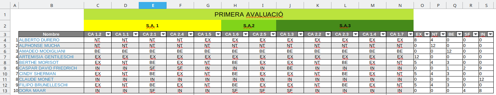

---
# Front matter
# Metainformació del document
title: Estrategias para el uso de la hoja de cálculo
titlepage: true
subtitle: Trabajando con la hoja de cálculo, uso de las fórmulas
author: 
- Alfredo Rafael Vicente Boix
lang: ca
page-background: img/bg.png

# portada
titlepage-rule-height: 2
titlepage-rule-color: AA0000
titlepage-text-color: AA0000
titlepage-background: ../portades/U2.png

# configuració de l'índex
toc-own-page: true
toc-title: Continguts
toc-depth: 2

# capçalera i peu
header-left: \thetitle
header-right: Curs 2023-2024
footer-left: CEFIRE València
footer-right: \thepage/\pageref{LastPage}

# Les figures que apareguen on les definim i centrades
float-placement-figure: H
caption-justification: centering 

# No volem numerar les linies de codi
listings-disable-line-numbers: true

# Configuracions dels paquets de latex
header-includes:

  #  imatges i subfigures
  - \usepackage{graphicx}
  - \usepackage{subfigure}
  - \usepackage{lastpage}


  #  - \usepackage{adjustbox}
  # marca d'aigua
  #- \usepackage{draftwatermark}
 # - \SetWatermarkText{\includegraphics{./img/Markdown.png}}
  #- \SetWatermarkText{Per revisar}
  #- \SetWatermarkScale{.5}
  #- \SetWatermarkAngle{20}
   
  # caixes d'avisos 
  - \usepackage{awesomebox}

  # text en columnes
  - \usepackage{multicol}
  - \setlength{\columnseprule}{1pt}
  - \setlength{\columnsep}{1em}

  # pàgines apaïsades
  - \usepackage{pdflscape}
  
  # per a permetre pandoc dins de blocs Latex
  - \newcommand{\hideFromPandoc}[1]{#1}
  - \hideFromPandoc {
      \let\Begin\begin
      \let\End\end
    }
 
# definició de les caixes d'avis
pandoc-latex-environment:
  noteblock: [note]
  tipblock: [tip]
  warningblock: [warning]
  cautionblock: [caution]
  importantblock: [important]
...

<!-- 
FÓRMULAS BÁSICAS + * / %
SUMAR
DIFERENCIES ENTRE TEXT I FORMULA

ÚS DE FÓRMULES 

AUTOEMPLENAR

REFERENCIAS ANSOLUTAS Y RELATIVAS
eL SIGNO $

CONTAR.SI
SI
si.error

OPERACIONS AMB DATES 

=HOY()
=DIA()
=DIASEMANA()


EXEMPLE PRÀCTIC 


Els errors en calc

 -->

\vspace*{\fill}

{ height=50px }

Este documento está sujeto a una licencia creative commons que permite su difusión y uso comercial reconociendo siempre la autoría de su creador. Este documento se encuentra para ser modificado en el siguiente repositorio de github:
<!-- CAMBIAR EL ENLACE -->
[https://github.com/arvicenteboix/fulldecalcul](https://github.com/arvicenteboix/fulldecalcul)
\newpage

# Introducción

En esta unidad vamos a empezar a utilizar las fórmulas, estas fórmulas las utilizaremos a través del asistente de Libreoffice que nos ayudará a hacer las fórmulas de manera correcta. Una vez ya tengamos cierta práctica las fórmulas las podremos escribir directamente sin hacer uso del asistente.

# Fórmulas

Como hemos visto para poder utilizar las fórmulas en las hojas de cálculo debemos poner delante de la celda el signo =, existen muchísimas fórmulas en las hojas de cálculo y se pueden programar

## Operadores fundamentales

Operadores fundamentales en hojas de cálculo:

- **Sumar (+):** Utilizado para agregar el valor de dos o más celdas. Por ejemplo, `=A1+A2` sumaría los valores de las celdas A1 y A2.
- **Restar (-):** Empleado para calcular la diferencia entre dos celdas. `=A1-A2` restaría el valor de la celda A2 del valor de la celda A1.
- **Multiplicar (\*):** Sirve para obtener el producto de dos números. `=A1*A2` multiplicaría los valores de las celdas A1 y A2.
- **Dividir (/):** Utilizado para dividir el valor de una celda entre otro. `=A1/A2` dividiría el valor de la celda A1 entre el valor de la celda A2.
- **Porcentaje (%):** Permite calcular el porcentaje de un valor. `=A1*10%` calcularía el 10% del valor de la celda A1.
- **Exponenciación (^):** Eleva un número a la potencia de otro. `=A1^2` elevaría el valor de la celda A1 al cuadrado.
- **Raíz ( $\sqrt{}$ ):** Se utiliza para calcular la raíz cuadrada de un valor. `=SQRT(A1)` retornaría la raíz cuadrada del valor de la celda A1.


Todas estas fórmulas se pueden ir combinando entre ellas utilizando los paréntesis de manera que podríamos hacer `=(A1+A2)*5` donde se haría primero la suma y después se multiplicaría por 5.

## Operadores con rango

Operar con los operadores fundamentales nos limita mucho nuestra capacidad de uso, por eso es mejor utilizar fórmulas. De manera que si quisiéramos sumar muchas celdas de una fila sería muy largo hacerlo de una en una, por eso se pueden utilizar fórmulas que utilizan todo un rango. Así por ejemplo si queremos sumar todas las celdas desde A1 a A10 podemos hacer uso de la fórmula **SUMA(A1:A10)**:


:::note
Para seleccionar el rango podemos hacer uso del ratón y seleccionar las celdas que queremos, automáticamente nos aparecerá el rango que queremos.
:::

### Otros operadores esenciales

* **PROMEDIO**: Esta fórmula devuelve el valor medio aritmético de las celdas que pases como parámetro. Ejemplo: =PROMEDIO(A2:B2).
* **MAX** y **MIN**: Estas fórmulas devuelven el valor máximo y mínimo respectivamente de un conjunto de celdas. Ejemplo: =MAX(A2:C8) o =MIN(A2,B4,C3,29).

:::tip
Fíjate en la fórmula MAX y MIN, normalmente casi todas las fórmulas de cálculo permiten bien introducir un rango o diferentes celdas separadas por una coma. Lo que no puedes hacer es utilizar dos rangos separados por una coma.
:::

## Asistente para fórmulas

Cuando vamos a utilizar fórmulas es interesante hacer uso del asistente, ya que siempre nos irá dando indicaciones de si una fórmula es correcta o no. En el siguiente gráfico tienes un esquema rápido de cómo sería hacer uso del asistente de fórmulas.


## Operadores condicionales

En el ejemplo anterior hemos visto un operador condicional. Los más comunes son los siguientes:

- **CONTAR.SI**: Esta función cuenta el número de celdas que cumplen un criterio específico. Por ejemplo, `=CONTAR.SI(A2:A5;"APTO")` cuenta el número de celdas que contienen la palabra "APTO" en el rango A2:A5.
- **SI**: Esta función realiza una comparación lógica entre un valor y el resultado esperado. Tiene dos resultados posibles: el primero si la comparación es verdadera y el segundo si la comparación es falsa. Supón que quieres asignar una calificación a un estudiante basada en su nota. Si la nota (en la celda B2) es superior o igual a 5, el estudiante aprueba. Si no, suspende. La fórmula sería: =SI(B2>=5; "Aprueba"; "Suspende"). La primera opción Normalmente suele ser una comparativa lógica que dé como resultado verdades o falso, por eso se utilizan los operadores:

  * \> Mayor
  * < Menor
  * = Igual
  * Combinación de dos >= Mayor o igual

- **SI.ERROR**: Esta función devuelve un valor especificado si una fórmula se evalúa como error; en caso contrario, devuelve el resultado de la fórmula. Por ejemplo =SI.ERROR(A2/B2; "Error en la división"), podría darse cuando B2 por ejemplo es 0.

# Auto rellenar

La opción Auto rellenar es una función que permite ahorrar tiempo en realizar tareas repetitivas. Con esta función, puedes copiar valores, realizar series, copiar fórmulas, entre otros, simplemente arrastrando el ratón.


Una vez arrastramos el ratón el resultado será que la fila se llene con Nom1, Nom2, Nom3, etc... De la misma manera pasaría si tuviéramos solo el número. Así mismo pasaría con las fórmulas. Si queremos que nos haga los cálculos de similares a los anteriores manteniendo las referencias podemos arrastrar y soltar. Así por ejemplo en el siguiente recuadro:


# Referencias absolutas y relativas $

En una hoja de cálculo, las referencias a las celdas pueden ser absolutas, relativas o mixtas:

1. **Referencias absolutas**: Hacen referencia a las celdas ubicadas en una posición específica e invariable. Se indican con el signo `$` delante de la letra de la columna y del número de fila. Por ejemplo, `$A$1` es una referencia absoluta.

2. **Referencias relativas**: Hacen referencia a celdas ubicadas en una columna o en una fila que se actualizarán según el cálculo que se realice. No contienen signos de dólar. Por ejemplo, `A1` es una referencia relativa.

3. **Referencias mixtas**: Combina las dos anteriores. Una parte de la referencia es absoluta (columna o fila) y la otra es relativa. Por ejemplo, `$A1` o `A$1`.

Estas referencias son útiles cuando se copian fórmulas a otras celdas, permitiendo ajustar automáticamente las referencias a las celdas.

Fijémonos en el siguiente ejemplo, hemos puesto las fórmulas


:::tip
Para poder crear la referencia absoluta pulsa F4 cuando tienes el cursor en la fórmula y se convierte automáticamente en absoluta. Es fácil recordarlo ya que el botón de 4 es el mismo que el de $.
:::

# Operaciones con fechas

En LibreOffice, puedes realizar varias operaciones con fechas. Por ejemplo, puedes restar dos fechas para obtener el número de días entre ellas. Esto se puede hacer simplemente restando una fecha de otra en una nueva celda.

```markdown
A1: 01/01/2024
A2: 01/02/2024
A3: =A2-A1
```

En aquest exemple, `A3` mostrarà `31`, que és el nombre de dies entre l'1 de gener de 2024 i l'1 de febrer de 2024. De la mateixa manera podem sumar dies, etc...

## Formato de fechas

Puedes cambiar el formato de las fechas en LibreOffice Calc yendo a `Formato -> Celdas -> Fecha`. Desde aquí, puedes seleccionar el formato de fecha que prefieras. También puedes crear un formato de fecha personalizado si ninguno de los formatos predefinidos se ajusta a tus necesidades.


:::tip
Puedes cambiar el idioma de las fechas también por si quieres que te aparezcan en otros idiomas al que tenemos configurado LibreOffice Calc.
:::

## Otras funciones con fechas

Existen otras funciones muy utilizadas para fechas en LibreOffice Calc son:

1. **HOY()**: Esta función devuelve la fecha actual. Se actualiza cada vez que recalculamos la hoja de cálculo.

2. **AHORA()**: Esta función devuelve la fecha y la hora actuales. Como la función HOY(), también se actualiza cada vez que recalculamos la hoja de cálculo.

3. **FECHA(año; mes; día)**: Esta función se puede utilizar para crear una fecha a partir de un año, mes y día especificados. Por ejemplo, `FECHA(1954;7;20)` crea la fecha 20 de julio de 1954. Esta función es interesante cuando estás calculando fechas a partir de otros parámetros. Si quieres escribir una fecha, escribe directamente la fecha.

4. **SIFECHA(fecha_inicio; fecha_final; "unidades")**: Esta función devuelve el número de días, meses o años completos entre dos fechas. Por ejemplo, `SIFECHA("2024-01-01"; "2024-12-31"; "d")` devuelve el número de días entre el 1 de enero de 2024 y el 31 de diciembre de 2024. Puedes cambiar, d - días, m - meses, y - años.

5. **DIASEMANA(fecha;tipo)**: devuelve el día de la semana para una fecha dada. El día se devuelve como un entero entre 1 (Domingo) y 7 (Sábado) si no se especifica ningún tipo o si el tipo es 1. Por ejemplo: DIASEMANA("1996-07-24";2) devuelve 3 (el parámetro tipo es 2, por lo tanto, Lunes es día número 1. El 24 de julio de 1996 fue un Miércoles y, por lo tanto, día número 3).

# Ejemplo práctico

Vamos a plantearos una hoja de cálculo para que vayáis practicando. Tendremos una hoja de cálculo con la siguiente disposición:



En esta hoja de cálculo tenemos diferentes Situaciones de Aprendizaje (SA) donde vamos a poner diferentes criterios de evaluación, los criterios de evaluación son desplegables. Las notas también son desplegables limitándose a las notas concretas que podemos poner.

Podemos ordenar las diferentes filas o crear un criterio de búsqueda, por nombre concreto o por orden alfabético.

Las últimas columnas contienen el número de calificaciones que se repiten a modo estadístico.

## Validez

Las celdas donde vamos a poner las notas deben aceptar únicamente el texto de las notas:


Poner los datos desplegables siempre en una lista en Datos > Validar no siempre es la mejor opción, por lo que se podría crear una hoja adicional donde se pongan todos los desplegables. Así crearemos una hoja llamada CONTROL, por ejemplo, y ahí añadiremos nuestros criterios de evaluación.


## CONTAR.SI

Al final de cada línea tenemos un cálculo del número de veces que se repite una calificación. Como ya sabéis no hace falta llenar todos los datos en todas las filas. Si jugamos con las referencias absolutas y relativas podemos hacer la siguiente fórmula en la celda AA5:

```markdown
AA5: =CONTAR.SI($C5:$Z5;AA$4)
```


* **\$C5:\$Z5**: Mantiene el rango entre la columna C y la Z, de manera que cuando arrastre el autocompletado a la derecha mantiene las columnas, pero el autocompletado hacia abajo las líneas sí que van cambiando.
* **AA$4**: Deja la Columna absoluta y la fila relativa, así cuando desplace el autocompletado a la derecha, **4** se queda fijo y las siguientes referencias pasan a ser AB4, AC4, AD4 y AE4 que corresponden a: SF, BÉ, NT y EX.

De esta manera solo creamos una fórmula y después podemos autocompletar a la derecha y después las 5 celdas hacia abajo y ya tenemos todas las fórmulas.

# Consejos

## Copiar y pegar

Muchas veces queremos trasladar valores de una celda a otra pero no queremos que nos copie el formato, o queremos copiar solo el formato de toda una columna a otra pero no queremos que se peguen los valores. A veces tenemos valores resultados de una fórmula pero queremos pasarlos a una columna de texto. Todo esto es posible con el pegado especial: **Ctrl+Shift+V**. Puedes ir también a *Editar > Pegado especial*.


Si nos fijamos en la ventana que nos aparece en este caso, tenemos seleccionado solo Formatos, de manera que solo se pegarán los formatos de la celda. Hay otras opciones interesantes, como podemos ver como es:

* **Trasponer**: Cambia las filas por columnas.
* **Omitir celdas vacías**: Las celdas vacías no las pega.
* **Desplazar celdas**: Si queremos que en lugar de hacerlo encima de lo que hay, estamos añadiendo una columna/fila nueva.
* **Operaciones**: Si queremos sumar a los valores presentes (u otra operación).

## Filtro automático

Podemos seleccionar una fila (o parte de ella) y pulsar el siguiente icono:


También pueden hacer uso de la combinación de teclas **Ctrl+Shift+L**. De esta manera podemos crear un filtro automático 


El filtro automático nos permite filtrar una series de celdas dados una serie de criterios, de manera que nos permite interactuar rápidamente con nuestra tabla.

## Filas alternas

Una de las cosas que habréis visto es que si queremos crear filas alternas de diferentes colores podemos hacerlo de dos maneras:

* Seleccionando las filas alternadamente y aplicar el formato.
* O bien a formato condicional y pegado especial.


Y definimos el formato:


:::tip
Podemos ver que estamos utilizando dos nuevos tipos de fórmulas.
**FILA()**: Nos devuelve el número de fila donde estamos.
**ESPAR()**: Nos devuelve VERDADERO si la fila es par o FALSO si es impar.
:::

Aplicar a múltiples celdas:


Esta es la actividad que tendrás que presentar en este módulo.


# Segon full

En aquest cas anem a crear un segon full on tindrem un desplegable on podrem escollir el nom del nostre alumne i traslladarà les notes que hem posat a la nova taula. En aquest full tenim la limitació que només agafarà un CA, però, es podria fer que n'agafara més. Els fulls ens quedaran de la següent manera.


:::important
Se trata de una hoja para practicar, es difícil en este momento sacarle una utilidad. A medida que avancemos en el curso iremos ampliando nuestros conocimientos para poder hacer cosas más concretas.
:::

Introduciremos las siguientes fórmulas:

1. **ÍNDICE**: Esta función se utiliza para recuperar el valor en una celda específica, especificada por números de fila y columna relativos dentro de una tabla de datos. Dependiendo del contexto, ÍNDICE también puede ser utilizado para determinar la referencia de la celda en la intersección de la fila y columna especificadas. La sintaxis general para la función ÍNDICE es: `INDICE (Referencia; Fila; Columna; Rango)`.

2. **COINCIDIR**¹²: Esta función busca un valor determinado en un vector, es decir, en un rango de una sola fila o de una sola columna. Devuelve la posición donde se encuentra el valor buscado. Por ejemplo, `COINCIDIR(200;D1:D100)` busca en el área D1:D100, que se ordena por la columna D, para el valor 200.

3. **COLUMNA**: Esta función determina el número de columna(s) de una referencia dada a una sola celda o a un rango de celdas. Devuelve uno o más enteros positivos en el rango de 1 a 1024 (incluidos) que son el número(s) de columna(s) de la(s) celda(s) especificada(s) en el argumento.

4. **SI.ERROR**: Esta función devuelve el valor de la primera expresión a menos que esta genere un error.

:::tip
La fórmula **SI.ERROR**, es muy recomendable tenerla presente ya que nos permite tener una tabla más clara cuando hay algún error.
:::

Lo que queremos es que se busque en la columna de nombres el nombre de la persona seleccionada y traslade esas notas a la línea correspondiente. Vamos a ir explicando detalladamente cada una de las fórmulas.

## ÍNDICE

Podemos entender la función índice con un ejemplo, si te fijas en la siguiente imagen:


Podemos ver que se trata de un juego similar a *hundir la flota*, hemos creado la función **ÍNDICE(C4:I22;L4;M4)**:

* **C4:I22** Corresponde al rango que hemos tomado.
* **L4** es una referencia a la celda. En esa celda cambiaremos el valor y pondremos el número de la fila.
* **M4** hace referencia a la celda donde escribiremos el número de la columna

## COINCIDIR

Fijémonos ahora en la siguiente hoja:


Lo que hace la fórmula COINCIDIR es buscar el valor que ponemos y nos devuelve el número de fila donde se encuentra, **=COINCIDIR(M4;C4:C22;0)**:

* **M4** es la celda del valor donde queremos buscar.
* **C4:C22** es el rango donde queremos buscar
* El valor 0, no vamos a entrar en detalles, pero significa que la coincidencia sea exacta.

:::warning
Si el rango que le damos es un rango horizontal (una fila por ejemplo) nos devuelve el número de columna.
:::

## COLUMNA

La fórmula COLUMNA devuelve el número de columna (en referencia global) donde se encuentra la celda que le estamos pasando. En este caso devuelve 5 porque hemos pasado la celda E7, que se encuentra en la columna 5.


:::tip
Al final no hemos usado esta fórmula, pero es sencilla de recordar y nos hará falta en algún momento.
:::

## Hoja de ejemplo

Antes de hacer la hoja y hacer una fórmula que contenga todas las fórmulas integradas es importante ir tratando de la hoja poco a poco. Primero una columna que nos busque la fila, luego otra que busque la columna, la NOTA y añadimos el SI.ERROR. Cuando tengamos todos los pasos claros podemos crear una fórmula donde esté todo junto y borrar el resto de columnas:


En esta tabla tenemos cómo quedarían las fórmulas en la primera línea. Podemos ver que una vez conseguimos la fila, la columna, podemos obtener ya la nota con índice referenciando a las celdas F8 y G8 que son las anteriores.

| FILA | Columna | NOTA |	Con SI.ERROR | TODO JUNTO |
| ---- | ---- | ---- | ---- | -------- | 
| `=COINCIDIR($C$3;''.$B4:$B$13;0)` |	`=COINCIDIR(E8;''.$C$3:$N$3;0)` | `=INDICE(''.$C$4:$N$13;F8;G8)` | `=SI.ERROR(INDICE(''.$C$4:$N$13;F8;G8);"No avaluat")` | `=SI.ERROR(INDICE($''.$C$4:$N$13;COINCIDIR($C$3;$''.$B$4:$B$13;0);COINCIDIR(E8;$''.$C$3:$N$3;0));"No avaluat")` |

:::tip
Hemos utilizado referencias absolutas y relativas mixtas para poder hacer una única fórmula y arrastrar las otras.
:::