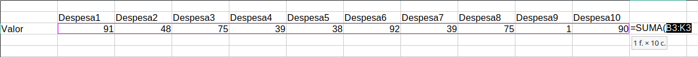

---
# Front matter
# Metainformació del document
title: Estratègies per a l'ús del full de càlcul
titlepage: true
subtitle: Mòdul II
author: 
- Alfredo Rafael Vicente Boix
lang: ca

# portada
titlepage-rule-height: 2
titlepage-rule-color: AA0000
titlepage-text-color: AA0000
titlepage-background: ../portades/U2.png

# configuració de l'índex
toc-own-page: true
toc-title: Continguts
toc-depth: 2

# capçalera i peu
header-left: \thetitle
header-right: Curs 2023-2024
footer-left: CEFIRE València
footer-right: \thepage/\pageref{LastPage}

# Les figures que apareguen on les definim i centrades
float-placement-figure: H
caption-justification: centering 

# No volem numerar les linies de codi
listings-disable-line-numbers: true

# Configuracions dels paquets de latex
header-includes:

  #  imatges i subfigures
  - \usepackage{graphicx}
  - \usepackage{subfigure}
  - \usepackage{lastpage}

  #  - \usepackage{adjustbox}
  # marca d'aigua
  #- \usepackage{draftwatermark}
 # - \SetWatermarkText{\includegraphics{./img/Markdown.png}}
  #- \SetWatermarkText{Per revisar}
  #- \SetWatermarkScale{.5}
  #- \SetWatermarkAngle{20}
   
  # caixes d'avisos 
  - \usepackage{awesomebox}

  # text en columnes
  - \usepackage{multicol}
  - \setlength{\columnseprule}{1pt}
  - \setlength{\columnsep}{1em}

  # pàgines apaïsades
  - \usepackage{pdflscape}
  
  # per a permetre pandoc dins de blocs Latex
  - \newcommand{\hideFromPandoc}[1]{#1}
  - \hideFromPandoc {
      \let\Begin\begin
      \let\End\end
    }
 
# definició de les caixes d'avis
pandoc-latex-environment:
  noteblock: [note]
  tipblock: [tip]
  warningblock: [warning]
  cautionblock: [caution]
  importantblock: [important]
...

<!-- 
FÓRMULAS BÁSICAS + * / %
SUMAR
DIFERENCIES ENTRE TEXT I FORMULA

ÚS DE FÓRMULES 

AUTOEMPLENAR

REFERENCIAS ANSOLUTAS Y RELATIVAS
eL SIGNO $

CONTAR.SI
SI
si.error

OPERACIONS AMB DATES 

=HOY()
=DIA()
=DIASEMANA()

EXEMPLE PRÀCTIC 

Els errors en calc

 -->

# Introducció

En aquesta unitat anem a entrar a utilitzar l'ús de les fórmules, aquestes fórmules les utilitzarem a través de l'assistent de Libreoffice que ens ajudarà a fer les fórmules de manera correcta. Una vegada ja tinguem certa pràctica les fórmules les podrem escriure directament sense fer ús de l'asssitent.

# Fórmules

Com hem vist per a poder utilitzar les fórmules als fulls de càlcul hem de posar davant de la celda el signe =, existeixen moltíssimes fórmules als fulls de càlcul i es poden programar

## Operadors fonamentals

Operadors fonamentals en fulls de càlcul:

- **Sumar (+):** Utilitzat per a agregar el valor de dues o més cel·les. Per exemple, `=A1+A2` sumaria els valors de les cel·les A1 i A2.
- **Restar (-):** Emprat per a calcular la diferència entre dues cel·les. `=A1-A2` restaria el valor de la cel·la A2 del valor de la cel·la A1.
- **Multiplicar (*):** Serveix per a obtenir el producte de dos números. `=A1*A2` multiplicaria els valors de les cel·les A1 i A2.
- **Dividir (/):** Utilitzat per a dividir el valor d'una cel·la entre un altre. `=A1/A2` dividiria el valor de la cel·la A1 entre el valor de la cel·la A2.
- **Percentatge (%):** Permet calcular el percentatge d'un valor. `=A1*10%` calcularia el 10% del valor de la cel·la A1.
- **Exponenciació (^):** Aixeca un número a la potència d'un altre. `=A1^2` elevaria el valor de la cel·la A1 al quadrat.
- **Radical (√):** S'utilitza per a calcular l'arrel quadrada d'un valor. `=SQRT(A1)` retornaria l'arrel quadrada del valor de la cel·la A1.

Totes aquestes fórmules es poden anar convinant entre elles utilitzant els paréntesi de manera que podríem fer `=(A1+A2)*5` on es faria primer la suma i després es multiplicaria per 5.

## Operadors amb rang

Operar amb els operadors fonamentals ens limita molt la nostra capacitat d'ús, per això és millor utilitzar fórmules. De manera que si volguésim sumar moltes cel·les d'una fila seria molt llarg fer-ho d'una en una, per això es poden utilitzar fórmules que utilitzen tot un rang. Així per exemple si volem sumar totes les cel·les desde A1 a A10 podem fer ús de la fórmula **SUMA(A1:A10)**:

:::note
Per a seleccionar el rang podem fer ús del ratolí i seleccionar les cel·les que volem, automàticament ens apreixerà el rang que volem.
:::

### Altres operadors esencials

* **PROMEDIO**: Aquesta fórmula retorna el valor mitjà aritmètic de les cel·les que passes com a paràmetre. Exemple: =PROMEDIO(A2:B2).
* **MAX** i **MIN**: Aquestes fórmules retornen el valor màxim i mínim respectivament d’un conjunt de cel·les. Exemple: =MAX(A2:C8) o =MIN(A2,B4,C3,29).

:::tip
Fica't en la fórmula MAX i MIN, normalment quasi totes les fórmules de càlcul permeten bé introduïr un rang o diferents cel·les separades per a una coma. El que no pots fer és utiltizar dos rangs separats per una coma.
:::

## Asssistent per a fórmules

Quan anem a utilitzar fórmules és interessant fer ús de l'assistent ja que sempre ens anirà donant indicacions de si una fórmula és correcta o no. Al següent gràfic tens un esquema ràpid de com seria fer ús de l'asssitent de fórmules.

## Operadors condicionals

A l'exemple anterior hem vist un operador condicional. Els més comuns són els següents:

- **CONTAR.SI**: Aquesta funció compta el nombre de cel·les que compleixen un criteri específic. Per exemple, `=CONTAR.SI(A2:A5;\"APTE\")` compta el nombre de cel·les que contenen la paraula "APTE" en el rang A2:A5.
- **SI**: Aquesta funció realitza una comparació lògica entre un valor i el resultat esperat. Té dos resultats possibles: el primer si la comparació és veritable i el segon si la comparació és falsa. Suposa que vols assignar una qualificació a un estudiant basada en la seva nota. Si la nota (en la cel·la B2) és superior o igual a 5, l’estudiant aprova. Si no, suspèn. La fórmula seria: =SI(B2>=5; "Aprova"; "Suspèn"). La primera opció Normalment sol ser una comparativa lògica que done com a resultat vertades o fals, per això s'utilitzen els operadors:

  * \> Major
  * < Menor
  * = Igual
  * Combinació de dos >= Major o igual

- **SI.ERROR**: Aquesta funció retorna un valor especificat si una fórmula s'avalua com a error; en cas contrari, retorna el resultat de la fórmula. Per exemple =SI.ERROR(A2/B2; "Error en la divisió"), podria donar-se quan B2 per exemple és 0.

# Autoemplenar

L’opció Autoemplenar és una funció que permet estalviar temps en realitzar tasques repetitives. Amb aquesta funció, pots copiar valors, realitzar sèries, copiar fórmules, entre altres, simplement arrossegant el ratolí.

# Referències absolutes i relatives $

# Operacions amb dates