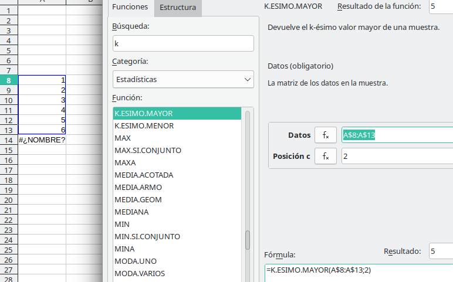
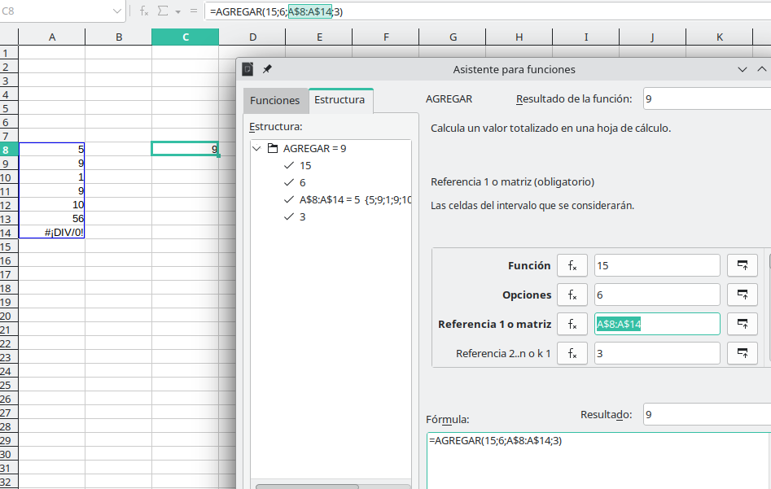
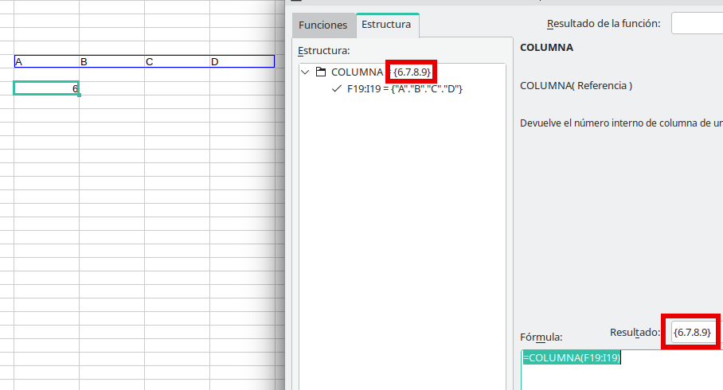

---
# Front matter
# Metainformació del document
title: Estratègies per a l'ús del full de càlcul
titlepage: true
subtitle: Treballant amb el full de càlcul, relacions
author: 
- Alfredo Rafael Vicente Boix
lang: ca
page-background: img/bg.png

# portada
titlepage-rule-height: 2
titlepage-rule-color: AA0000
titlepage-text-color: AA0000
titlepage-background: ../portades/U3.png

# configuració de l'índex
toc-own-page: true
toc-title: Continguts
toc-depth: 2

# capçalera i peu
header-left: \thetitle
header-right: Curs 2023-2024
footer-left: CEFIRE València
footer-right: \thepage/\pageref{LastPage}

# Les figures que apareguen on les definim i centrades
float-placement-figure: H
caption-justification: centering 

# No volem numerar les linies de codi
listings-disable-line-numbers: true

# Configuracions dels paquets de latex
header-includes:

  #  imatges i subfigures
  - \usepackage{graphicx}
  - \usepackage{subfigure}
  - \usepackage{lastpage}


  #  - \usepackage{adjustbox}
  # mar| ca d'aigua   #- \usepackage{draftwatermark}
 # - \SetWatermarkText{\includegraphics{./img/Markdown.png}}
  #- \SetWatermarkText{Per revisar}
  #- \SetWatermarkScale{.5}
  #- \SetWatermarkAngle{20}
   
  # caixes d'avisos 
  - \usepackage{awesomebox}

  # text en columnes
  - \usepackage{multicol}
  - \setlength{\columnseprule}{1pt}
  - \setlength{\columnsep}{1em}

  # pàgines apaïsades
  - \usepackage{pdflscape}
  
  # per a permetre pandoc dins de blocs Latex
  - \newcommand{\hideFromPandoc}[1]{#1}
  - \hideFromPandoc {
      \let\Begin\begin
      \let\End\end
    }
 
# definició de les caixes d'avis
pandoc-latex-environment:
  noteblock: [note]
  tipblock: [tip]
  warningblock: [warning]
  cautionblock: [caution]
  importantblock: [important]
...

\vspace*{\fill}

{ height=50px }

Aquest document està subjecte a una llicència creative commons que permet la seua difusió i ús comercial reconeixent sempre l'autoria del seu creador. Aquest document es troba per a ser modificat al següent repositori de github:
<!-- CANVIAR L'ENLLAÇ -->
[https://github.com/arvicenteboix/fulldecalcul](https://github.com/arvicenteboix/fulldecalcul)
\newpage


# INTRODUCCIÓ

Aquesta unitat serà breu però en aquest cas anem a seguir utilitzant funcions i veurem com poder traure relacions coincidents entre diferents rangs. Probablement aquesta siga la unitat més compelxa de totes ja que anem a utilitzar funcions d'una manera bastant avançada. Però no vos preocupeu que a la tasca vos demanarem exactament el que hem fet ací.

Anem a partir del full en el qual estem treballant, aquest full ens està realcionant criteris d'avaluació amb competències específiques (no vos estem demanant que seguiu la normativa, insistim que sempre podeu adaptar les entregues a la vostra realitat).

Així, una de les coses que anem a veure en aquest cas, és... Què passa si tenim més d'un criteri d'avaluació que es repetix en diferents situacions d'aprenentatge? Volem tindre una llista on estiguen totes les qualificacions reflectides. Pues és precisament això el que anem a veure en aquest mòdul. Per això parlem de relacions, anema relacionar dades entre elles.

# Introducció teòrica

És possible que no entengueu el que anem a parlar en aquest apartat, però és important que tingueu clar el concepte. Clar tenir clars els conceptes teòrics del que estem fem, si apliquem la fórmula suma per exemple, és perquè sabem que els valors que estem sumant han de sumar-se.

## Buscar coincidències

En el nostre cas imaginem-nos que tenim el següent full amb un criteri d'avaluació (CA 1.1)   ue es repetix diverses vegades, hauríem de buscar el valor que té eixa qualificació i posar tots els valors seguits en una línia.

{ width=70% }

I com farem eixa búsqueda? Comparem dos files, en primer lloc afegirem el número de columna al rang on tenim tots els criteris, per exemple:

| Línia criteris | CA 1.1 | CA 1.2 | CA 2.1 | CA 2.4 | CA 1.5 | CA 1.1 | CA 1.2 | CA 1.1 | CA 2.2 | CA 2.3 | CA 1.4 | CA 1.7 |
| -- | - | - | - | - | - | - | - | - | - | - | - | - | - |
| Criteri+nº columna | CA 1.11 | CA 1.22 | CA 2.13 | CA 2.44 | CA 1.55 | CA 1.16 | CA 1.27 | CA 1.18 | CA 2.29 | CA 2.310 | CA 1.411 | CA 1.712 |

:::info
Fixem-nos que el que estem fent és sumar a la celda de cada criteri el número de columna on està.
:::

I, per altra banda afegirem al criteri que estem buscant (CA 1.1) també el número de columna:

| Criteri | CA 1.1 |  CA 1.1 | CA 1.1 | CA 1.1 | CA 1.1 | CA 1.1 | CA 1.1 | CA 1.1 | CA 1.1 | CA 1.1 | CA 1.1 | CA 1.1 |
| -- | - | - | - | - | - | - | - | - | - | - | - | - | - |
| Criteri+nº columna | CA 1.11 | CA 1.12 | CA 1.13 | CA 1.14 | CA 1.15 | CA 1.16 | CA 1.17 | CA 1.18 | CA 1.19 | CA 1.110 | CA 1.111 | CA 1.112 |

:::info
Fixem-nos que el que estem fent és sumar a cada criteri el número de columna on està i ho repetim 12 vegades.
:::

Si comparem ambdós:

| **CA 1.11** | CA 1.22 | CA 2.13 | CA 2.44 | CA 1.55 | **CA 1.16** | CA 1.27 | **CA 1.18** | CA 2.29 | CA 2.310 | CA 1.411 | CA 1.712 |
| - | - | - | - | - | - | - | - | - | - | - | - | - |
| **CA 1.11** | CA 1.12 | CA 1.13 | CA 1.14 | CA 1.15 | **CA 1.16** | CA 1.17 | **CA 1.18** | CA 1.19 | CA 1.110 | CA 1.111 | CA 1.112 |

Podem veure que els valors coincidents són els valors que es repetixen. En aquest cas tenim que la columna 1, 6 i 8 contenen els criteris d'avaluació que es repetixen.

:::warning
Hi han moltes maneres d'extraure els valors, aquesta és només una d'exemple. El raonament s'ha seguit basant-se en les fórmules que es coneixen. Cal pensar que existeixen al voltant de 400 fórmules en qualsevol full de càlcul.
:::

## Implementació al full de càlcul

Les fórmules que anem a introduir per a aconseguir aquest propòsit són les següents:

Aquí tens una breu explicació de les fórmules que has demanat:

1. **K.ENESIMO.MENOR**: Aquesta funció retorna el k-èsim valor més petit d'un conjunt de dades. La seva sintaxi és `K.ENESIMO.MENOR (matriu;k)`, on `matriu` és l'array o rang de dades numèriques del qual vols determinar el k-èsim valor més petit, i `k` és la posició, dins de l'array o rang de dades, dels dades que es retornaran, determinada a partir dels valors més petits.

2. **K.ENESIMO.MAYOR**: Aquesta funció retorna el k-èsim valor més gran d'un conjunt de dades. La seva sintaxi és `K.ENESIMO.MAYOR (matriu;k)`, on `matriu` és l'array o rang de dades del qual vols determinar el k-èsim valor més gran, i `k` és la posició (a partir del valor més gran), dins de l'array o rang de cel·les, de les dades que es retornaran.

3. **AGREGAR**: Aquesta funció retorna un agregat en una llista o base de dades. Pot aplicar diferents funcions d'agregació a la llista o base de dades, amb l'opció d'ometre les files ocultes i els valors d'error. La seva sintaxi és `AGREGAR (núm_funció; opcions; ref1; [ref2]; …)` per a la forma de referència, i `AGREGAR (núm_funció, opcions, matriu, [k])` per a la forma matricial.

4. **\&**: Encara que no es tracte d'un funció pròpiament dita, aquesta expressió ens serveix per a concatenar valors. Per exemple, si tenim els següents valors:

```
A1: "Hola"
A2: 5
A3: =A1\&A2
```
El resultat de A3 serà Hola5.

Bé aquestes són totes les definicions dels manuals, però anem a analitzar cadascuna d'elles amb un exemple:

### K.ENESIMO.MENOR i K.ENESIMO.MAYOR

En el següents exemples podem extraure el segon valor més xicotet del següent llistat, o el segon valor més gran.

{ width=70% }


{ width=70% }

Podem afegir la fórmula SI.ERROR per a que ens done un altre valor en cas que demanem algun valor que no està a la llista:

{ width=70% }

Si el llistat que agafem té una cel·la amb error ens tornarà un error.

#### AGREGAR

La funció `AGREGAR` a Excel és una funció auxiliar que ens ajuda a implementar altres funcions d'Excel com són `PROMEDIO`, `SUMAR` ,`CONTAR`, `K.ENESIMO.MENOR` y mayor, etc... però fent que aquestes funcions no prenguin en compte els errors.


Per exemple, si tens el següent rang de cel·les a la columna A i la funció `CONTAR` fent un recompte de les cel·les que conformen el rang:

```
A1: 1
A2: 2
A3: DIV/0
A4: 4
A5: 5
```

Si ocultes la fila 4, la funció `CONTAR` seguirà retornant com a resultat el valor 5. No obstant això, si vols que la funció `CONTAR` no prengui en compte les cel·les ocultes, llavors pots utilitzar la funció `AGREGAR` i executar la funció `CONTAR` sense considerar la fila oculta:

```excel
=AGREGAR(2;5;A1:A5)
```

En aquest cas, la funció `AGREGAR` està executant la funció `CONTAR` (que es representa amb el número 2 en el primer argument de la funció `AGREGAR`) sobre el rang A1:A5, però està ignorant les cel·les ocultes (que es representa amb el número 5 en el segon argument de la funció `AGREGAR`). Com a resultat, la funció `AGREGAR` retornarà el valor 4, ja que està comptant només les cel·les visibles.

Recordem que la funció AGREGAR té la següent estructura: `AGREGAR (núm_funció; opcions; ref1; [ref2]; …)`. Cal conèixer les taules de les funcions que pot utilitzar la funció agregar ja que cada funció ve representada per un número (nú,_funció). Així tenim que la fórmula `AGREGAR` pot utilitzar les següents funcions[^1],

[^1]: https://help.libreoffice.org/7.0/es/text/scalc/01/func_aggregate.html?DbPAR=CALC#bm_id126123001625791

| Núm_funció | Funció |
| --- | --- |
| 1 | PROMEDIO |
| 2 | CONTAR |
| 3 | CONTARA |
| 4 | MAX |
| 5 | MIN |
| 6 | PRODUCTO |
| 7 | DESVEST.M |
| 8 | DESVEST.P |
| 9 | SUMA |
| 10 | VAR.M |
| 11 | VAR.P |
| 12 | MEDIANA |
| 13 | MODA.UNO |
| 14 | **K.ESIMO.MAYOR** |
| 15 | **K.ESIMO.MENOR** |
| 16 | PERCENTIL.INC |
| 17 | CUARTIL.INC |
| 18 | PERCENTIL.EXC |
| 19 | CUARTIL.EXC |

I aquí tenim les opcions que podem utilitzar:

| Opció | Comportament |
| --- | --- |
| 0 o omitit | Omet funcions AGREGAR i SUBTOTALES anidades |
| 1 | Omet files ocultes i funcions AGREGAR i SUBTOTALES anidades |
| 2 | Omet valors d'error i funcions AGREGAR i SUBTOTALES anidades |
| 3 | Omet files ocultes, valors d'error i funcions AGREGAR i SUBTOTALES anidades |
| 4 | No omet res |
| 5 | Omet files ocultes |
| 6 | Omet valors d'error |
| 7 | Omet files ocultes i valors d'error |

Per tant nosaltres anem a centrar-nos en la fórmula K.ESIMO.MENOR, que correspon al número 15, y volem que els valors que agafem (aquells que corresponen a ref1), s'omitixquen els valors no vàlids. En el següent exemple tindríem el mateix que tenim amb el valor K.ESIMO.MENOR, pero hem agafat l'opció 6, per tant el valor no vàlid no el tindrà en compte:

{ width=70% }

### COINCIDIR

Recordem que COLUMNA ens tornava el número on es trobava una cel·la, si passem un rang, ens tornarà un llistat de números on es troba cada cel·la:

{ width=70% }

Ací podem veure que ens torna {6.7.8.9} que són les posicions de les columnes, el resultat que ens mostra al full de càlcul és el 6 que és el primer número del llistat.

En aquest cas veurem que COINCIDIR en realitat no ens torna un valor, sino un llistat de números. 

{ width=70% }

Recordem que la formulació de és COINCIDIR("Criteri de búsqueda","Matriu de búsqueda", 0 per a valor exacte), en aquest cas tenim els següents valors:

* Criteri de búsqueda: $M$5\&COLUMNA($A2:$L2) unim el valor "CA 1.1" als números de les columnes
* Matriu de búsqueda: $A2:$L2\&COLUMNA($A2:$L2) unim el valor dels criteris CA 1.1	CA 1.2	CA 2.1... als número de les columnes:

Tenint aquests resultats:

| Criteri de búsqueda | **CA 1.11** | CA 1.22 | CA 2.13 | CA 2.44 | CA 1.55 | **CA 1.16** | CA 1.27 | **CA 1.18** | CA 2.29 | CA 2.310 | CA 1.411 | CA 1.712 |
| ---- | - | - | - | - | - | - | - | - | - | - | - | - | - |
| Matriu de búsqueda | **CA 1.11** | CA 1.12 | CA 1.13 | CA 1.14 | CA 1.15 | **CA 1.16** | CA 1.17 | **CA 1.18** | CA 1.19 | CA 1.110 | CA 1.111 | CA 1.112 |

A la imatge podem veure que el resultat de COINCIDIR és: {**1**.#N/D.#N/D.#N/D.#N/D.**6**.#N/D.**8**.#N/D.#N/D.#N/D.#N/D}, que el resultat de la comparació de les dos llistes anteriors, els valors que coincideixen deixen el número de columna i els que no coincideixen ens sur **#N/D** qeu significa NO DISPONIBLE.

# Full de càlcul 

Ara anem a posar-ho tot junt, però per a simplificar la nostra comprensió, hem decidit donar noms als rangs. Així partirem del següent full de càlcul amb els següents noms:

{ width=70% }

:::caution
Sempre és recomanable anar poc a poc. En fórmules llargues sempre hi ha alguna cosa susceptible d'error, per això cal tindre fulls intermedis fins que ja tens el teu full complet.
:::

## K.ESIMO.MENOR

En primer lloc tractarem de traure el següent llistat:

{ width=70% }

Per a tal fi utilitzarem la següent fórmula:

```excel
=K.ESIMO.MENOR(COINCIDIR(E8\&COLUMNA(CRITERIS)-2;CRITERIS\&COLUMNA(CRITERIS)-2;0);1)
```

Fixeu-vos que tenim un -2 tant al Criteri com a la matriu de búsqueda. Això és perquè el nostre rang comença en a tercera columna, i volem ajustar-ho per a tindre el llistat amb de COLUMNA amb {1.2.3.4...}. Recordem que el 0 és per a valor exacte i el 1 del final es per a traure el primer número més xicotet.

{ width=70% }

:::note
Hem triat K.ESIMO.MENOR enlloc de K.ESIMO.MAYOR, per a ordenar de menor a major. Si escollirem K.ESIMO.MAYOR ordenaríem de major a menor, o siga de l'última columna on apareix el Criteri a la primera.
:::

## AGREGAR

Canviant la fórmula d'abans a AGREGAR, recordem que K.ESIMO.MENOR és la fórmula 15 i li afegim l'opció 6, que es que no tinga en compte els valors no vàlids, per tant ens quedaria una fórmula:

```
=AGREGAR(15;6;COINCIDIR(E8\&COLUMNA(CRITERIS)-2;CRITERIS\&COLUMNA(CRITERIS)-2;0);1)
```

Podem veure el resultat ací:

{ width=70% }

Si anàrem canviant l'últim valor per 2 o 3, podríem veure com van canviant els valors al que està en segon lloc i al que està en tercer.

## Ajustos finals

Una de les coses que volem aconseguir és que al desplaçar la fórmula aquesta agafe tots els valors que tenim. Per tant, tindríem que anar canviant el valor del que parlàvem abans per a que vaja pujant automàticament. Això ho podem fer seleccionant una del·la `A1` per exemple i utilitzar la fórmula COLUMNA, de manera que al desplaçar la cel·la A1 passarà a A2 i així successivament, de manera que ens retornarà 1,2,3, etc...

:::tip
Si agafes A1, tracta que estiga buida, busca sempre una línia que no puga posar-te problemes, les cel·les unificades poden donar problemes.
:::

{ width=70% }

Així la fórmula quedaría de la següent manera:

```excel
=AGREGAR(15;6;COINCIDIR($E8\&COLUMNA(CRITERIS)-2;CRITERIS\&COLUMNA(CRITERIS)-2;0);COLUMNA(A1))
```

Finalment només ens caldria afegir SI.ERROR per a que el valor que ens donara fos més "humà".


