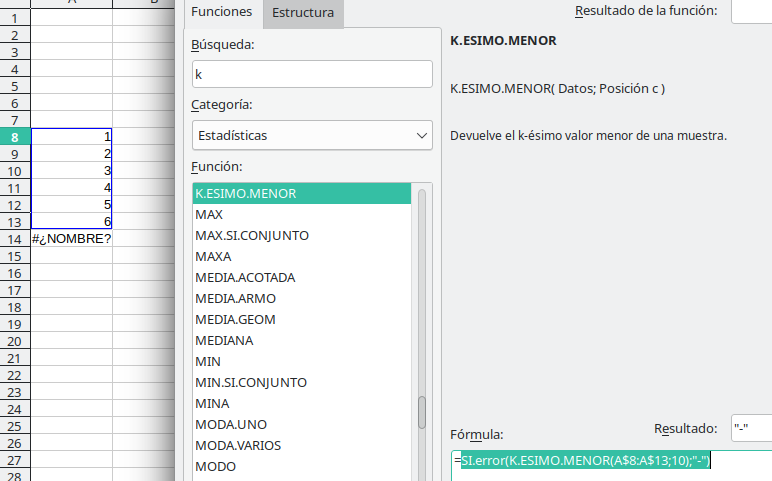
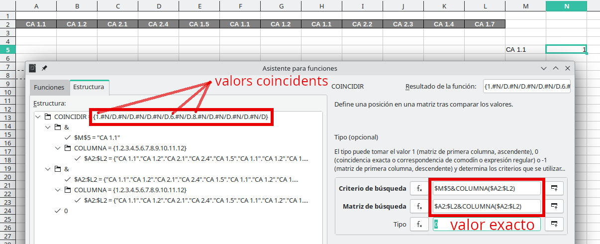
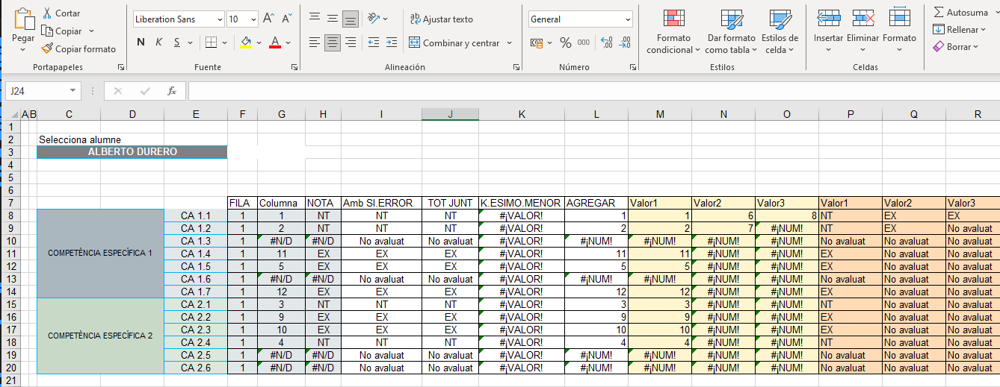
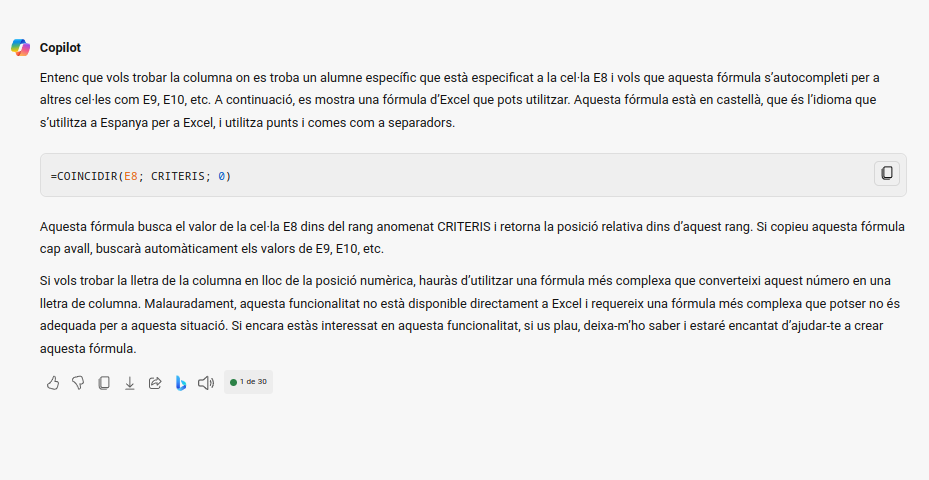
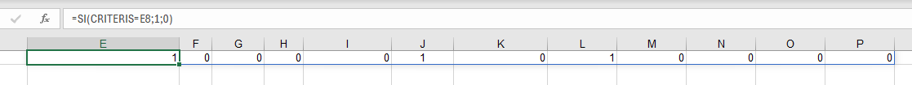

---
# Front matter
# Metainformació del document
title: Estrategias para el uso de la hoja de cálculo
titlepage: true
subtitle: Trabajando con la hoja de cálculo, relaciones
author: 
- Alfredo Rafael Vicente Boix
lang: ca
page-background: img/bg.png

# portada
titlepage-rule-height: 2
titlepage-rule-color: AA0000
titlepage-text-color: AA0000
titlepage-background: ../portades/U3.png

# configuració de l'índex
toc-own-page: true
toc-title: Continguts
toc-depth: 2

# capçalera i peu
header-left: \thetitle
header-right: Curs 2023-2024
footer-left: CEFIRE València
footer-right: \thepage/\pageref{LastPage}

# Les figures que apareguen on les definim i centrades
float-placement-figure: H
caption-justification: centering 

# No volem numerar les linies de codi
listings-disable-line-numbers: true

# Configuracions dels paquets de latex
header-includes:

  #  imatges i subfigures
  - \usepackage{graphicx}
  - \usepackage{subfigure}
  - \usepackage{lastpage}


  #  - \usepackage{adjustbox}
  # mar| ca d'aigua   #- \usepackage{draftwatermark}
 # - \SetWatermarkText{\includegraphics{./img/Markdown.png}}
  #- \SetWatermarkText{Per revisar}
  #- \SetWatermarkScale{.5}
  #- \SetWatermarkAngle{20}
   
  # caixes d'avisos 
  - \usepackage{awesomebox}

  # text en columnes
  - \usepackage{multicol}
  - \setlength{\columnseprule}{1pt}
  - \setlength{\columnsep}{1em}

  # pàgines apaïsades
  - \usepackage{pdflscape}
  
  # per a permetre pandoc dins de blocs Latex
  - \newcommand{\hideFromPandoc}[1]{#1}
  - \hideFromPandoc {
      \let\Begin\begin
      \let\End\end
    }
 
# definició de les caixes d'avis
pandoc-latex-environment:
  noteblock: [note]
  tipblock: [tip]
  warningblock: [warning]
  cautionblock: [caution]
  importantblock: [important]
...

\vspace*{\fill}

{ height=50px }

Este documento está sujeto a una licencia creative commons que permite su difusión y uso comercial reconociendo siempre la autoría de su creador. Este documento se encuentra para ser modificado en el siguiente repositorio de github:
<!-- CANVIAR L'ENLLAÇ -->
[https://github.com/arvicenteboix/fulldecalcul](https://github.com/arvicenteboix/fulldecalcul)
\newpage


# INTRODUCCIÓN

En esta unidad vamos a seguir utilizando funciones y veremos cómo poder sacar relaciones coincidentes entre diferentes rangos. Probablemente esta sea la unidad más compleja de todas, ya que utilizaremos funciones de una manera bastante avanzada. Pero no os preocupéis que en la tarea os pediremos exactamente lo que hemos hecho aquí.

Partiremos de la hoja en la que estamos trabajando, esta hoja nos está relacionando criterios de evaluación con competencias específicas (no os estamos pidiendo que sigáis la normativa, insistimos que siempre podéis adaptar las entregas a vuestra realidad).

Así, una de las cosas que veremos en este caso, es... ¿Qué pasa si tenemos más de un criterio de evaluación que se repite en diferentes situaciones de aprendizaje? Queremos tener una lista donde estén todas las calificaciones reflejadas. Pues es precisamente esto lo que veremos en este módulo. Por eso hablamos de relaciones, vamos a relacionar datos entre ellos.

La unidad tiene una primera parte que nos permitirá resolver hacer la fórmula con Libreoffice Calc, podéis seguir el mismo procedimiento con Excel. Luego haremos el mismo procedimiento con ayuda de Copilot, un asistente GPT de Microsoft, donde podremos ver sus posibilidades y las limitaciones. Al mismo tiempo, introduciremos algunas de las diferencias que presenta Excel respecto a Libreoffice Calc, y en este caso con Excel puede ser más sencillo.

# Introducción teórica

Es posible que no entendáis esta introducción teórica, pero es importante que tengáis claro el concepto que vamos a tratar. Es necesario conocer los conceptos teóricos de lo que estamos haciendo, si aplicamos la fórmula suma, por ejemplo, es porque sabemos que los valores que estamos sumando deben sumarse.

## Buscar coincidencias

En nuestro caso imaginemos que tenemos la siguiente hoja con un criterio de evaluación (CA 1.1) que se repite varias veces, tendríamos que buscar el valor que tiene esa calificación y poner todos los valores seguidos en una línea.

{ width=70% }

¿Y cómo haremos esa búsqueda? Comparamos dos filas, en primer lugar añadiremos el número de columna al rango donde tenemos todos los criterios, por ejemplo:

| Línea criterios | CA 1.1 | CA 1.2 | CA 2.1 | CA 2.4 | CA 1.5 | CA 1.1 | CA 1.2 | CA 1.1 | CA 2.2 | CA 2.3 | CA 1.4 | CA 1.7 |
| -- | - | - | - | - | - | - | - | - | - | - | - | - | - |
| Criterio+nº columna | CA 1.11 | CA 1.22 | CA 2.13 | CA 2.44 | CA 1.55 | CA 1.16 | CA 1.27 | CA 1.18 | CA 2.29 | CA 2.310 | CA 1.411 | CA 1.712 |

:::info
Fijémonos que lo que estamos haciendo es añadir a la celda de cada criterio el número de columna donde está.
:::

Y, por otro lado añadiremos al criterio que estamos buscando (CA 1.1) también el número de columna:

| Criterio | CA 1.1 |  CA 1.1 | CA 1.1 | CA 1.1 | CA 1.1 | CA 1.1 | CA 1.1 | CA 1.1 | CA 1.1 | CA 1.1 | CA 1.1 | CA 1.1 |
| -- | - | - | - | - | - | - | - | - | - | - | - | - | - |
| Criterio+nº columna | CA 1.11 | CA 1.12 | CA 1.13 | CA 1.14 | CA 1.15 | CA 1.16 | CA 1.17 | CA 1.18 | CA 1.19 | CA 1.110 | CA 1.111 | CA 1.112 |

:::info
Fijémonos que lo que estamos haciendo es añadir a cada criterio el número de columna donde está y lo repetimos 12 veces.
:::

Si comparamos ambos:

| **CA 1.11** | CA 1.22 | CA 2.13 | CA 2.44 | CA 1.55 | **CA 1.16** | CA 1.27 | **CA 1.18** | CA 2.29 | CA 2.310 | CA 1.411 | CA 1.712 |
| - | - | - | - | - | - | - | - | - | - | - | - | - |
| **CA 1.11** | CA 1.12 | CA 1.13 | CA 1.14 | CA 1.15 | **CA 1.16** | CA 1.17 | **CA 1.18** | CA 1.19 | CA 1.110 | CA 1.111 | CA 1.112 |

Podemos ver que los valores coincidentes son los valores que se repiten. En este caso tenemos que la columna 1, 6 y 8 contienen los criterios de evaluación que se repiten.

:::warning
Hay muchas maneras de extraer los valores, esta es solo un ejemplo. El razonamiento se ha seguido basándose en las fórmulas que se conocen. Hay que pensar que existen alrededor de 400 fórmulas en cualquier hoja de cálculo.
:::

## Implementación en la hoja de cálculo

Las fórmulas que vamos a introducir para conseguir este propósito son las siguientes:

1. **K.ENESIMO.MENOR**: Esta función devuelve el k-ésimo valor más pequeño de un conjunto de datos. Su sintaxis es `K.ENESIMO.MENOR (matriz;k)`, donde `matriz` es el array o rango de datos numéricos del cual quieres determinar el k-ésimo valor más pequeño, y `k` es la posición, dentro del array o rango de datos, de los datos que se devolverán, determinada a partir de los valores más pequeños.

2. **K.ENESIMO.MAYOR**: Esta función devuelve el k-ésimo valor más grande de un conjunto de datos. Su sintaxis es `K.ENESIMO.MAYOR (matriz;k)`, donde `matriz` es el array o rango de datos del cual quieres determinar el k-ésimo valor más grande, y `k` es la posición (a partir del valor más grande), dentro del array o rango de celdas, de los datos que se devolverán.

3. **AGREGAR**: Esta función devuelve un agregado en una lista o base de datos. Puede aplicar diferentes funciones de agregación a la lista o base de datos, con la opción de omitir las filas ocultas y los valores de error. Su sintaxis es `AGREGAR (num_función; opciones; ref1; [ref2]; …)` para la forma de referencia, y `AGREGAR (num_función, opciones, matriz, [k])` para la forma matricial.

4. **\&**: Aunque no se trate de una función propiamente dicha, esta expresión nos sirve para concatenar valores. Por ejemplo, si tenemos los siguientes valores:

```
A1: "Hola"
A2: 5
A3: =A1\&A2
```
El resultado de A3 será Hola5.

Bueno, estas son todas las definiciones de los manuales, pero vamos a analizar cada una de ellas con un ejemplo.

### K.ENESIMO.MENOR i K.ENESIMO.MAYOR

En los siguientes ejemplos podemos extraer el segundo valor más pequeño de la siguiente lista, o el segundo valor más grande.

{ width=70% }


{ width=70% }

Podemos agregar la fórmula SI.ERROR para que nos dé otro valor en caso de que pidamos algún valor que no está en la lista:

{ width=70% }

Si la lista que tomamos tiene una celda con error nos devolverá un error.


### AGREGAR

La función `AGREGAR` en Excel es una función auxiliar que nos ayuda a implementar otras funciones de Excel como son `PROMEDIO`, `SUMAR`, `CONTAR`, `K.ENESIMO.MENOR` y mayor, etc... pero haciendo que estas funciones no tomen en cuenta los errores.

La sintaxis de la función `AGREGAR` es la siguiente: `AGREGAR (num_función; opciones; ref1; [ref2]; …)`. Es necesario conocer las tablas de las funciones que puede utilizar la función agregar ya que cada función viene representada por un número (num_función). Así tenemos que la fórmula `AGREGAR` puede utilizar las siguientes funciones[^1],

[^1]: https://help.libreoffice.org/7.0/es/text/scalc/01/func_aggregate.html?DbPAR=CALC#bm_id126123001625791

| Num_función | Función |
| --- | --- |
| 1 | PROMEDIO |
| 2 | CONTAR |
| 3 | CONTARA |
| 4 | MAX |
| 5 | MIN |
| 6 | PRODUCTO |
| 7 | DESVEST.M |
| 8 | DESVEST.P |
| 9 | SUMA |
| 10 | VAR.M |
| 11 | VAR.P |
| 12 | MEDIANA |
| 13 | MODA.UNO |
| 14 | **K.ESIMO.MAYOR** |
| 15 | **K.ESIMO.MENOR** |
| 16 | PERCENTIL.INC |
| 17 | CUARTIL.INC |
| 18 | PERCENTIL.EXC |
| 19 | CUARTIL.EXC |

Y aquí tenemos las opciones que podemos utilizar:

| Opción | Comportamiento |
| --- | --- |
| 0 o omitido | Omite funciones AGREGAR y SUBTOTALES anidadas |
| 1 | Omite filas ocultas y funciones AGREGAR y SUBTOTALES anidadas |
| 2 | Omite valores de error y funciones AGREGAR y SUBTOTALES anidadas |
| 3 | Omite filas ocultas, valores de error y funciones AGREGAR y SUBTOTALES anidadas |
| 4 | No omite nada |
| 5 | Omite filas ocultas |
| 6 | Omite valores de error |
| 7 | Omite filas ocultas y valores de error |

Por ejemplo, si tienes el siguiente rango de celdas en la columna A y la función `CONTAR` haciendo un recuento de las celdas que conforman el rango:

```excel
A1: 1
A2: 2
A3: DIV/0
A4: 4
A5: 5
```

Si ocultas la fila 4, la función `CONTAR` seguirá devolviendo como resultado el valor 5. Sin embargo, si quieres que la función `CONTAR` no tenga en cuenta las celdas ocultas, entonces puedes utilizar la función `AGREGAR` y ejecutar la función `CONTAR` sin considerar la fila oculta:

```excel
=AGREGAR(2;5;A1:A5)
```

En este caso, la función `AGREGAR` está ejecutando la función `CONTAR` (que se representa con el número 2 en el primer argumento de la función `AGREGAR`) sobre el rango A1:A5, pero está ignorando las celdas ocultas (que se representa con el número 5 en el segundo argumento de la función `AGREGAR`). Como resultado, la función `AGREGAR` devolverá el valor 4, ya que está contando solo las celdas visibles.

Una vez visto este ejemplo, vamos a centrarnos en la fórmula K.ESIMO.MENOR en nuestra hoja de cálculo, que corresponde al número 15. Queremos que de los valores que tomemos (aquellos que corresponden a ref1), se omitan los valores no válidos. A continuación, pasamos a ver un nuevo ejemplo. En este caso tendríamos lo mismo que tenemos con el valor K.ESIMO.MENOR, pero hemos tomado la opción 6, por lo tanto el valor no válido no lo tendrá en cuenta:

{ width=70% }

Lo veremos con más detalle en el ejemplo de la hoja de cálculo.

### COINCIDIR

Recordemos que COLUMNA nos devolvía el número donde se encontraba una celda, si pasamos un rango, nos devolverá una lista de números donde se encuentra cada celda:

{ width=70% }

Aquí podemos ver que nos devuelve {6.7.8.9} que son las posiciones de las columnas, el resultado que nos muestra en la hoja de cálculo es el 6 que es el primer número de la lista.

En este caso veremos que COINCIDIR en realidad no nos devuelve un valor, sino una lista de números. 

{ width=90% }

Recordemos que la formulación de la función es COINCIDIR("Criterio de búsqueda","Matriz de búsqueda", **0** para valor exacto), en este caso tenemos los siguientes valores:

* Criterio de búsqueda: \$M\$5\&COLUMNA($A2:$L2) unimos el valor "CA 1.1" a los números de las columnas
* Matriz de búsqueda: \$A2:\$L2\&COLUMNA($A2:$L2) unimos el valor de los criterios CA 1.1	CA 1.2	CA 2.1... a los números de las columnas:

Teniendo estos resultados:

| Criterio de búsqueda | **CA 1.11** | CA 1.22 | CA 2.13 | CA 2.44 | CA 1.55 | **CA 1.16** | CA 1.27 | **CA 1.18** | CA 2.29 | CA 2.310 | CA 1.411 | CA 1.712 |
| ---- | - | - | - | - | - | - | - | - | - | - | - | - | - |
| Matriz de búsqueda | **CA 1.11** | CA 1.12 | CA 1.13 | CA 1.14 | CA 1.15 | **CA 1.16** | CA 1.17 | **CA 1.18** | CA 1.19 | CA 1.110 | CA 1.111 | CA 1.112 |

En la imagen podemos ver que el resultado de COINCIDIR es: {**1**.#N/D.#N/D.#N/D.#N/D.**6**.#N/D.**8**.#N/D.#N/D.#N/D.#N/D}, que es el resultado de la comparación de las dos listas anteriores, los valores que coinciden dejan el número de columna y los que no coinciden nos aparece **#N/D** que significa NO DISPONIBLE.

# Hoja de cálculo 

Ahora vamos a juntarlo todo, pero para simplificar nuestra comprensión, hemos decidido dar nombres a los rangos. Así partiremos de la siguiente hoja de cálculo con los siguientes nombres:

{ width=90% }

:::caution
Siempre es recomendable ir poco a poco. En fórmulas largas siempre hay algo susceptible de error, por eso es necesario tener hojas intermedias hasta que ya tienes tu hoja completa.
:::

## K.ESIMO.MENOR

En primer lugar trataremos de obtener el siguiente listado marcado con un recuadro rojo:

{ width=90% }

Este recuadro nos lo da la unión de las dos listas de números:  

| Criterio búsqueda E8&COLUMNA(CRITERIS) |**CA 1.11** | CA 1.22 | CA 2.13 | CA 2.44 | CA 1.55 | **CA 1.16** | CA 1.27 | **CA 1.18** | CA 2.29 | CA 2.310 | CA 1.411 | CA 1.712 |
| -------- | - | - | - | - | - | - | - | - | - | - | - | - | - |
| Matriz búsqueda CRITERIS&COLUMNA(CRITERIS) | **CA 1.11** | CA 1.12 | CA 1.13 | CA 1.14 | CA 1.15 | **CA 1.16** | CA 1.17 | **CA 1.18** | CA 1.19 | CA 1.110 | CA 1.111 | CA 1.112 |

Fíjate que estamos comparando con COINCIDIR cuáles son de las dos filas los valores iguales. En este caso en 1, 6 y 8, que conseguimos con la fórmula COINCIDIR(E8&COLUMNA(CRITERIS)-2;CRITERIS&COLUMNA(CRITERIS)-2;0). K.ESIMO.MENOR nos da el menor de esos 3 valores. Para tal fin utilizaremos la siguiente fórmula:

```excel
=K.ESIMO.MENOR(COINCIDIR(E8&COLUMNA(CRITERIS)-2;CRITERIS&COLUMNA(CRITERIS)-2;0);1)
```

Fíjate que tenemos un -2 tanto en el Criterio como en la matriz de búsqueda. Esto es porque nuestro rango comienza en la tercera columna, y queremos ajustarlo para tener el listado con de COLUMNA con {1.2.3.4...}. Recordemos que el 0 en la fórmula COINCIDIR es para valor exacto y el 1 del final es para sacar el primer número más pequeño.

{ width=100% }

:::note
Hemos elegido K.ESIMO.MENOR en lugar de K.ESIMO.MAYOR, para ordenar de menor a mayor. Si eligiéramos K.ESIMO.MAYOR ordenaríamos de mayor a menor, es decir, de la última columna donde aparece el Criterio a la primera.
:::

## AGREGAR

Cambiando la fórmula anterior a AGREGAR, recordemos que K.ESIMO.MENOR es la fórmula 15 y le añadimos la opción 6, que es que no tenga en cuenta los valores no válidos, por lo tanto nos quedaría una fórmula:

```
=AGREGAR(15;6;COINCIDIR(E8&COLUMNA(CRITERIS)-2;CRITERIS&COLUMNA(CRITERIS)-2;0);1)
```

Podemos ver el resultado aquí:

{ width=70% }

Si fuéramos cambiando el último valor por 2 o 3, podríamos ver cómo van cambiando los valores en el segundo y tercer lugar.

## Ajustes finales

Una de las cosas que queremos lograr es que al desplazar la fórmula, esta tome todos los valores que tenemos. Por lo tanto, tendríamos que ir cambiando el valor del que hablábamos antes para que vaya aumentando automáticamente. Esto lo podemos hacer seleccionando una celda `A1` por ejemplo y utilizar la fórmula COLUMNA, de manera que al desplazar la celda A1 pasará a A2 y así sucesivamente, de manera que nos retornará 1,2,3, etc...

:::tip
Si eliges A1, asegúrate de que esté vacía, busca siempre una línea que no pueda causarte problemas como las celdas unificadas.
:::

{ width=80% }

Así, la fórmula quedaría de la siguiente manera:

```excel
=AGREGAR(15;6;COINCIDIR($E8&COLUMNA(CRITERIS)-2;CRITERIS&COLUMNA(CRITERIS)-2;0);COLUMNA(A1))
```

Finalmente, solo necesitaríamos agregar SI.ERROR para que el valor que nos diera en caso de error fuera más legible.

# Excel

En esta sección vamos a hablar del mismo procedimiento pero con Excel. LibreOffice Calc es totalmente compatible con Excel, pero no al revés. Excel presenta algunas diferencias en la forma de abordar las fórmulas.

En este apartado seguiremos el mismo procedimiento que hemos seguido antes, crearnos una hoja intermedia para una fórmula tan grande. Pero introduciremos el uso de la inteligencia artificial. En este caso utilizaremos Copilot, ya que, y es una apreciación personal, es la que mejor funciona para programar.

## Copilot

Microsoft Copilot es un asistente de inteligencia artificial que proporciona respuestas de uso general, además integra la tecnología Wall-e para crear imágenes. Podemos acceder a este asistente desde la siguiente página: [https://copilot.microsoft.com/](https://copilot.microsoft.com/). Para aquellos que no estén familiarizados con este tipo de tecnologías, deben saber que las preguntas que se le plantean a un asistente como puede ser Copilot o ChatGPT se llaman **prompts**. Nosotros los representaremos con el siguiente icono:

\awesomebox[violet]{2pt}{\faRobot}{violet}{Lorem ipsum…}

Debemos tener en cuenta que las respuestas que dan las IA suelen ser traducciones en inglés, y el Excel en EEUU tiene dos características que no tenemos en España:

* Las fórmulas, obviamente, están en inglés.
* Estas normalmente se separan por ",". En España las separamos por ";".

## Nuestra página intermedia 

Partimos de la siguiente página pero iremos creando un prompt para cada paso, veremos que las fórmulas más sencillas las sacará perfectamente, las otras no. Eso sí, crear prompts para extraer la fórmula es todo un arte y hay que ser muy claros con lo que se pide.

{ width=80% }

:::warning
El prompt original lo hemos hecho en valenciano, por eso las imágenes estan con el prompt en valenciano. En castellano el resultado es el mismo.
:::

## FILA

Partimos del siguiente prompt:

\awesomebox[violet]{2pt}{\faRobot}{violet}{Tenemos una hoja de cálculo con Excel con un rango llamado ALUMNES, en el rango se encuentran todos en una fila. En la celda C3 que debe ser referencia absoluta tenemos un desplegable con todos los nombres de los alumnos. Hazme una fórmula que me diga en qué fila se encuentra el alumno seleccionado en C3. El Excel que estamos utilizando está en España, por lo tanto las fórmulas deben ser en castellano y separadas por puntos y coma en lugar de por comas.}

La respuesta:

{ width=80% }

Respuesta prácticamente igual a la que teníamos.

:::warning
Aunque le hemos pedido que sea una referencia absoluta, no nos ha dado la referencia absoluta a $C$3, por lo tanto tenemos que revisar la fórmula para corregir estas cosas.
:::

## COLUMNA

\awesomebox[violet]{2pt}{\faRobot}{violet}{Tenemos una hoja de cálculo con Excel con un rango llamado CRITERIS, en el rango se encuentran todos en una columna. En la celda E8 tenemos el nombre que buscamos. Hazme una fórmula que me diga en qué columna se encuentra el alumno seleccionado en E8. Esta fórmula queremos que se autocomplete hacia abajo de manera que busque los criterios en E9, E10, etc... El Excel que estamos utilizando está en España, por lo tanto las fórmulas deben ser en castellano y separadas por puntos y coma en lugar de por comas.}

La respuesta:

{ width=80% }

## NOTA y SI.ERROR

Pasamos directamente a la columna con SI.ERROR.

\awesomebox[violet]{2pt}{\faRobot}{violet}{Tenemos una hoja de cálculo con Excel con una celda en F8 donde se encuentra el número de FILA que quiero extraer y la celda G8 con el número de columna que quiero extraer de un rango llamado NOTES. Hazme una fórmula que me extraiga el valor del rango dadas esta fila y esta columna. Si devuelve un error quiero que aparezca el mensaje "No evaluado". El Excel que estamos utilizando está en España, por lo tanto las fórmulas deben ser en castellano y separadas por puntos y coma en lugar de por comas.}

La respuesta:

{ width=80% }

# TODO JUNTO

\awesomebox[violet]{2pt}{\faRobot}{violet}{Tenemos una hoja de cálculo donde tenemos un rango llamado ALUMNES que va de B4:B13, y un rango llamado CRITERIS que va de C3:N3, dentro de estos rangos, concretamente en C4:N13 tenemos un rango llamado NOTES. Crea una fórmula que me extraiga el valor de NOTES dado un Alumno que se encontrará en la celda \$C\$3 y buscará en el rango ALUMNES y un valor de Criterio que se encontrará en la celda E8 y buscará en el rango CRITERIS. SI el resultado que nos da es erróneo quiero que aparezca el mensaje "No evaluado". El Excel que estamos utilizando está en España, por lo tanto las fórmulas deben ser en castellano y separadas por puntos y coma en lugar de por comas.}

La respuesta:

{ width=80% }

:::info
Hasta ahora todo ha ido muy bien y los resultados son bastante exactos a lo que íbamos buscando. Pero hay que tener cuidado ya que se ha colado un INDEX en la fórmula, podemos continuar la conversación y pedir que nos haga la fórmula con todas las funciones en castellano. O meternos y cambiarlo nosotros.
:::

:::tip
Desde un principio habéis visto que hemos dado un nombre a los rangos, esto hace que nos resulte más sencillo interpretar las fórmulas que nos está dando, no es lo mismo leer ALUMNES que $'Alumnos'.B4:B10. Nos simplifica mucho la tarea de interpretar.
:::

# AGREGAR

Aquí es donde termina el potencial de los asistentes GPT. El razonamiento que hemos hecho en la introducción teórica es demasiado complejo para una IA, tal vez invirtiendo más tiempo podríamos conseguir sacar la fórmula. Lo que hemos tratado de hacer es lo siguiente:

\awesomebox[violet]{2pt}{\faRobot}{violet}{Tenemos una hoja de cálculo donde tenemos un rango llamado ALUMNES que va de B4:B13, y un rango llamado CRITERIS que va de C3:N3, dentro de estos rangos, concretamente en C4:N13 tenemos un rango llamado NOTES donde están los siguientes valores EX, NT, BE, SF, IN. Crea una fórmula que me extraiga el valor de NOTES dado un Alumno que se encontrará en la celda \$C\$3 y buscará en el rango ALUMNES y un valor de Criterio que se encontrará en la celda E8 y buscará en el rango CRITERIS. Los criterios pueden estar repetidos así que quiero extraer todos los valores de NOTES, utilizando autocompletar, de manera que escribiré la fórmula en una celda que me dará el primer valor que encuentre de NOTES y al desplazar la celda para autocompletar en la segunda celda me dará el segundo valor y así sucesivamente.  SI el resultado que nos da es erróneo o ya no hay más valores quiero que aparezca el mensaje "No evaluado". El Excel que estamos utilizando está en España, por lo tanto las fórmulas deben ser en castellano y separadas por puntos y coma en lugar de por comas.}

{ width=80% }

Si analizamos la respuesta podemos ver que algunas funciones no están correctamente traducidas, por ejemplo K.ESIMO.MENOR en inglés es la fórmula SMALL que se traduce a PEQUEÑO.La fórmula correcta sería:

```
=SI.ERROR(INDICE(NOTES; K.ESIMO.MENOR(SI((ALUMNES=$C$3)*(CRITERIS=E8); FILA(NOTES)-MIN(FILA(NOTES))+1); FILA(A1))); "No evaluado")
```
Pero, aún así, no funciona. Por lo tanto, podemos seguir intentando que funcione o podemos tratar de hacerlo nosotros mismos.

## AGREGAR con Excel

Una de las ventajas que nos ofrece Excel respecto a Libreoffice Calc es que nos permite comparar un rango de valores. Por ejemplo:

{ width=90% }

No hemos autocompletado, es el resultado que nos da directamente la fórmula sobre E1, llenando todas las celdas de la derecha. De esta manera podemos ver cuáles son las columnas coincidentes, y no necesitamos hacer la comparativa que hemos hecho antes. Hay que tener cuidado de no tener celdas ocupadas delante o nos dará un error, fíjate que en F1 hemos puesto la palabra "Emplenem":

{ width=80% }

De esta manera podemos utilizar la fórmula AGREGAR de la siguiente manera para que nos dé la posición de los valores:

```
=AGREGAR(15;6;SI(CRITERIS=$E$8;COLUMNA(CRITERIS);FALSO());COLUMNA(A1))-2
```
:::warning
Si lo hacemos de esta manera y abrimos esta hoja de cálculo con Libreoffice Calc, no interpretará correctamente la fórmula y no nos dará el valor.
:::

Recordemos:

* **15**: Función K.ESIMO.MENOR
* **6**: Elimina los valores no válidos
* **SI(CRITERIS=\$E\$8;COLUMNA(CRITERIS);FALSO())**: Aquí tenemos el rango que pasamos a K.ESIMO.MENOR. Observemos que tomamos los criterios
  * **CRITERIS=\$E\$8** -> {1	0	0	0	0	1	0	1	0	0	0	0}
  * **COLUMNA(CRITERIS)** -> Si es cierto, o sea 1, devolverá el valor de la columna, por lo tanto tendremos: {1	0	0	0	0	6	0	8	0	0	0	0}
  * **FALSO()** -> Si es falso devolverá el valor FALSO, por lo tanto: {1	FALSO	FALSO	FALSO	FALSO	6	FALSO	8	FALSO	FALSO	FALSO	FALSO}
* Recordemos que el valor 6 nos extrae los valores no válidos, por lo tanto tenemos: {1 6 8}
* **COLUMNA(A1)**: Recordemos que lo hacemos para conseguir el valor 1º, 2º y 3º, ya que al desplazar para hacer el autocompletado, COLUMNA(A1) es 1, COLUMNA(A2) es 2, etc...
* **-2**, es para ajustar ya que el rango CRITERIS comienza en la 3ª columna.

De esta manera ya tenemos las posiciones donde se encuentran los criterios. La fórmula final quedaría:

```
=SI.ERROR(INDICE(NOTES;COINCIDIR($C$3;ALUMNES;0);AGREGAR(15;6;SI(CRITERIS=$E8;COLUMNA(CRITERIS);FALSO());COLUMNA(A1))-2);"No avaluat")
```

Fíjate que de la matriz NOTES, conseguimos la fila con la siguiente fórmula:

```
COINCIDIR($C$3;ALUMNES;0)
```
La columna es la fórmula que acabamos de extraer:

```
AGREGAR(15;6;SI(CRITERIS=$E8;COLUMNA(CRITERIS);FALSO());COLUMNA(A1))-2)
```

:::tip
En este caso podemos escalar todo lo que queramos nuestra página, solo necesitamos cambiar los rangos a los que hemos dado los nombres. Otro de los motivos por los cuales es importante dar nombre a los rangos.
:::

# Conclusiones

Este es el módulo más complejo ya que estamos concatenando fórmulas que es una de las principales ventajas de utilizar hojas de cálculo, los próximos módulos son mucho más sencillos y vamos a pasar a otro ejemplo, vamos a preparar el presupuesto para una excursión, pero es necesario tener claras algunas estrategias para buscar igualdades. Podemos confiar en que el asistente Copilot nos ayude en algunas tareas, pero las más complejas no. Hemos visto que Excel presenta algunas diferencias respecto a Libreoffice, ambas soluciones son válidas, pero es necesario tenerlo en cuenta cuando trabajamos con ambos simultáneamente.
