---
# Front matter
# Metainformació del document
title: Estratègies per a l'ús del full de càlcul
titlepage: true
subtitle: "Mòdul V: Estratègies ambal tre programari" 
author: 
- Alfredo Rafael Vicente Boix
lang: ca

# portada
titlepage-rule-height: 2
titlepage-rule-color: AA0000
titlepage-text-color: AA0000
titlepage-background: ../portades/U2.png

# configuració de l'índex
toc-own-page: true
toc-title: Continguts
toc-depth: 2

# capçalera i peu
header-left: \thetitle
header-right: Curs 2023-2024
footer-left: CEFIRE València
footer-right: \thepage/\pageref{LastPage}

# Les figures que apareguen on les definim i centrades
float-placement-figure: H
caption-justification: centering 

# No volem numerar les linies de codi
listings-disable-line-numbers: true

# Configuracions dels paquets de latex
header-includes:

  #  imatges i subfigures
  - \usepackage{graphicx}
  - \usepackage{subfigure}
  - \usepackage{lastpage}


  #  - \usepackage{adjustbox}
  # marca d'aigua
  #- \usepackage{draftwatermark}
 # - \SetWatermarkText{\includegraphics{./img/Markdown.png}}
  #- \SetWatermarkText{Per revisar}
  #- \SetWatermarkScale{.5}
  #- \SetWatermarkAngle{20}
   
  # caixes d'avisos 
  - \usepackage{awesomebox}

  # text en columnes
  - \usepackage{multicol}
  - \setlength{\columnseprule}{1pt}
  - \setlength{\columnsep}{1em}

  # pàgines apaïsades
  - \usepackage{pdflscape}
  
  # per a permetre pandoc dins de blocs Latex
  - \newcommand{\hideFromPandoc}[1]{#1}
  - \hideFromPandoc {
      \let\Begin\begin
      \let\End\end
    }
 
# definició de les caixes d'avis
pandoc-latex-environment:
  noteblock: [note]
  tipblock: [tip]
  warningblock: [warning]
  cautionblock: [caution]
  importantblock: [important]
...

\vspace*{\fill}

{ height=50px }

Este document està subjecte a una llicència Creative Commons que permet la seua difusió i ús comercial reconeixent sempre l'autoria del seu creador. Aquest document es troba per a ser modificat al següent repositori de github:
<!-- CANVIAR L'ENLLAÇ -->
[https://github.com/arvicenteboix/fulldecalcul](https://github.com/arvicenteboix/fulldecalcul)
\newpage


# INTRODUCCIÓ

Les macros als fulls de càlcul són operacions que podem realitzar de manera automatitzada. En aquest mòdul veurem com realitzar operacions molt senzilles amb macros però que ens poden donar resultats molt vistosos. Tot i així podem dir que vs pot resultar extremadament complicada esta unitat, però la tasca que anem a demanar-vos tindrà una part molt senzilla per a ser APTA, al menys utilitzat el gravador de macros. Però paga la pena esforçar-se i intentar traure el màxim possible. 

Les macros poden estar escrites en diferents llenguatges de programació, LibreOffice Basic, BeanShell, JavaScript i Python, nosaltres ens centrarem en aquest primer ja que té un mode de compatibilitat amb Excel. Les macros no sempre són compatibles entre Excel i Libreoffice Calc i moltes vegades quan creen una macro en un u altre sistema sempre tindrem que retocar-la.

Així mateix també veurem com crear *dialogs*[^1] per a dotar de major usabilitat el full de càlcul. Principalment per a aquelles persones que no són usuàries de fulls de càlcul i fer-lo més amigable.

Partirem de l'exemple que teníem en el mòdul d'abans i anirem explicant poc a poc a través d'exemples, això sí... Aneu a escriure codi, poc, però les macros al final són línies de codi. Aquest mòdul vos facilitarà les ferramentes bàsiques per a crear macros i a partir d'ahí podeu complicar les coses tot el que vullgueu, penseu que es tracta d'uns conceptes molt bàsics.

[^1]: Un diàleg en programació és una finestra que mostra informació a l’usuari o sol·licita una entrada d’usuari. Aquesta eina facilita la interacció entre l’usuari i el sistema o aplicació.

# Organitzant Macros i diàlegs

Entendre el gestionament de les macros en Libreoffice Calc és poc intuïtiu, per a poder accedir a les macros qeu tenim al sistema anem al menú de *Herramientas*  i tenim varies opcions:

* Ejecutar macros: Si volem executar una macro.
* Editar macro: Si volem editar alguna de les macros ja creades. Ací és on anirem normalment.
* Organitzar macros: Si volem crear una macro nova o eliminar-la, hem d'anar sempre a esta opció.
* Organitzar diàlegs: per a crear finestres (diàlegs).

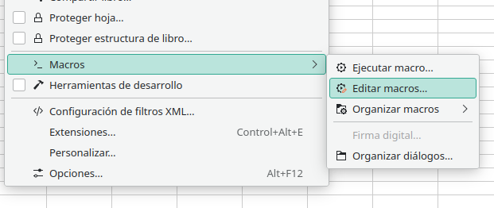{ width=60% }

Si anem a editar macros podem veure que ens apareix un menú a l'esquerre on estan totes les nostres macros. Fixem-nos que tenim classificades les macros en:

* Mis macros y diálogos: Estes macros són les que tenim al sistema, o siga, al nostre Libreoffice calc.
* Macros y diálogos de la aplicación: vos recomane que no toqueu esta part.
* Sin título 1: és el nom del nostre full de càlcul. Ací es guarden les macros que es troben en el nostre full de càlcul. Si anem a passar este full a altres persones per a que utilitzen els macros, les deure posar ací.

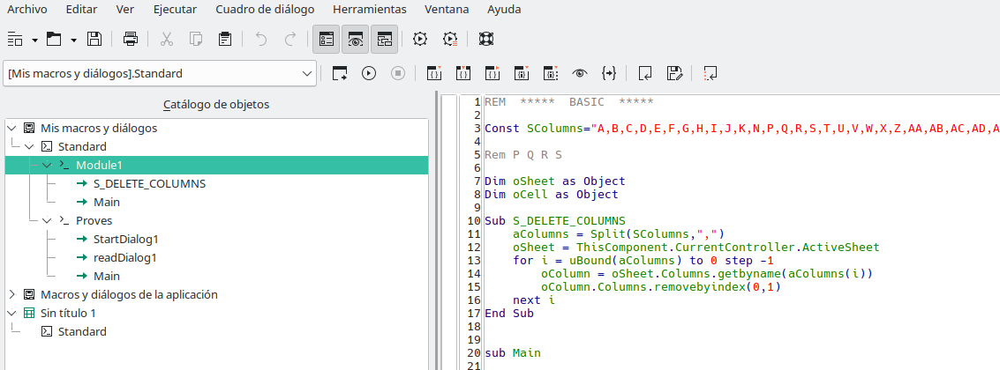{ width=60% }

Per a crear una macro podem anar a Organitzat macros en el menú de Herramientas > Macros. O si ja estem dins de la finestra editar. Podem anar ací:

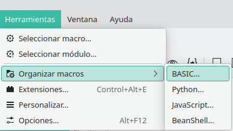{ width=60% }

:::caution
Recordeu qeu nosaltres anem a treballar amb BASIC. Per tant hem d'escollir l'opció BASIC.
:::

Ací podem editar directament, eliminar o executar.

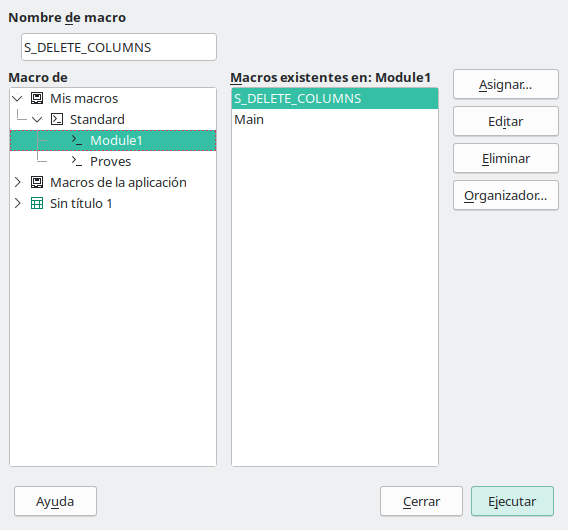{ width=60% }

Si seleccionem Standard dins del nostre full de càlcul (*Sin título 1*), podem crear-nos una macro.

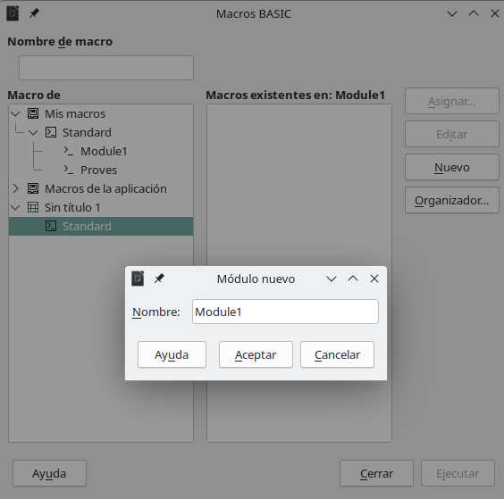{ width=60% }

Ens creem una macro molt senzilla:

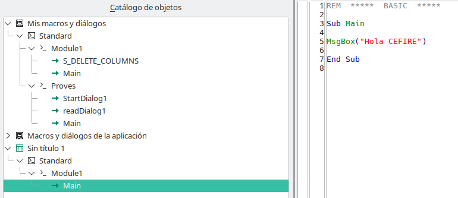{ width=60% }

:::info
El comandament MsgBox, el que fa és obrir una finestra mostrant un missatge.
:::

Si volem executar la macro anirem a Ejecutar macro:

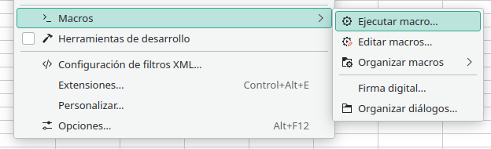{ width=60% }

I li diem quina macro volem executar:

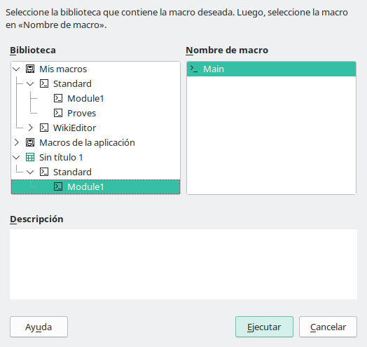{ width=60% }

I podem veure el resultat:

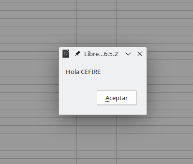{ width=60% }


<!-- **Habilitar macros** -->

# Gravador de macros

Una de les opcions més senzilles per a crear macros és utilitzar el gravador de macros, que no és més que repetir una sèrie d'accions que gravarem, este accions podem ser editar uan cel·la i afegir una fórmula o un text, llevar columnes o línies, etc...

:::warning
Sembla senzill, però no sempre es pot fer tot i, de vegades, hem de recórrer a afegir alguna cosa que necessitem escriure i no sempre va a ser possible. És més complexe del que pareix. Moltes vegades han d'acabar utilitzant codi perquè no trobes la manera de fer el que realment tens pensat. Tot i això, moltes vegades pot ser útil i et pot estalviar molta feina i simplificar l'ús del teu full.
:::

## Habilitar gravador de macros

Les macros venen deshabilitades per defecte en Libreoffice Calc, per a habilitar-les hem d'anar al menú d'opcions (Herramientas > Opciones):

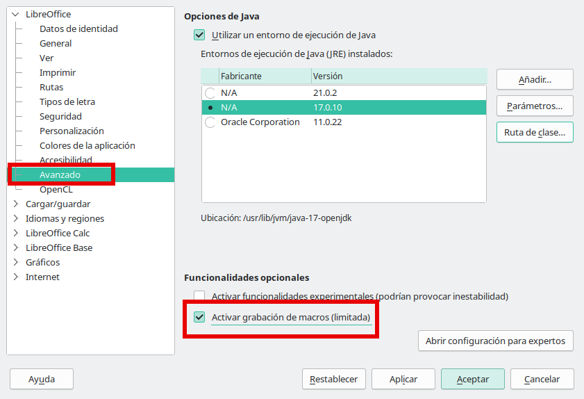{ width=60% }

Ata si anem al menú macros ja ens apareixerà en el menú "gravar macro".

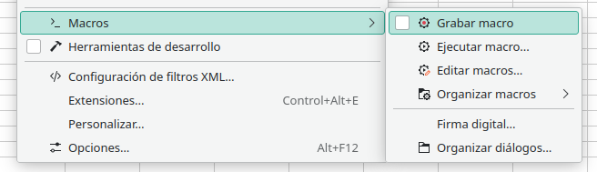{ width=60% }

## Exemple d'ús

Anem a partir del full que hem utilitzat en el mòdul anterior al qual li hem afegit el recuadre marcat en roig:

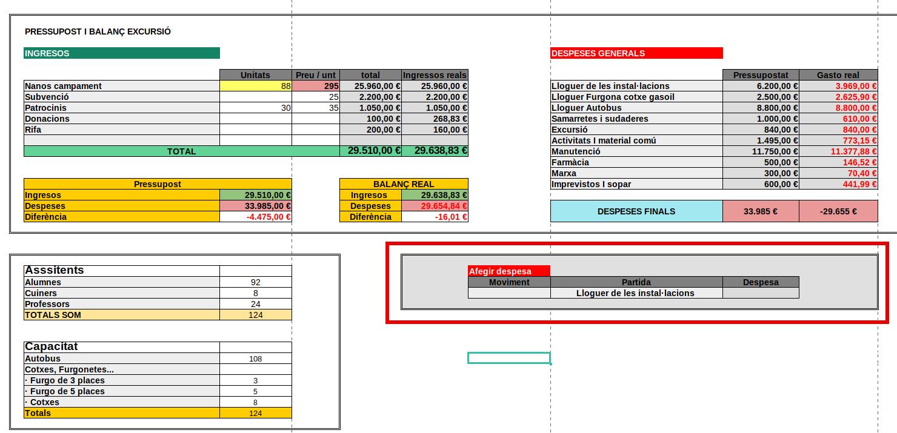

Anem a tractar d'afegir els valors que anem posant al full de factures, i ens ho faja tot automàticament sense necessitat d'anar al full de factures. Hem de pensar detingudament tot el que anem a realitzar, no sempre el resultat esperat ens eixirà a la primera.

1. Comencem el gravador de macros i ens apareixerà esta finestram polsarem el botó *finalizar macro* quan acabem de fer totes les accions:

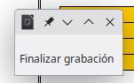{ width=60% }

2. Copiem la línia

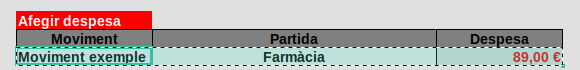{ width=60% }

3. Insertem una fila.

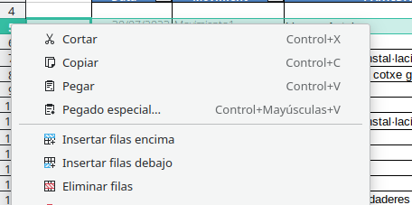{ width=40% }

:::caution
Com que estem gravant una macro hem de posar una línia nova sempre en el mateix lloc, es bona estratègia anar afegint línies al principi i no al final, ja que no hi ha manera de gravar que estàs en l'última línia, ja que la gravadora de macros no entén que és l'última sinó la número X.
:::

4. Peguem

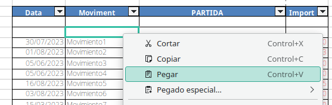{ width=60% }

5. Tornem a la full on estàvem i borrem el valor que ha afegit.

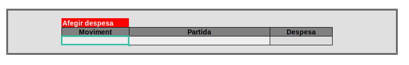{ width=60% }


:::caution
Una de les limitacions que tindríem en este cas será el de utilitzar dates, ja que, encara que li diguem que ens escriga la data actual (Ctrl+,), la gravadora no ho detecta.
:::

6. Finalment anem a executar macro i podem veure com es realitzem totes les accions.

# Botons de formularis

Una de les coses que podem pensar és que bastant incòmode afegir


# La meua primera macro


# Macros.


## Nocions bàsiques

## Sub

```
Sub

End Sub
```


## MsgBox()

## Variables (Dim)

## Comentaris (REM)

## If Then

## For Next


## Functions


### Amb Argument

```
Function TestMax(x, y)
  If x >= y Then
    TestMax = x
    Else
    TestMax = y
  End If
End Function
```

## Objectes

* **ThisComponent**
  - .getSheets() o .Sheets 
    - .getByIndex(INDEX_FULL)
    - .getByName(NOM_FULL)
    - .getCount()


Podríem tindre el nostre full:

```
el_nostre_full = ThisComponent.getSheets().getByIndex(0)
```
* **el_nostre_full**
  - .getCellByPosition(0, 0)
  - .getCellRangeByName(NOM_CEL·LA_O_RANG)
    - .setValue(VALOR_A_DONAR)
    - .setFormula("=A1+A2")
    - .getValue()
    - .getString()
    - .getFormula()


## Copilot al rescat


# Utilitzant macros. Ús dels dialogs.


```
Sub StartDialog1()
    BasicLibraries.LoadLibrary("Tools")
    oDialog1 = LoadDialog("Standard", "Dialog1")
    oDialog1.Execute()
End Sub
```

oDialog1.GetControl("TextField1")


# Estratègies