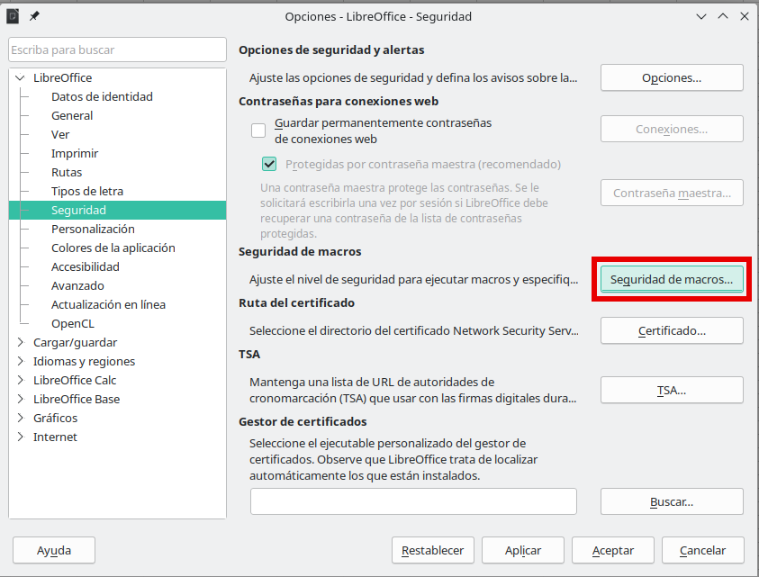
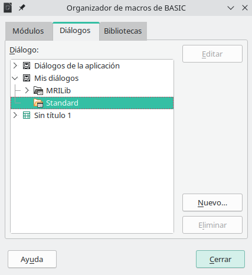
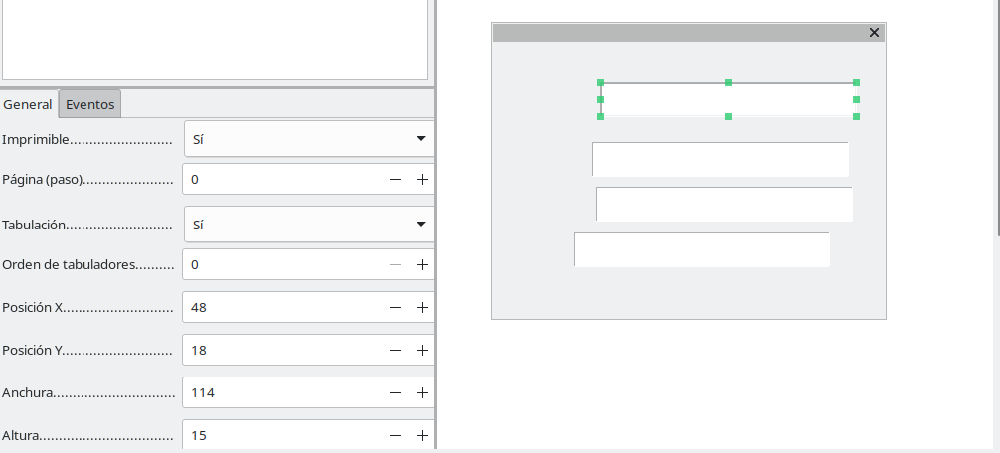

---
# Front matter
# Metainformació del document
title: Estratègies per a l'ús del full de càlcul
titlepage: true
subtitle: "Mòdul V: Introducció a Macros. Gravador de macros" 
author: 
- Alfredo Rafael Vicente Boix
lang: ca

# portada
titlepage-rule-height: 2
titlepage-rule-color: AA0000
titlepage-text-color: AA0000
titlepage-background: ../portades/U2.png

# configuració de l'índex
toc-own-page: true
toc-title: Continguts
toc-depth: 2

# capçalera i peu
header-left: \thetitle
header-right: Curs 2023-2024
footer-left: CEFIRE València
footer-right: \thepage/\pageref{LastPage}

# Les figures que apareguen on les definim i centrades
float-placement-figure: H
caption-justification: centering 

# No volem numerar les linies de codi
listings-disable-line-numbers: true
print-highlight-style: true
# Configuracions dels paquets de latex
header-includes:

  #  imatges i subfigures
  - \usepackage{graphicx}
  - \usepackage{subfigure}
  - \usepackage{lastpage}


  #  - \usepackage{adjustbox}
  # marca d'aigua
  #- \usepackage{draftwatermark}
 # - \SetWatermarkText{\includegraphics{./img/Markdown.png}}
  #- \SetWatermarkText{Per revisar}
  #- \SetWatermarkScale{.5}
  #- \SetWatermarkAngle{20}
   
  # caixes d'avisos 
  - \usepackage{awesomebox}

  # text en columnes
  - \usepackage{multicol}
  - \setlength{\columnseprule}{1pt}
  - \setlength{\columnsep}{1em}

  # pàgines apaïsades
  - \usepackage{pdflscape}
  
  # per a permetre pandoc dins de blocs Latex
  - \newcommand{\hideFromPandoc}[1]{#1}
  - \hideFromPandoc {
      \let\Begin\begin
      \let\End\end
    }
 
# definició de les caixes d'avis
pandoc-latex-environment:
  noteblock: [note]
  tipblock: [tip]
  warningblock: [warning]
  cautionblock: [caution]
  importantblock: [important]
...

\vspace*{\fill}

{ height=50px }

Este document està subjecte a una llicència Creative Commons que permet la seua difusió i ús comercial reconeixent sempre l'autoria del seu creador. Aquest document es troba per a ser modificat al següent repositori de github:
<!-- CANVIAR L'ENLLAÇ -->
[https://github.com/arvicenteboix/fulldecalcul](https://github.com/arvicenteboix/fulldecalcul)
\newpage


# INTRODUCCIÓ

Les macros als fulls de càlcul són operacions que podem realitzar de manera automatitzada. En aquest mòdul veurem com realitzar operacions molt senzilles amb macros, però que ens poden donar resultats molt vistosos. Tot i així, podem dir que pot resultar-vos extremadament complicada esta unitat, però la tasca que anem a demanar-vos tindrà una part molt senzilla per a ser APTA, al menys utilitzat el gravador de macros. Però paga la pena esforçar-se i intentar traure el màxim possible. 

Les macros poden estar escrites en diferents llenguatges de programació, LibreOffice Basic, BeanShell, JavaScript i Python, nosaltres ens centrarem en aquest primer ja que té un mode de compatibilitat amb Excel. Les macros no sempre són compatibles entre Excel i Libreoffice Calc i moltes vegades quan creem una macro en un u altre sistema tindrem que retocar-la.

Així mateix també veurem com crear *dialogs*[^1] per a dotar de major usabilitat el full de càlcul. Principalment per a aquelles persones que no són usuàries de fulls de càlcul i fer-lo més amigable.

Partirem de l'exemple que teníem en el mòdul d'abans i anirem explicant poc a poc a través d'exemples, això sí... Aneu a escriure codi, poc, però les macros al final són línies de codi. Aquest mòdul vos facilitarà les ferramentes bàsiques per a crear macros i a partir d'ahí podeu complicar les coses tot el que vullgueu, penseu que es tracta d'uns conceptes molt bàsics.

[^1]: Un diàleg en programació és una finestra que mostra informació a l’usuari o sol·licita una entrada d’usuari. Aquesta eina facilita la interacció entre l’usuari i el sistema o aplicació.

# Organitzant Macros i diàlegs

Entendre la gestió de les macros en Libreoffice Calc és poc intuïtiu, per a poder accedir a les macros que tenim al sistema anem al menú de *Herramientas*  i tenim varies opcions:

* Ejecutar macros: Si volem executar una macro.
* Editar macro: Si volem editar alguna de les macros ja creades. Ací és on anirem normalment.
* Organitzar macros: Si volem crear una macro nova o eliminar-la, hem d'anar sempre a esta opció.
* Organitzar diàlegs: per a crear finestres (diàlegs).

{ width=60% }

Si anem a editar macros podem veure que ens apareix un menú a l'esquerre on estan totes les nostres macros. Fixem-nos que tenim classificades les macros en:

* Mis macros y diálogos: Estes macros són les que tenim al sistema, es a dir, al nostre Libreoffice calc.
* Macros y diálogos de la aplicación: vos recomane que no toqueu esta part.
* Sin título 1: és el nom del nostre full de càlcul. Ací es guarden les macros que es troben en el nostre full de càlcul. Si anem a passar este full a altres persones per a que utilitzen els macros, les hem de posar ací.

{ width=60% }

Per a crear una macro podem anar a Organitzat macros en el menú de Herramientas > Macros. O si ja estem dins de la finestra editar. Podem anar ací:

{ width=60% }

:::caution
Recordeu qeu nosaltres anem a treballar amb BASIC. Per tant hem d'escollir l'opció BASIC.
:::

Ací podem editar directament, eliminar o executar.

{ width=50% }

Si seleccionem Standard dins del nostre full de càlcul (*Sin título 1*), podem crear-nos una macro.

{ width=60% }

Ens creem una macro molt senzilla:

{ width=50% }

:::info
El comandament MsgBox, el que fa és obrir una finestra mostrant un missatge.
:::

Si volem executar la macro anirem a Ejecutar macro:

{ width=60% }

I li diem quina macro volem executar:

{ width=50% }

I podem veure el resultat:

{ width=40% }


<!-- **Habilitar macros** -->

# Gravador de macros

Una de les opcions més senzilles per a crear macros és utilitzar el gravador de macros, que no és més que repetir una sèrie d'accions que gravarem, este accions podem ser editar una cel·la i afegir una fórmula o un text, llevar columnes o línies, etc...

:::warning
Tot i semblar senzill, no sempre és possible realitzar totes les accions mitjançant el gravador de macros. En ocasions, haurem de recórrer a escriure codi per aconseguir l'efecte desitjat. És més complex del que sembla a primera vista. Malgrat això, sovint pot ser una eina útil que ens estalvia temps i simplifica l'ús del full de càlcul.
:::

## Habilitar gravador de macros

Les macros venen deshabilitades per defecte en Libreoffice Calc, per a habilitar-les hem d'anar al menú d'opcions (Herramientas > Opciones):

{ width=60% }

Ata si anem al menú macros ja ens apareixerà en el menú "gravar macro".

{ width=60% }

## Exemple d'ús

Anem a partir del full que hem utilitzat en el mòdul anterior al qual li hem afegit el recuadre marcat en roig:


Anem a tractar d'afegir els valors que anem posant al full de factures, i ens ho faja tot automàticament sense necessitat d'anar al full de factures. Hem de pensar detingudament tot el que anem a realitzar, no sempre el resultat esperat ens eixirà a la primera.

1. Comencem el gravador de macros i ens apareixerà esta finestram polsarem el botó *finalizar macro* quan acabem de fer totes les accions:

{ width=20% }

2. Insertem una fila.

{ width=40% }

:::caution
Com que estem gravant una macro hem de posar una línia nova sempre en el mateix lloc, es bona estratègia anar afegint línies al principi i no al final, ja que no hi ha manera de gravar que estàs en l'última línia, ja que la gravadora de macros no entén que és l'última sinó la número X.
:::

3. Copiem cel·la per cel·la

{ width=60% }

:::warning
En Libreoffice Calc si selecciones un rang i l'enganxes no funciona. Has de fer el procediment de copiar i enganxar per a cada Cel·la. De manera que si volem copiar i enganxar les 3 cel·les has de copiar i enganxar 3 vegades. 
:::

4. Enganxem cel·la per cel·la

{ width=60% }

5. Tornem a la full on estàvem i borrem el valor que hem afegit.

{ width=60% }


:::caution
Una de les limitacions que tindríem en este cas será el de utilitzar dates o el fet de copiar i enganxar una línia, ja que, encara que li diguem que ens escriga la data actual (Ctrl+,), la gravadora no ho detecta. Pero podries posar altre camp amb la data de la factura.
:::

6. Finalment anem a *executar macro* i podem veure com es realitzem totes les accions.

# Botons de formularis

Una de les coses que podem pensar és que bastant incòmode anar cada vegada a *Executar macro* quan volem afegir una despesa. És per això que podem recòrrer a l'ús de formularis. El que farem en primer lloc és habilitar la barra de ferramentes de *Controles de formulari*. Anem a Ver > Barra de herramientas > Controles de formularios:

{ width=60% }

Ens apreixerà la següent barra de ferramentes. En esta ens hem de fixar en un botó per a Activar el mode edició, en el qual podem afegir controls, però no podem fer ús dels controls. Quan desactivem el mode edició podrem fer ús del controls, com per exemple apretar el botó que hem afegit.

{ width=40% }

Seleccionem un botó i l'afegim, però per a associar-lo a una macro en concret, com la que tenim creada, el que hem de fer és polsar el botó dret del ratolí i anar a *Propiedades de control*:

{ width=40% }

Ens apareixerà una finestra on anirem a la pestanya Eventos i polsarem el botó de *Ejecutar una acción*:

{ width=50% }

Ahí ja seleccionem la nostra macro per a que s'execute cada vegada que polsem eixe botó:

{ width=60% }

{ width=40% }

:::caution
Recorda que per a que funcione el botó has d'eixir del mode d'edició polsant:


:::

# Programant macros

Fins ara hem vist el gravador de macros, i ací acaba el curs. Si penses que ha sigut massa complicat per a tu, pots deixar la unitat ací i fer la tasca, entenem que en este punt les coses es poden complicar un poc. Però un dels veritables potencials dels fulls de càlcul és conèixer un poc l'ús de les macros. En este apartat anem a donar-vos algunes nocions bàsiques de com realitzar l'exemple anterior però sense gravar la macro. 

:::caution
Si penseu que el gravador de macros vos va a donar una idea de com fer certes accions voreu que el codi que crea el gravador és molt poc intuitiu i difícil d'entendre.
:::

## La meua primera macro

Ja hem vist com s'organitzen les macros. Anem a crear una macro que es diga modul5 on tractarem de traure el valor d'una cel·la i que, al polsar un botó, ens aparega una finestra que diga "Hola + Nom".

:::warning
Es recomanable desar les macros sempre en local. Si utilitzes macros adherides als documents has d'habilitar l'opció per a poder executar-les. Cal anar a  *Herramientas>Opciones>Libreoffice>Seguridad>Seguridad macros>Nivel de seguridad medio.

{ width=60% }
:::

Començarem anar al *Herramientas>Macros>Organizar macros>BASIC*, anirem a *Organizador*:

{ width=60% }

I li donarem a *Nuevo* per a crear un nou mòdul:

{ width=60% }

Li donem el nom de **Modul5**:

{ width=60% }

Si ara anem a *Editar macros* ja veurem el nostre mòdul creat en una funció anomenada main, si executem eixe mòdul sempre executarà eixa funció, també podem executar una funció específica dins del mòdul.

{ width=60% }

I escriurem el següent codi:

```vb
Sub Main

oFull = ThisComponent.CurrentController.ActiveSheet
oCellCadena = oFull.getCellByPosition(0,0).getString()

MsgBox("Hola "+oCellCadena)

End Sub
```
En aquest codi el que hem fet és:

* **oFull = ThisComponent.CurrentController.ActiveSheet** : assignem a la variable oFull un objecte[^2]. De manera que jo estic extraient l'objecte *ActiveSheet* de l'objecte *CurrentController* que es troba a *ThisComponent*. I el guarde dins de oCell, ara és com si cada vegada que escribira oCell escric tot el que hi havia abans.
* **oCell = oFull.getCellByPosition(0,0)** : assignem a oCellCadena el text que hi ha dins de la cel·la que es troba en 0,0. O siga la primera cel·la de totes.
* **MsgBox("Hola "+oCellCadena)** : MsgBox(TEXT) és una funció que ens permet traure una finestra amb un text, en este cas en concatenat dos cadenes: "Hola "+oCellCadena. 

[^2]: Un objecte és una entitat que guarda dins diverses funcions, diverses variables i diversos objectes. 

D'aquesta manera el resultat és:

{ width=60% }

# Nocions bàsiques de programació de macros

En aquest punt vos anem a donar uns objectes comuns que es solen utilitzar per a programar.

## Procediments

:::caution
Este apartat i el següent s'han de llegir en paral·lel, podeu llegir primer este i després variables i després tornar a llegir este.
:::

La paraula **Sub** mostra l'abertura d'un procediment. Un procediment és un codi que realitza una acció determinada. Hi ha un procediments que és el que s'executa quan executem un mòdul que és **Sub Main**, en l'exemple anterior hem posat el codi dins de Sub Main.


```vb
Sub NOM_PROCEDIMENT()

End Sub
```

Podem pasar variables al procediment posant entre parèntesis les variables que volem passar:

```vb
Sub NOM_PROCEDIMENT(var1 as Integer, var2 as Integer)
  var3 = var1+var2
End Sub
```

Si volem que ens torne un valor el procediment caldrà que li diem el resultat quin tipus de variable serà:

```vb
Sub NOM_PROCEDIMENT(var1 as Integer, var2 as Integer) as Integer
  NOM_PROCEDIMENT = var1+var2
End Sub
```

:::important
Fixem-nos que ara per a tornar un valor hem de donar a la variable NOM_PROCEDIMENT un valor i eixe serà el valor que tornarà.
:::

## Variables (Dim)

Una variable és una paraula[^3] a la qual se li assigna un valor, eixe valor pot ser:

* String: quan es tracta d'un text.
* Integer: quan es tracta d'un número.
* Object: Quan es tracta d'un objecte.
* Hi han altre tipus de variables, però ens centrarem en este 3.

### Definició de variables

Les variables poden trobar-se dins d'un procediment o són necessàries per a utilitzar-les en tot el mòdul:

* Si la utilitzem dins d'un procediment simplement donarem un nom i posarem =.
* Si volem utilitzar-la en tot el mòdul, l'hem de definir al principi amb la paraula *Dim NOM_VARIABLE As TIPUS_VARIABLE*

Per exemple:

```vb
REM Definim una variable a l'inici, per tant la podrem utilitzar on vullguem.

Dim oFull As Object

Sub Finestra()

  REM Ací tenim una variable que només podem utilitzar dins d'este procediment (aux). En canvi podem utilitzar oFull en qualsevol lloc.

  aux = oFull.getCellByPosition(0,0).getString()
  MsgBox(aux)

End Sub

Sub Main

  REM Dins del procediment Main assignem un valor que podem utilitzar en qualsevol lloc.

  oFull = ThisComponent.CurrentController.ActiveSheet
  Finestra()

End Sub
```

:::tip
Vos haureu fixa't que quan possem la paraula REM davant estem fent un caomentari sobre el que estem fent. Eixa paraula ens permet fer comentaris en el codi per  aclarir coses, o saber què s'està fent quan en un futur vullguem modificar la nostra macro.
:::

[^3]: No pots anomenar a les variables amb paraules reservades. No pots anomenar Main a una variable per exemple.

## Objectes

Tot en el llenguatge de programació BASIC són objectes. Ací anem a mostrar-vos alguns que s'utilitzen molt freqüentment

* **ThisComponent**: Es tracta del Objecte que representa el nostre full de càlcul actual, d'ací deriven tots els altres objectes
  - **.CurrentController.ActiveSheet**: Ens torna un objecte que representa el nostre full
  - **.getSheets()** o **.Sheets**:  Ens torna un objecte que representa tots els nostre fulls
    * **.getByIndex(INDEX_FULL)**: Podem agafar un full per Index, el 0 és el primer.
    * **.getByName(NOM_FULL)**: Podem fer-ho també per nom
    * **.getCount()**: O extraure el número de fulls totals que tinc al meu full de càlcul.

Podríem tindre el nostre full en el que estem treballant per a extraure valors de cel·les:

```
el_nostre_full = ThisComponent.getSheets().getByIndex(0)
```

* **el_nostre_full**
  - **.getCellByPosition(0,0)** : Trauríem un objecte tipus cel·la, que representa la nostra cel·la en la posició 0,0.
  - **.getCellRangeByName(NOM_CEL·LA_O_RANG)** : Si hem anomenat una cel·la o un rang, podem extraure'l d'ací.
    * **.setValue(VALOR_A_DONAR)** : Podríem donar un valor a la cel·la amb aquesta funció.
    * **.setFormula("=A1+A2")** : O una fórmula.
    * **.getValue()** : Podríem agafar el valor de la cel·la.
    * **.getString()** : O el text, si es un nombre enter, no ens tornarà el valor en text, caldria que utilitzarem getValue.
    * **.getFormula()** : Igualment, si és una fórmula la podem extraure amb aquesta funció.


## Copilot al rescat

Copilot sempre ens proporcionarà exemples sobre les diferents opcions. Això sí, sempre cal tenir unes nocions bàsiques sobre el que s'està preguntant:

\awesomebox[violet]{2pt}{\faRobot}{violet}{Estic realitzant una macro amb Libreoffice calc i vull extraure el valor d'una cel·la.}

{ width=80% }

# Utilitzant macros. Ús dels diàlegs

Com hem dit, un diàleg és una finestra que facilita l'interacció entre el full de càlcul i l'usuari. Anem a crear un xicotet exemple per al nostre full de càlcul del pressupost. 

Per a afegir un diàleg nou anem a *Herramientas>Macros>Organizar diálogos* i creem un nou diàleg:

{ width=40% }

I editem:

{ width=40% }

Ens apareixerà la següent finestra que podrem configurar arrastrant i soltant els elements que es troben a la barra de ferramentes a la part inferior de la pantalla.

{ width=60% }

Quan arrastrem i soltem podem veure que en la part de propietats ens apareixen les propietats de l'element:

{ width=60% }

:::tip
Vos recomanem que utiltizeu les propietats per a posar cadascun dels elements i que queden correctament disposats dins de la finestra.
:::

Arrastrant i soltant podem crear-nos la següent finestra per exemple:

{ width=60% }

:::caution
Este diàleg té 3 camps de text i l'últim és un camp numèric. El camp numèric encara que visualment semblen iguals, són diferents.
:::


Podem veure les propietats del botó que poden canviar la seua manera d'actuar, al botó Cancelar poden anar a *Tipo de botón* i dir-li que es un botó *Cancelar*.

{ width=40% }

Dins de les propietats del botó, podem anar a *Eventos* i en *Ejecutar Acción* polsem al botó del costat:

{ width=50% }

Se'ns obrirà una finestra que ens permetrà associar eixe botó a un procediment de la macro:

{ width=60% }

Finalment, obriríem el diàleg de la mateixa manera que hem associat abans un botó del formulari en el nostre full de càlcul, el codi que hem d'utilitzar per a obrir el diàleg és le següent. Sempre serà del mateixa manera, només caldrà canviar:

* Standard: Posarem el nom de la nostra macro.
* Dialog1: Posarem el nom que li donem al nostre Diàleg.

```vb
Sub StartDialog1()
    BasicLibraries.LoadLibrary("Tools")
    oDialog1 = LoadDialog("Standard", "Dialog1")
    oDialog1.Execute()
End Sub
```
## Exemple

Anem a realitzar el mateix exemple d'abans però esta vegada enlloc de posar els valors en 3 cel·les, posarem un botó que associarem al procediment, *StartDialog1*:

{ width=80% }

Crearen altre procediment que s'anomenarà readDialog1, que tenim associat al botó *Afegix* del nostre diàleg. Hem definit do procediments auxiliars per a practicar un poc:

```vb

REM Definim 2 variables globals per a poder utilitzar-les en tots els llocs
REM oDialog1 el necessitem en dos procediments, en startDialog1 i en readDialog1
REM oFullFactures l utilitzem en InsertaText, InsertaValor i definim l objecte en readDialog1

Dim oDialog1 as Object
Dim oFullFactures as Object

REM Procediment per a obrir el Diàleg

Sub StartDialog1()
    BasicLibraries.LoadLibrary("Tools")
    oDialog1 = LoadDialog("Standard", "Dialog1")
    oDialog1.Execute()
End Sub

REM Definim un procediment auxiliar on li passem 3 paràmetres, la fila i la columna on volem afegir el text i el text que volem afegir

Sub InsertaText(fila as Integer, columna as Integer, texto as String)
	
    oFullFactures.getCellByPosition(fila,columna).setString(texto)

End Sub

REM Definim un procediment auxiliar on li passem 3 paràmetres, la fila i la columna on volem afegir el valor i el valor que volem afegir

Sub InsertaValor(fila as Integer, columna as Integer, valor as Integer)

    oFullFactures.getCellByPosition(fila,columna).setValue(valor)

End Sub
 
REM En este procediment en primer lloc agafem el valor de tots els camps i els guardem en oT1, oT2, oT3 i oT4
REM DEsprés definim la nostra fulla
REM Afegim una línia en el full Facture
REM Emplenem eixa línia en inserta valor


Sub readDialog1()

    oT1 = oDialog1.GetControl("TextField1").Text
    oT2 = oDialog1.GetControl("TextField2").Text
    oT3 = oDialog1.GetControl("TextField3").Text
    oT4 = oDialog1.GetControl("NumericField1").getValue()
    
    oFullFactures = ThisComponent.getSheets().getByName("Factures")

    oFullFactures.getRows().insertByIndex(4,1)

    InsertaText(1,4, oT1)
    InsertaText(2,4,oT2)
    InsertaText(3,4,oT3)
    InsertaValor(4,4,oT4)
    
    MsgBox("Dades Introduïdes")
    
End Sub

Sub Main

End Sub
```

# Consideracions finals 

Utilitzar macros pot facilitar l'interacció amb el nostre full de càlcul i podem dotar-lo de multitud d'operacions que ens faciliten les tasques. Això sí, és necessari practicar amb ell molt. A la fi, és aprendre a programar.

Cal dir que se'ns queden algunes coses en el tinten que vos convidem a investigar pel vostre compte. Per exemple:

* Function: es tracta d'un procediment especial per a definir noves funcions en el nostre full
* Bucle For: Podem crear bucles, al full de la bibliografia teniu exemple molt aclaridors sobre com utilitzar el bucle.
* Condicional If: Igualment, podem necessitar en alguna tasca algun condicional.

Casi que caldria un curs sencer per a practica i fer una introducció com cal a l'ús dels fulls de càlculs. Ací vos hem mostrat les ferramentes  que hi ha i alguns esborranys de com utilitzar-les.

# Bibliografia

1. [Introducció a macros. Documentació Libreoffice](https://documentation.libreoffice.org/assets/Uploads/Documentation/es/CG62/PDF/CG6212-MacrosDeCalc.pdf)
