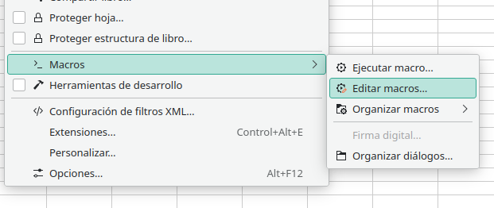
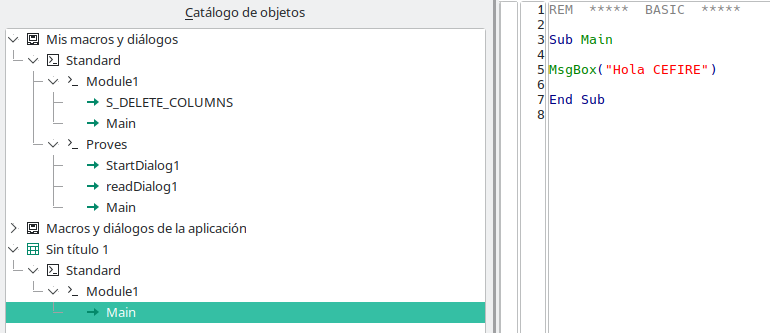
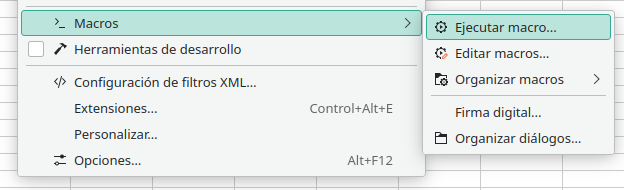
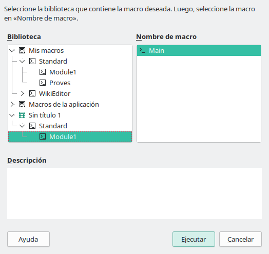
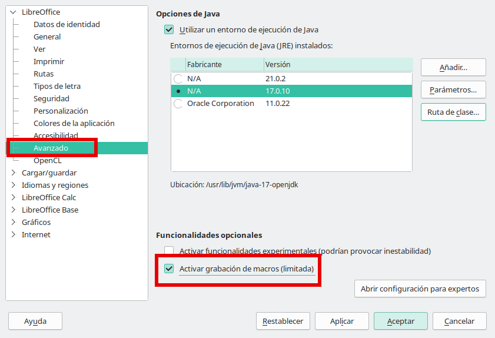
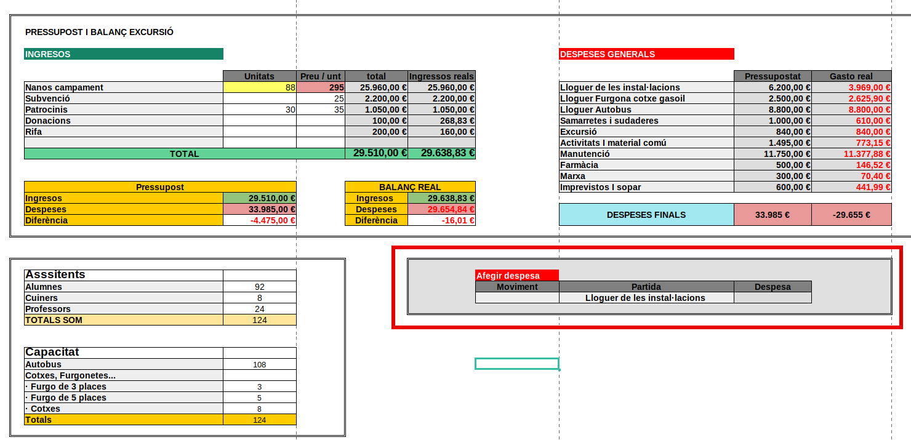
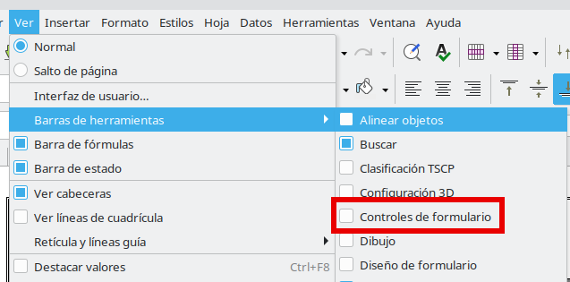
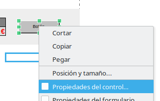
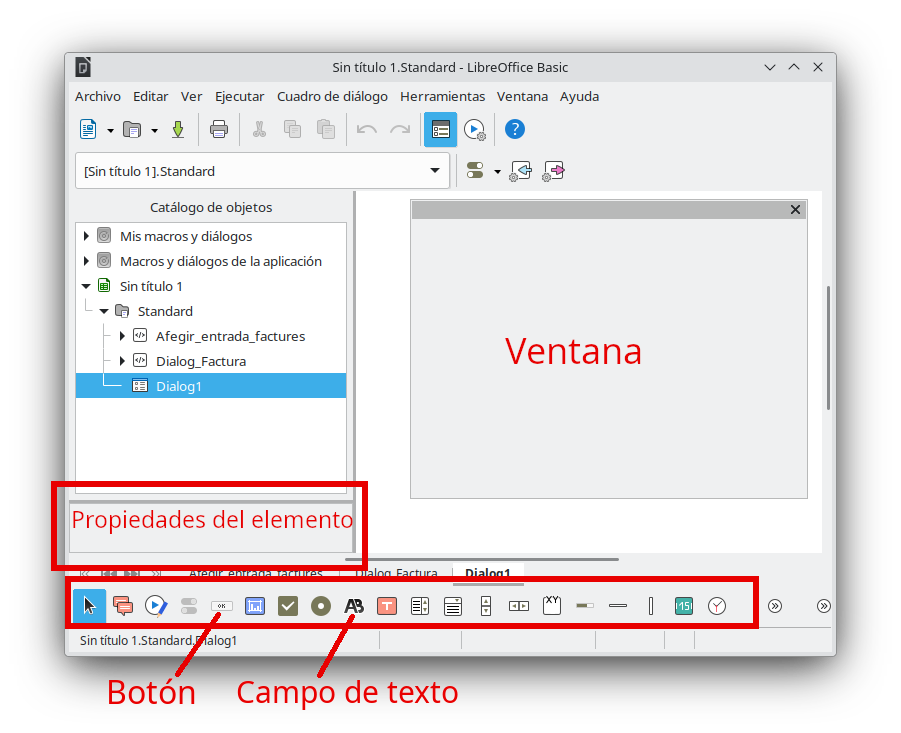
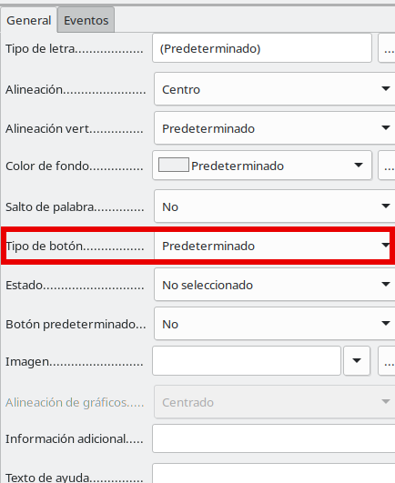

---
# Front matter
# Metainformació del document
title: Estrategias para el uso de la hoja de cálculo
titlepage: true
subtitle: "Módulo V: Introducción a Macros. Grabador de macros"
author: 
- Alfredo Rafael Vicente Boix
lang: es

# portada
titlepage-rule-height: 2
titlepage-rule-color: AA0000
titlepage-text-color: AA0000
titlepage-background: ../portades/U2.png

# configuració de l'índex
toc-own-page: true
toc-title: Continguts
toc-depth: 2

# capçalera i peu
header-left: \thetitle
header-right: Curs 2023-2024
footer-left: CEFIRE València
footer-right: \thepage/\pageref{LastPage}

# Les figures que apareguen on les definim i centrades
float-placement-figure: H
caption-justification: centering 

# No volem numerar les linies de codi
listings-disable-line-numbers: true
print-highlight-style: true
# Configuracions dels paquets de latex
header-includes:

  #  imatges i subfigures
  - \usepackage{graphicx}
  - \usepackage{subfigure}
  - \usepackage{lastpage}


  #  - \usepackage{adjustbox}
  # marca d'aigua
  #- \usepackage{draftwatermark}
 # - \SetWatermarkText{\includegraphics{./img/Markdown.png}}
  #- \SetWatermarkText{Per revisar}
  #- \SetWatermarkScale{.5}
  #- \SetWatermarkAngle{20}
   
  # caixes d'avisos 
  - \usepackage{awesomebox}

  # text en columnes
  - \usepackage{multicol}
  - \setlength{\columnseprule}{1pt}
  - \setlength{\columnsep}{1em}

  # pàgines apaïsades
  - \usepackage{pdflscape}
  
  # per a permetre pandoc dins de blocs Latex
  - \newcommand{\hideFromPandoc}[1]{#1}
  - \hideFromPandoc {
      \let\Begin\begin
      \let\End\end
    }
 
# definició de les caixes d'avis
pandoc-latex-environment:
  noteblock: [note]
  tipblock: [tip]
  warningblock: [warning]
  cautionblock: [caution]
  importantblock: [important]
...

\vspace*{\fill}

{ height=50px }

Este documento está sujeto a una licencia Creative Commons que permite su difusión y uso comercial reconociendo siempre la autoría de su creador. Este documento se encuentra para ser modificado en el siguiente repositorio de github:
<!-- CAMBIAR EL ENLACE -->
[https://github.com/arvicenteboix/fulldecalcul](https://github.com/arvicenteboix/fulldecalcul)
\newpage


# INTRODUCCIÓN

Las macros en las hojas de cálculo son operaciones que podemos realizar de manera automatizada. En este módulo veremos cómo realizar operaciones muy sencillas con macros, pero que nos pueden dar resultados muy vistosos. Sin embargo, podemos decir que puede resultar extremadamente complicada esta unidad, pero la tarea que vamos a pedirles tendrá una parte muy sencilla para ser APTA, al menos utilizando el grabador de macros. Pero vale la pena esforzarse e intentar sacar el máximo posible.

Las macros pueden estar escritas en diferentes lenguajes de programación, LibreOffice Basic, BeanShell, JavaScript y Python, nosotros nos centraremos en este primero ya que tiene un modo de compatibilidad con Excel. Las macros no siempre son compatibles entre Excel y LibreOffice Calc y muchas veces cuando creamos una macro en uno u otro sistema tendremos que retocarla.

Asimismo, también veremos cómo crear *diálogos*[^1] para dotar de mayor usabilidad a la hoja de cálculo. Principalmente para aquellas personas que no son usuarias de hojas de cálculo y hacerlo más amigable.

Partiremos del ejemplo que teníamos en el módulo anterior y iremos explicando poco a poco a través de ejemplos, eso sí... Vayan a escribir código, poco, pero las macros al final son líneas de código. Este módulo les facilitará las herramientas básicas para crear macros y a partir de ahí pueden complicar las cosas todo lo que quieran, piensen que se trata de unos conceptos muy básicos.

[^1]: Un diálogo en programación es una ventana que muestra información al usuario o solicita una entrada de usuario. Esta herramienta facilita la interacción entre el usuario y el sistema o aplicación.

# Organizando Macros y diálogos

Entender la gestión de las macros en LibreOffice Calc es poco intuitivo, para poder acceder a las macros que tenemos en el sistema vamos al menú de *Herramientas* y tenemos varias opciones:

* Ejecutar macros: Si queremos ejecutar una macro.
* Editar macro: Si queremos editar alguna de las macros ya creadas. Aquí es donde iremos normalmente.
* Organizar macros: Si queremos crear una macro nueva o eliminarla, debemos ir siempre a esta opción.
* Organizar diálogos: para crear ventanas (diálogos).

{ width=60% }

Si vamos a editar macros podemos ver que nos aparece un menú a la izquierda donde están todas nuestras macros. Fíjense que tenemos clasificadas las macros en:

* Mis macros y diálogos: Estas macros son las que tenemos en el sistema, es decir, en nuestro LibreOffice Calc.
* Macros y diálogos de la aplicación: les recomiendo que no toquen esta parte.
* Sin título 1: es el nombre de nuestra hoja de cálculo. Aquí se guardan las macros que se encuentran en nuestra hoja de cálculo. Si vamos a pasar esta hoja a otras personas para que utilicen las macros, las debemos poner aquí.

{ width=60% }

Para crear una macro podemos ir a Organizar macros en el menú de Herramientas > Macros. O si ya estamos dentro de la ventana editar. Podemos ir aquí:

{ width=60% }

:::caution
Recuerden que nosotros vamos a trabajar con BASIC. Por lo tanto debemos elegir la opción BASIC.
:::

Aquí podemos editar directamente, eliminar o ejecutar.

{ width=50% }

Si seleccionamos Standard dentro de nuestra hoja de cálculo (*Sin título 1*), podemos crearnos una macro.

{ width=60% }

Nos creamos una macro muy sencilla:

{ width=50% }

:::info
El comando MsgBox, lo que hace es abrir una ventana mostrando un mensaje.
:::

Si queremos ejecutar la macro iremos a Ejecutar macro:

{ width=60% }

Y le decimos qué macro queremos ejecutar:

{ width=50% }

Y podemos ver el resultado:

{ width=40% }


<!-- **Habilitar macros** -->

# Grabador de macros

Una de las opciones más sencillas para crear macros es utilizar el grabador de macros, que no es más que repetir una serie de acciones que grabaremos, estas acciones pueden ser editar una celda y agregar una fórmula o un texto, eliminar columnas o filas, etc...

:::warning
Aunque parezca sencillo, no siempre es posible realizar todas las acciones mediante el grabador de macros. En ocasiones, tendremos que recurrir a escribir código para conseguir el efecto deseado. Es más complejo de lo que parece a primera vista. Sin embargo, a menudo puede ser una herramienta útil que nos ahorra tiempo y simplifica el uso de la hoja de cálculo.
:::

## Habilitar grabador de macros

Las macros vienen deshabilitadas por defecto en LibreOffice Calc, para habilitarlas debemos ir al menú de opciones (Herramientas > Opciones):

{ width=60% }

Una vez que vamos al menú de macros, ya nos aparecerá en el menú "grabar macro".

{ width=60% }

## Ejemplo de uso

Vamos a partir de la hoja que hemos utilizado en el módulo anterior a la cual le hemos agregado el recuadro marcado en rojo:



Vamos a tratar de agregar los valores que vamos poniendo en la hoja de facturas, y que se haga todo automáticamente sin necesidad de ir a la hoja de facturas. Debemos pensar detenidamente todo lo que vamos a realizar, no siempre el resultado esperado nos saldrá a la primera.

1. Comenzamos el grabador de macros y nos aparecerá esta ventana, pulsaremos el botón *finalizar macro* cuando terminemos de hacer todas las acciones:

{ width=20% }

2. Insertamos una fila.

{ width=40% }

:::caution
Como estamos grabando una macro, debemos poner una línea nueva siempre en el mismo lugar, es buena estrategia ir agregando líneas al principio y no al final, ya que no hay manera de grabar que estás en la última línea, ya que el grabador de macros no entiende que es la última sino la número X.
:::

3. Copiamos celda por celda

{ width=60% }

:::warning
En LibreOffice Calc, si seleccionas un rango y lo pegas, no funciona. Debes hacer el procedimiento de copiar y pegar para cada celda. Por lo tanto, si queremos copiar y pegar las 3 celdas, debes copiar y pegar 3 veces.
:::

4. Pegamos celda por celda

{ width=60% }

5. Volvemos a la hoja en la que estábamos y borramos el valor que hemos agregado.

{ width=60% }

:::caution
Una de las limitaciones que tendríamos en este caso sería el uso de fechas o el hecho de copiar y pegar una línea, ya que, aunque le digamos que nos escriba la fecha actual (Ctrl+;), el grabador no lo detecta. Pero podrías poner otro campo con la fecha de la factura.
:::

6. Finalmente, vamos a *ejecutar macro* y podemos ver cómo se realizan todas las acciones.

# Botones de formularios

Una de las cosas que podemos pensar es que es bastante incómodo ir cada vez a *Ejecutar macro* cuando queremos agregar un gasto. Es por eso que podemos recurrir al uso de formularios. Lo primero que haremos es habilitar la barra de herramientas de *Controles de formulario*. Vamos a Ver > Barra de herramientas > Controles de formularios:

{ width=60% }

Nos aparecerá la siguiente barra de herramientas. En esta nos debemos fijar en un botón para Activar el modo edición, en el cual podemos agregar controles, pero no podemos hacer uso de los controles. Cuando desactivemos el modo edición podremos hacer uso de los controles, como por ejemplo presionar el botón que hemos agregado.

{ width=40% }

Seleccionamos un botón y lo agregamos, pero para asociarlo a una macro en concreto, como la que tenemos creada, lo que debemos hacer es presionar el botón derecho del ratón y ir a *Propiedades de control*:

{ width=40% }

Nos aparecerá una ventana donde iremos a la pestaña Eventos y presionaremos el botón de *Ejecutar una acción*:

{ width=50% }

Ahí seleccionamos nuestra macro para que se ejecute cada vez que presionemos ese botón:

{ width=60% }

{ width=40% }

:::caution
Recuerda que para que funcione el botón debes salir del modo de edición presionando:


:::

# Programando macros

Hasta ahora hemos visto el grabador de macros, y aquí termina el curso. Si piensas que ha sido demasiado complicado para ti, puedes dejar la unidad aquí y hacer la tarea, entendemos que en este punto las cosas pueden complicarse un poco. Pero uno de los verdaderos potenciales de las hojas de cálculo es conocer un poco el uso de las macros. En esta sección vamos a darte algunas nociones básicas de cómo realizar el ejemplo anterior pero sin grabar la macro.

:::caution
Si piensas que el grabador de macros te va a dar una idea de cómo hacer ciertas acciones, verás que el código que crea el grabador es muy poco intuitivo y difícil de entender.
:::


## Mi primera macro

Ya hemos visto cómo se organizan las macros. Vamos a crear una macro llamada modul5 donde intentaremos obtener el valor de una celda y, al presionar un botón, nos aparecerá una ventana que diga "Hola + Nombre".

Por supuesto, aquí está la traducción al español:

:::warning
Es recomendable guardar las macros siempre en local. Si utilizas macros adjuntas a los documentos debes habilitar la opción para poder ejecutarlas. Debes ir a *Herramientas>Opciones>Libreoffice>Seguridad>Seguridad macros>Nivel de seguridad medio*.
:::

Comenzaremos yendo a *Herramientas>Macros>Organizar macros>BASIC*, iremos a *Organizador*:

Y le daremos a *Nuevo* para crear un nuevo módulo:

Le damos el nombre de **Modul5**:

Si ahora vamos a *Editar macros* ya veremos nuestro módulo creado en una función llamada main, si ejecutamos ese módulo siempre ejecutará esa función, también podemos ejecutar una función específica dentro del módulo.

Y escribiremos el siguiente código:

```vb
Sub Main

oFull = ThisComponent.CurrentController.ActiveSheet
oCellCadena = oFull.getCellByPosition(0,0).getString()

MsgBox("Hola "+oCellCadena)

End Sub
```

En este código lo que hemos hecho es:

* **oFull = ThisComponent.CurrentController.ActiveSheet** : asignamos a la variable oFull un objeto. De manera que estoy extrayendo el objeto *ActiveSheet* del objeto *CurrentController* que se encuentra en *ThisComponent*. Y lo guardo dentro de oCell, ahora es como si cada vez que escribiera oCell escribiera todo lo que había antes.
* **oCell = oFull.getCellByPosition(0,0)** : asignamos a oCellCadena el texto que hay dentro de la celda que se encuentra en 0,0. O sea la primera celda de todas.
* **MsgBox("Hola "+oCellCadena)** : MsgBox(TEXT) es una función que nos permite sacar una ventana con un texto, en este caso hemos concatenado dos cadenas: "Hola "+oCellCadena. 

: Un objeto es una entidad que guarda dentro diversas funciones, diversas variables y diversos objetos. 

De esta manera el resultado es:

{ width=60% }

Claro, aquí está la traducción al castellano:

# Conceptos básicos de programación de macros

En este punto vamos a dar unos objetos comunes que se suelen utilizar para programar.

## Procedimientos

:::caution
Este apartado y el siguiente se deben leer en paralelo, puedes leer primero este y después variables y después volver a leer este.
:::

La palabra clave o reservada del lenguaje BASIC, **Sub**, se utiliza para mostrar el inicio de la definición de un procedimiento. Un procedimiento es un código que realiza una acción determinada. Los procedimientos pueden ejecutarse llamándolos desde dentro de otro procedimiento. En el ejemplo anterior hicimos una llamada al procedimiento **MsgBox** dentro de Sub Main para ejecutarlo.

Aquí tenemos un ejemplo de un procedimiento llamado NOM_PROCEDIMIENTO sin parámetros o variables, ya que en la definición del procedimiento no hemos puesto nada entre los paréntesis.

```vb
Sub NOMBRE_PROCEDIMIENTO()

End Sub
```

Podemos pasar variables al procedimiento poniendo entre paréntesis las variables que queremos pasar:

```vb
Sub NOMBRE_PROCEDIMIENTO(var1 as Integer, var2 as Integer)
  var3 = var1+var2
End Sub
```

Si queremos que nos devuelva un valor el procedimiento tendremos que decirle el resultado qué tipo de variable será:

```vb
Sub NOMBRE_PROCEDIMIENTO(var1 as Integer, var2 as Integer) as Integer
  NOMBRE_PROCEDIMIENTO = var1+var2
End Sub
```

:::important
Fijémonos que ahora para devolver un valor tenemos que dar a la variable NOMBRE_PROCEDIMIENTO un valor y ese será el valor que devolverá.
:::

## Variables (Dim)

Una variable es una palabra a la cual se le asigna un valor, ese valor puede ser:

* String: cuando se trata de un texto.
* Integer: cuando se trata de un número.
* Object: Cuando se trata de un objeto.
* Hay otros tipos de variables, pero nos centraremos en estos 3.

### Definición de variables

Las variables pueden encontrarse dentro de un procedimiento o son necesarias para utilizarlas en todo el módulo:

* Si la utilizamos dentro de un procedimiento simplemente daremos un nombre y pondremos =.
* Si queremos utilizarla en todo el módulo, la tenemos que definir al principio con la palabra *Dim NOMBRE_VARIABLE As TIPO_VARIABLE*

Por ejemplo:

```vb
REM Definimos una variable al inicio, por lo tanto la podremos utilizar donde queramos.

Dim oFull As Object

Sub Ventana()

  REM Aquí tenemos una variable que solo podemos utilizar dentro de este procedimiento (aux). En cambio podemos utilizar oFull en cualquier lugar.

  aux = oFull.getCellByPosition(0,0).getString()
  MsgBox(aux)

End Sub

Sub Main

  REM Dentro del procedimiento Main asignamos un valor que podemos utilizar en cualquier lugar.

  oFull = ThisComponent.CurrentController.ActiveSheet
  Ventana()

End Sub
```

:::tip
Os habréis fijado que cuando ponemos la palabra REM delante estamos haciendo un comentario sobre lo que estamos haciendo. Esa palabra nos permite hacer comentarios en el código para aclarar cosas, o saber qué se está haciendo cuando en un futuro queramos modificar nuestra macro.
:::

: No puedes nombrar a las variables con palabras reservadas. No puedes nombrar Main a una variable por ejemplo.

## Objetos

Todo en el lenguaje de programación BASIC son objetos. Aquí vamos a mostraros algunos que se utilizan muy frecuentemente

* **ThisComponent**: Se trata del Objeto que representa nuestra hoja de cálculo actual, de aquí derivan todos los demás objetos
  - **.CurrentController.ActiveSheet**: Nos devuelve un objeto que representa nuestra hoja
  - **.getSheets()** o **.Sheets**:  Nos devuelve un objeto que representa todas nuestras hojas
    * **.getByIndex(INDEX_HOJA)**: Podemos coger una hoja por Index, el 0 es el primero.
    * **.getByName(NOMBRE_HOJA)**: Podemos hacerlo también por nombre
    * **.getCount()**: O extraer el número de hojas totales que tengo en mi hoja de cálculo.

Podríamos tener nuestra hoja en la que estamos trabajando para extraer valores de celdas:

```
nuestra_hoja = ThisComponent.getSheets().getByIndex(0)
```

* **nuestra_hoja**
  - **.getCellByPosition(0,0)** : Sacaríamos un objeto tipo celda, que representa nuestra celda en la posición 0,0.
  - **.getCellRangeByName(NOMBRE_CELDA_O_RANGO)** : Si hemos nombrado una celda o un rango, podemos extraerlo de aquí.
    * **.setValue(VALOR_A_DAR)** : Podríamos dar un valor a la celda con esta función.
    * **.setFormula("=A1+A2")** : O una fórmula.
    * **.getValue()** : Podríamos coger el valor de la celda.
    * **.getString()** : O el texto, si es un número entero, no nos devolverá el valor en texto, tendríamos que utilizar getValue.
    * **.getFormula()** : Igualmente, si es una fórmula la podemos extraer con esta función.


## Copilot al rescate

Copilot siempre nos proporcionará ejemplos sobre las diferentes opciones. Eso sí, siempre hay que tener unas nociones básicas sobre lo que se está preguntando:

\awesomebox[violet]{2pt}{\faRobot}{violet}{Estoy realizando una macro con Libreoffice calc y quiero extraer el valor de una celda.}

{ width=80% }

Claro, aquí está la traducción al castellano:

# Usando macros. Uso de diálogos

Como hemos dicho, un diálogo es una ventana que facilita la interacción entre la hoja de cálculo y el usuario. Vamos a crear un pequeño ejemplo para nuestra hoja de cálculo del presupuesto.

Para agregar un nuevo diálogo vamos a *Herramientas>Macros>Organizar diálogos* y creamos un nuevo diálogo:

{ width=40% }

Y editamos:

{ width=40% }

Nos aparecerá la siguiente ventana que podremos configurar arrastrando y soltando los elementos que se encuentran en la barra de herramientas en la parte inferior de la pantalla.

{ width=60% }

Cuando arrastramos y soltamos podemos ver que en la parte de propiedades nos aparecen las propiedades del elemento:

{ width=60% }

:::tip
Os recomendamos que utilicéis las propiedades para colocar cada uno de los elementos y que queden correctamente dispuestos dentro de la ventana.
:::

Arrastrando y soltando podemos crearnos la siguiente ventana por ejemplo:

{ width=60% }

:::caution
Este diálogo tiene 3 campos de texto y el último es un campo numérico. El campo numérico aunque visualmente parecen iguales, son diferentes.
:::


Podemos ver las propiedades del botón que pueden cambiar su manera de actuar, al botón Cancelar pueden ir a *Tipo de botón* y decirle que es un botón *Cancelar*.

{ width=40% }

Dentro de las propiedades del botón, podemos ir a *Eventos* y en *Ejecutar Acción* pulsamos al botón del lado:

{ width=50% }

Se nos abrirá una ventana que nos permitirá asociar ese botón a un procedimiento de la macro:

{ width=60% }

Finalmente, abriríamos el diálogo de la misma manera que hemos asociado antes un botón del formulario en nuestra hoja de cálculo, el código que debemos utilizar para abrir el diálogo es el siguiente. Siempre será de la misma manera, solo habrá que cambiar:

* Standard: Pondremos el nombre de nuestra macro.
* Dialog1: Pondremos el nombre que le damos a nuestro Diálogo.

```vb
Sub StartDialog1()
    BasicLibraries.LoadLibrary("Tools")
    oDialog1 = LoadDialog("Standard", "Dialog1")
    oDialog1.Execute()
End Sub
```
## Ejemplo

Vamos a realizar el mismo ejemplo de antes pero esta vez en lugar de poner los valores en 3 celdas, pondremos un botón que asociaremos al procedimiento, *StartDialog1*:

{ width=80% }

Crearemos otro procedimiento que se llamará readDialog1, que tenemos asociado al botón *Añadir* de nuestro diálogo. Hemos definido dos procedimientos auxiliares para practicar un poco:

```vb

REM Definimos 2 variables globales para poder utilizarlas en todos los lugares
REM oDialog1 lo necesitamos en dos procedimientos, en startDialog1 y en readDialog1
REM oFullFactures lo utilizamos en InsertaText, InsertaValor y definimos el objeto en readDialog1

Dim oDialog1 as Object
Dim oFullFactures as Object

REM Procedimiento para abrir el Diálogo

Sub StartDialog1()
    BasicLibraries.LoadLibrary("Tools")
    oDialog1 = LoadDialog("Standard", "Dialog1")
    oDialog1.Execute()
End Sub

REM Definimos un procedimiento auxiliar donde le pasamos 3 parámetros, la fila y la columna donde queremos añadir el texto y el texto que queremos añadir

Sub InsertaText(fila as Integer, columna as Integer, texto as String)
	
    oFullFactures.getCellByPosition(fila,columna).setString(texto)

End Sub

REM Definimos un procedimiento auxiliar donde le pasamos 3 parámetros, la fila y la columna donde queremos añadir el valor y el valor que queremos añadir

Sub InsertaValor(fila as Integer, columna as Integer, valor as Integer)

    oFullFactures.getCellByPosition(fila,columna).setValue(valor)

End Sub
 
REM En este procedimiento en primer lugar cogemos el valor de todos los campos y los guardamos en oT1, oT2, oT3 y oT4
REM Después definimos nuestra hoja
REM Añadimos una línea en la hoja Factura
REM Llenamos esa línea con inserta valor


Sub readDialog1()

    oT1 = oDialog1.GetControl("TextField1").Text
    oT2 = oDialog1.GetControl("TextField2").Text
    oT3 = oDialog1.GetControl("TextField3").Text
    oT4 = oDialog1.GetControl("NumericField1").getValue()
    
    oFullFactures = ThisComponent.getSheets().getByName("Facturas")

    oFullFactures.getRows().insertByIndex(4,1)

    InsertaText(1,4, oT1)
    InsertaText(2,4,oT2)
    InsertaText(3,4,oT3)
    InsertaValor(4,4,oT4)
    
    MsgBox("Datos Introducidos")
    
End Sub

Sub Main

End Sub
```

# Consideraciones finales 

Utilizar macros puede facilitar la interacción con nuestra hoja de cálculo y podemos dotarlo de multitud de operaciones que nos facilitan las tareas. Eso sí, es necesario practicar con él mucho. Al fin, es aprender a programar.

Hay que decir que se nos quedan algunas cosas en el tintero que os invitamos a investigar por vuestra cuenta. Por ejemplo:

* Function: se trata de un procedimiento especial para definir nuevas funciones en nuestra hoja
* Bucle For: Podemos crear bucles, en la hoja de la bibliografía tenéis ejemplos muy aclaratorios sobre cómo utilizar el bucle.
* Condicional If: Igualmente, podemos necesitar en alguna tarea algún condicional.

Casi que haría falta un curso entero para practicar y hacer una introducción como es debido al uso de las hojas de cálculos. Aquí os hemos mostrado las herramientas que hay y algunos borradores de cómo utilizarlas.

# Bibliografía

1. [Introducción a macros. Documentación Libreoffice](https://documentation.libreoffice.org/assets/Uploads/Documentation/es/CG62/PDF/CG6212-MacrosDeCalc.pdf)